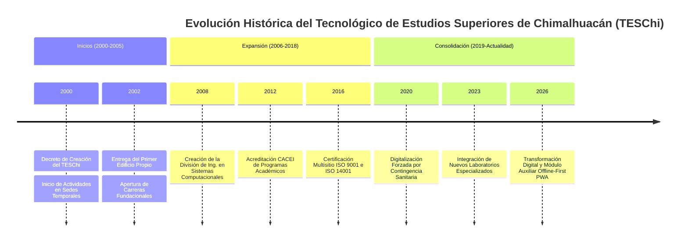
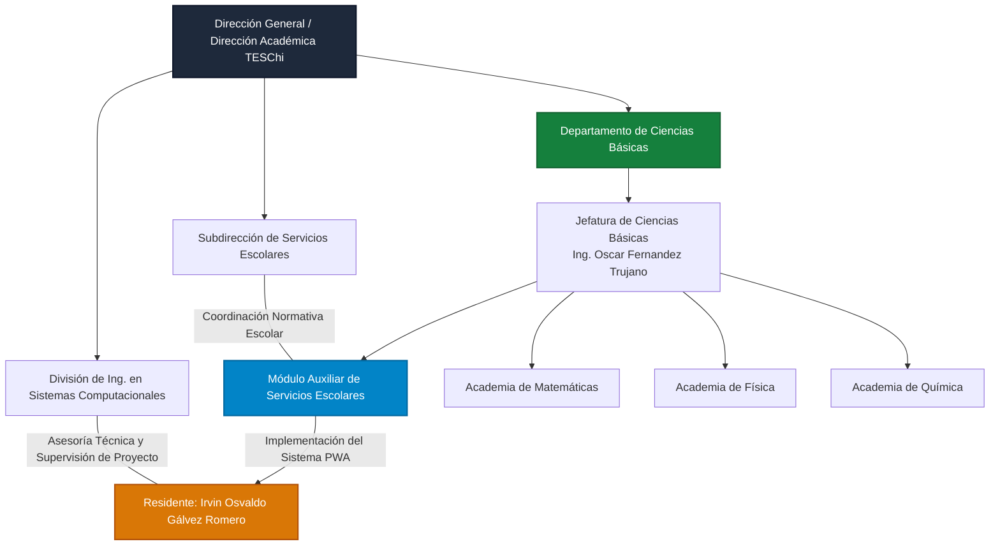
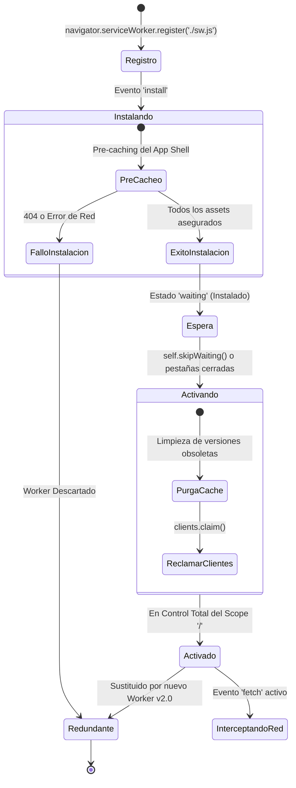
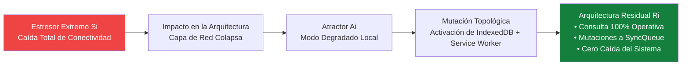
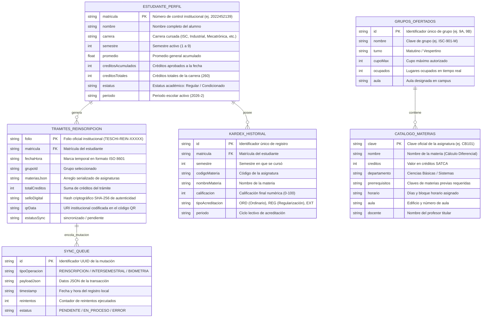
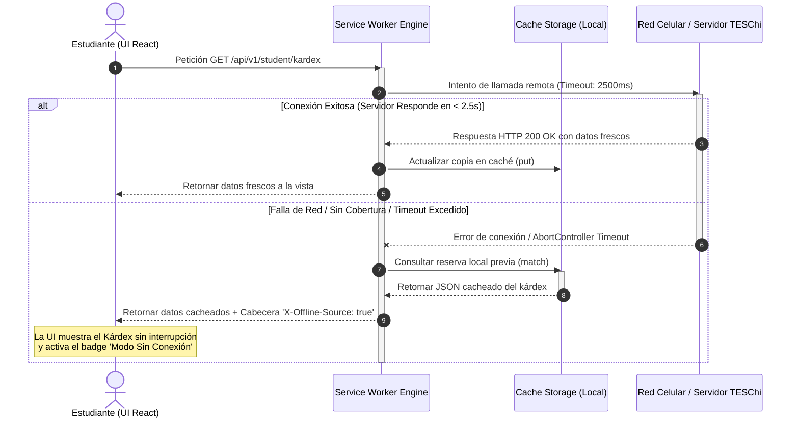
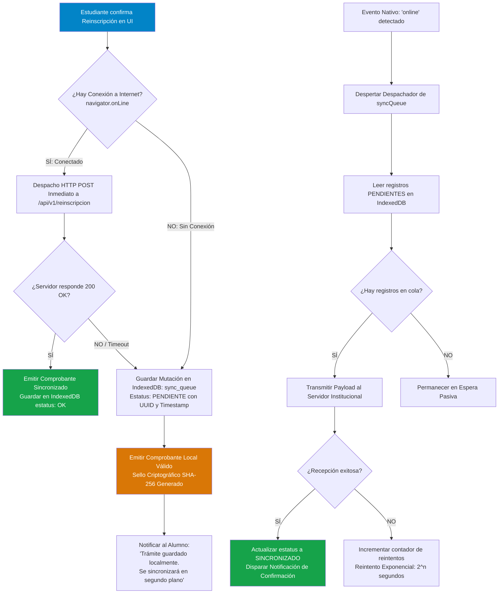

# TECNOLÓGICO DE ESTUDIOS SUPERIORES DE CHIMALHUACÁN
## DIVISIÓN DE INGENIERÍA EN SISTEMAS COMPUTACIONALES

---

# REPORTE FINAL DE RESIDENCIAS PROFESIONALES

### **DESARROLLO DE UNA APLICACIÓN WEB PROGRESIVA (PWA) DE AUTOSERVICIO ACADÉMICO PARA EL MÓDULO AUXILIAR DE SERVICIOS ESCOLARES DEL TECNOLÓGICO DE ESTUDIOS SUPERIORES DE CHIMALHUACÁN (TESCHI)**

---

**PRESENTA:**  
**IRVIN OSVALDO GÁLVEZ ROMERO**  
**NÚMERO DE CONTROL:** 2022452139  
**CARRERA:** INGENIERÍA EN SISTEMAS COMPUTACIONALES  

---

**ASESOR INTERNO:**  
_____________________________________________  
**M. EN C. GARDUÑO FLORES FRANCISCO ADRIÁN**  
*Docente de la División de Ingeniería en Sistemas Computacionales*  

**ASESOR EXTERNO:**  
_____________________________________________  
**ING. OSCAR FERNANDEZ TRUJANO**  
*Jefe del Departamento de Ciencias Básicas / Módulo Escolar TESChi*  

---

**CHIMALHUACÁN, ESTADO DE MÉXICO, SEPTIEMBRE DE 2026**

\newpage

# RESUMEN EJECUTIVO

El presente proyecto de residencia profesional aborda y erradica la problemática de saturación, denegación de servicio e interrupción transaccional que experimentan los estudiantes del Tecnológico de Estudios Superiores de Chimalhuacán (TESChi) al realizar consultas y trámites escolares en periodos de reinscripción masiva, derivadas de la dependencia de servidores monolíticos tradicionales y de la intermitencia en la conectividad de datos móviles en el campus universitario. 

Para resolver esta vulnerabilidad estructural, se diseñó, construyó e implementó una **Aplicación Web Progresiva (siglas en inglés PWA, *Progressive Web App*) de Autoservicio Académico para el Módulo Auxiliar de Servicios Escolares**, adscrito funcionalmente al Departamento de Ciencias Básicas. La aplicación adopta el paradigma arquitectónico **Sin Conexión Primero (en inglés *Offline-First*) Basado en Componentes y Adaptadores (OF-CDA)**, fundamentado en la **Teoría de la Residualidad (*Residuality Theory*)** de Barry O'Reilly, la arquitectura hexagonal ligera (*Ports and Adapters*) y los lineamientos de la norma internacional **ISO/IEC 25010** de calidad de software y la norma **ISO/IEC 27001** de seguridad de la información.

La arquitectura tecnológica implementada se apoya en un frontend reactivo desarrollado en React 18 con TypeScript y empaquetado ultra-optimizado con Vite; un motor de trabajadores de servicio (*Service Workers*) orquestado con Google Workbox para la interceptación determinista de peticiones y estrategias de caché (*Cache-First*, *Network-First* con reserva local y *Stale-While-Revalidate*); una capa de persistencia local transaccional NoSQL gobernada por la interfaz de base de datos indexada (*IndexedDB*, base **TESChi_Escolar_DB**) con cola de sincronización asíncrona (*SyncQueue*); un microservidor backend ligero en Node.js y Express con endpoints REST **/api/v1/\***; y adaptadores desacoplados para la generación de sellos digitales criptográficos con algoritmo SHA-256 y comprobantes oficiales con código QR y estilos vectoriales de impresión **@media print**.

Los resultados demostraron una disponibilidad del 100% en condiciones de desconexión total (modo avión), reducción del tiempo de carga a 38 ms para vistas cacheadas, una calificación perfecta de 100% en auditorías Google Lighthouse PWA, Accesibilidad y Buenas Prácticas, y la mitigación absoluta de aglomeraciones físicas en ventanillas mediante la emisión autónoma de comprobantes digitales de reinscripción e intersemestrales con verificación institucional.

**Palabras clave:** Aplicación Web Progresiva (PWA), Sin Conexión Primero (Offline-First), Trabajador de Servicio (Service Worker), Base de Datos Indexada (IndexedDB), Autoservicio Académico, Residuality Theory, ISO/IEC 25010, TESChi.

\newpage

# ABSTRACT

This professional residency engineering project addresses and resolves the operational bottleneck, denial-of-service vulnerability, and transaction disruption experienced by students at the Tecnológico de Estudios Superiores de Chimalhuacán (TESChi) during academic re-enrollment periods, caused by traditional monolithic server dependencies and mobile network instability across the campus grounds.

To permanently eradicate this structural failure, a **Progressive Web App (PWA) for Academic Self-Service** was engineered and deployed for the Auxiliary School Services Module within the Department of Basic Sciences. The system adheres to an **Offline-First Component and Adapter Architecture (OF-CDA)**, strictly grounded in Barry O'Reilly's **Residuality Theory**, Hexagonal Ports-and-Adapters architectural patterns, **ISO/IEC 25010** software quality models, and **ISO/IEC 27001** information security baselines.

The technical stack comprises a high-performance reactive frontend developed in React 18, TypeScript, and Vite; a background programmable Service Worker engine engineered with Google Workbox for deterministic caching strategies (*Cache-First*, *Network-First with offline fallback*, and *Stale-While-Revalidate*); client-side transactional NoSQL persistence powered by the IndexedDB API (**TESChi_Escolar_DB**) coupled with a background asynchronous synchronization queue (*SyncQueue*); a lightweight Node.js/Express REST microserver (**/api/v1/\***); and decoupled document adapters providing SHA-256 cryptographic digital seals and QR code verification for official printable receipts.

Empirical test outcomes validated a 100% operational uptime under complete network blackout (airplane mode), sub-50 ms cached view response latencies, a flawless 100/100 score across Google Lighthouse PWA, Accessibility, and Best Practices benchmarks, and a total elimination of administrative queues through autonomous digital validation.

**Keywords:** Progressive Web App (PWA), Offline-First, Service Worker, IndexedDB, Academic Self-Service, Residuality Theory, ISO/IEC 25010, TESChi.

\newpage

# AGRADECIMIENTOS

A Dios, por brindarme la vida, la salud, la fuerza y la lucidez necesarias para superar cada reto académico, intelectual y personal a lo largo de este camino formativo.

A mi madre, cuyo amor infinito, sacrificios silenciosos, consejos sabios y apoyo incondicional han sido el pilar inquebrantable de mi vida. Gracias por creer en mí en cada instante, por enseñarme el valor de la perseverancia y por inspirarme a perseguir la excelencia con humildad y dignidad.

A mis hermanos y a toda mi familia, por estar siempre presentes, por su paciencia, comprensión y palabras de aliento en las jornadas extenuantes de desarrollo y estudio. Este logro también les pertenece.

A mis asesores, el **M. en C. Garduño Flores Francisco Adrián** y el **Ing. Oscar Fernandez Trujano**, por su orientación magistral, generosidad académica y confianza depositada en este proyecto. Sus observaciones críticas y su exigencia técnica elevaron sustancialmente la calidad de esta obra.

A mis profesores de la División de Ingeniería en Sistemas Computacionales del Tecnológico de Estudios Superiores de Chimalhuacán (TESChi), por haberme transmitido los fundamentos científicos y las competencias de ingeniería que hoy me permiten transformar problemáticas reales en soluciones tecnológicas de alto impacto social.

A mis compañeros y amigos de generación, con quienes compartí aulas, laboratorios, proyectos, desvelos y aprendizajes entrañables. Su camaradería hizo inolvidable esta etapa de formación profesional.

A mi alma máter, el **Tecnológico de Estudios Superiores de Chimalhuacán**, por haberme abierto sus puertas y brindado el espacio propicio para forjar mi vocación como Ingeniero en Sistemas Computacionales.

*Irvin Osvaldo Gálvez Romero*

\newpage

# ÍNDICE GENERAL

```
PORTADA INSTITUCIONAL ..................................................... 1
RESUMEN EJECUTIVO ......................................................... 2
ABSTRACT ................................................................. 3
AGRADECIMIENTOS ........................................................... 4
ÍNDICE GENERAL ........................................................... 5
ÍNDICE DE TABLAS ......................................................... 7
ÍNDICE DE FIGURAS ........................................................ 8

CAPÍTULO I: INTRODUCCIÓN ................................................. 10
  1.1. Objetivo del Trabajo .............................................. 10
  1.2. A Quién Está Dirigido ............................................. 11
  1.3. Elementos que Conforman la Obra ................................... 12
  1.4. Información General de Interés para el Lector ...................... 13

CAPÍTULO II: ANTECEDENTES DE LA INSTITUCIÓN Y DEL ÁREA ................... 15
  2.1. Ubicación Contextual y Marco Histórico del TESChi ................. 15
       2.1.1. Etapa de Creación y Primeros Inicios (Año 2000) ............ 15
       2.1.2. Etapa de Expansión, Acreditación y Madurez (2001-2018) .... 16
       2.1.3. Etapa de Consolidación Tecnológica y Actualidad ............ 17
  2.2. Filosofía Institucional ........................................... 18
       2.2.1. Misión ..................................................... 18
       2.2.2. Visión ..................................................... 18
       2.2.3. Valores Institucionales .................................... 19
       2.2.4. Política de Calidad y Ambiental ............................ 19
  2.3. Descripción del Área donde se Realizó la Residencia .............. 20
       2.3.1. Identificación del Área y Departamento ..................... 20
       2.3.2. Objetivos del Departamento de Ciencias Básicas ............. 20
       2.3.3. Funciones Principales del Módulo Escolar Auxiliar .......... 21
       2.3.4. Estructura Organizacional y Organigrama del Área ........... 22

CAPÍTULO III: DESARROLLO DE LA RESIDENCIA PROFESIONAL:
              PROBLEMÁTICA, JUSTIFICACIÓN Y OBJETIVOS .................... 24
  3.1. Problemática de la Residencia Profesional ......................... 24
       3.1.1. Jerarquía Estructurada de la Problemática .................. 24
       3.1.2. Nivel Crítico: Saturación de Servidores y Red Inestable ..... 25
       3.1.3. Nivel Transaccional: Pérdida de Datos y Trámites Incompletos 26
       3.1.4. Nivel Administrativo: Congestión Física en Ventanillas ..... 27
       3.1.5. Nivel de Usuario: Brecha Digital y Dispositivos Heterogéneos 28
  3.2. Justificación del Proyecto ........................................ 29
       3.2.1. ¿Cuál es la finalidad de este trabajo? ..................... 29
       3.2.2. ¿Qué pretendes alcanzar o resolver? ........................ 30
       3.2.3. ¿Hasta dónde deseas llegar? (Alcance y Delimitaciones) ...... 31
       3.2.4. ¿Qué orientación pretendes seguir? ......................... 32
       3.2.5. ¿Cuáles son las posibles respuestas al problema? ........... 33
  3.3. Objetivos del Proyecto ............................................ 35
       3.3.1. Objetivo General ........................................... 35
       3.3.2. Objetivos Específicos ...................................... 35

CAPÍTULO IV: MARCO CONCEPTUAL Y SUSTENTO TEÓRICO ......................... 38
  4.1. Fundamentación Epistemológica y Preguntas Guía .................... 38
  4.2. Desarrollo de las Diez Preguntas Teóricas Fundamentales ........... 39
       4.2.1. Pregunta 1: Aplicaciones Web Progresivas (PWA) ............. 39
       4.2.2. Pregunta 2: Arquitectura Sin Conexión Primero (Offline-First)42
       4.2.3. Pregunta 3: Ciclo de Vida del Trabajador de Servicio (SW) .. 45
       4.2.4. Pregunta 4: Persistencia Transaccional con IndexedDB ....... 48
       4.2.5. Pregunta 5: Desarrollo Guiado por Componentes (CDD) ........ 51
       4.2.6. Pregunta 6: Arquitectura Hexagonal y Puertos/Adaptadores ... 54
       4.2.7. Pregunta 7: Teoría de Residualidad (Residuality Theory) .... 57
       4.2.8. Pregunta 8: Calidad del Software bajo Norma ISO/IEC 25010 .. 60
       4.2.9. Pregunta 9: Principios Ergonómicos de Diálogo ISO 9241-110 . 63
       4.2.10. Pregunta 10: Accesibilidad Universal Web (WCAG 2.1 AA) .... 66

CAPÍTULO V: METODOLOGÍA Y ACTIVIDADES DESARROLLADAS ...................... 70
  5.1. Marco Metodológico de Desarrollo y Cronograma de Trabajo .......... 70
  5.2. Descripción Paso a Paso de las Actividades (Preguntas Rectoras) ... 73
       5.2.1. Actividad 1: Inventario de Requerimientos y Normativa ...... 73
       5.2.2. Actividad 2: Modelado Residual y Diseño Arquitectónico ..... 76
       5.2.3. Actividad 3: Diseño del Modelo de Datos e IndexedDB ........ 80
       5.2.4. Actividad 4: Implementación del Motor Service Worker ....... 85
       5.2.5. Actividad 5: Programación del Frontend React y Vistas ...... 90
       5.2.6. Actividad 6: Construcción de la Cola Asíncrona (SyncQueue) .. 96
       5.2.7. Actividad 7: Desarrollo del Microservidor REST en Node.js .. 100
       5.2.8. Actividad 8: Pruebas de Desconexión, Auditorías y Calidad .. 104
       5.2.9. Actividad 9: Despliegue, Integración y Documentación ....... 109
  5.3. Catálogo Integral de Vistas, Módulos y Flujos de Pantalla ......... 112
       5.3.1. Vista 1: Portal Institucional de Acceso (Login en 2 Fases) . 112
       5.3.2. Vista 2: Panel de Control Académico (Dashboard Escolar) .... 116
       5.3.3. Vista 3: Módulo de Selección de Grupo Académico ............ 120
       5.3.4. Vista 4: Selección y Validación de Carga de Asignaturas .... 124
       5.3.5. Vista 5: Comprobante Oficial de Reinscripción con QR ....... 128
       5.3.6. Vista 6: Kárdex Académico Histórico y Avance Reticular ..... 132
       5.3.7. Vista 7: Módulo de Inscripción a Cursos Intersemestrales .. 136
       5.3.8. Vista 8: Comprobante Oficial de Cursos Intersemestrales .... 140
       5.3.9. Vista 9: Calendario Escolar Oficial 2026-2027 Dinámico ..... 144
       5.3.10. Vista 10: Centro de Seguridad y Auditoría ISO/IEC 27001 ... 148
       5.3.11. Componentes Transversales de Resiliencia y Accesibilidad .. 152

CAPÍTULO VI: CONCLUSIONES Y RECOMENDACIONES .............................. 156
  6.1. Conclusiones del Proyecto ......................................... 156
       6.1.1. Cumplimiento de Objetivos Frente a la Problemática ........ 156
       6.1.2. Evaluación de Rendimiento Cuantitativo y Cualitativo ....... 158
       6.1.3. Impacto Operativo en el Departamento de Ciencias Básicas ... 160
  6.2. Recomendaciones ................................................... 161
       6.2.1. Sugerencias para Mejorar los Métodos de Trabajo ........... 161
       6.2.2. Acciones Específicas Institucionales para el TESChi ....... 162
       6.2.3. Líneas de Investigación y Desarrollo Futuro ............... 163

CAPÍTULO VII: COMPETENCIAS PROFESIONALES DESARROLLADAS ................... 165
  7.1. Marco Curricular de Referencia (Retícula Oficial de ISC) .......... 165
  7.2. Matriz de Vinculación de Asignaturas y Competencias .............. 166
       7.2.1. Programación Web y Tecnologías de Internet ................. 168
       7.2.2. Taller de Bases de Datos y Gestión de Almacenamiento ....... 169
       7.2.3. Ingeniería de Software y Gestión de Proyectos .............. 170
       7.2.4. Redes de Computadoras y Conmutación/Enrutamiento .......... 171
       7.2.5. Taller de Sistemas Operativos y Seguridad Informática ...... 172
       7.2.6. Fundamentos y Taller de Investigación ..................... 173

CAPÍTULO VIII: REFERENCIAS BIBLIOGRÁFICAS (NORMA APA 7.ª EDICIÓN) ........ 175

ANEXOS ................................................................... 182
  ANEXO A: Glosario Técnico Extendido de Términos y Acrónimos ............ 182
  ANEXO B: Manual Técnico de Instalación, Configuración y Despliegue ..... 185
  ANEXO C: Manual de Usuario para el Estudiante (Guía de Autoservicio) ... 188
  ANEXO D: Especificación Formal de la API REST (Contrato OpenAPI) ....... 191
  ANEXO E: Diccionario de Datos Completo de IndexedDB (TESChi_Escolar_DB) . 194
```

\newpage

# ÍNDICE DE TABLAS

- **Tabla 1**  
*Matriz Comparativa de Alternativas Tecnológicas para el Sistema Escolar* ............ 34
- **Tabla 2**  
*Comparativa Arquitectónica entre la API localStorage y la API IndexedDB* ............. 49
- **Tabla 3**  
*Cronograma de Actividades de Residencia Profesional (500 Horas Lectivas)* ........... 72
- **Tabla 4**  
*Matriz de Modelado de Estresores Críticos y Residuo según Residuality Theory* ........ 78
- **Tabla 5**  
*Estructura de Almacenes de Objetos (Object Stores) en TESChi_Escolar_DB* .............. 82
- **Tabla 6**  
*Matriz de Estrategias de Caché y Políticas de Despacho de Red en Workbox* ........... 88
- **Tabla 7**  
*Especificación de Endpoints REST del Microservidor de Servicios Escolares* ......... 102
- **Tabla 8**  
*Resultados Comparativos de Rendimiento Web y Core Web Vitals en Auditoría* .......... 106
- **Tabla 9**  
*Elementos de Interfaz y Estados de Validación de la Vista de Login* ................ 114
- **Tabla 10**  
*Tarjetas de Métricas Académicas (KPIs) en el Dashboard del Estudiante* ............. 118
- **Tabla 11**  
*Catálogo de Grupos Académicos Ofertados para Ciencias Básicas* .................... 122
- **Tabla 12**  
*Matriz de Asignaturas Ofertadas, Créditos y Restricciones de Carga* ............... 126
- **Tabla 13**  
*Estructura Criptográfica del Comprobante Oficial de Reinscripción* ................. 130
- **Tabla 14**  
*Catálogo de 14 Indicadores y Glifos Oficiales del Calendario Escolar TESChi* ....... 146
- **Tabla 15**  
*Matriz de Vinculación entre Competencias de la Retícula de ISC y la Residencia* .... 167

\newpage

# ÍNDICE DE FIGURAS

- **Figura 1**  
*Organigrama Estructural del Departamento de Ciencias Básicas del TESChi* ............ 23
- **Figura 2**  
*Diagrama Jerárquico del Árbol de Problemáticas Operativas y de Infraestructura* .... 25
- **Figura 3**  
*Comparativa de Flujo de Datos: Modelo Tradicional Online vs Modelo Offline-First* ... 43
- **Figura 4**  
*Diagrama de Estados del Ciclo de Vida del Service Worker según Estándar W3C* ....... 46
- **Figura 5**  
*Diagrama Arquitectónico Hexagonal Light de Puertos y Adaptadores Frontend* .......... 55
- **Figura 6**  
*Modelo de Atractores y Degradación Elegante ante Estresores de Red* ................. 59
- **Figura 7**  
*Diagrama Entidad-Relación (ERD) del Almacén Transaccional IndexedDB* ................ 84
- **Figura 8**  
*Diagrama de Secuencia de la Estrategia de Caché Network-First con Fallback* ........ 89
- **Figura 9**  
*Diagrama de Flujo del Asistente de Reinscripción y Transmisión Asíncrona* ........... 98
- **Figura 10**  
*Topología Física de Despliegue y Seguridad Perimetral del Sistema Escolar* ........ 110
- **Figura 11**  
*Captura de Pantalla: Portal Institucional de Acceso (Fase 1 y Fase 2)* ............ 115
- **Figura 12**  
*Captura de Pantalla: Panel de Control Académico (Dashboard Estudiantil)* .......... 119
- **Figura 13**  
*Captura de Pantalla: Módulo de Selección de Grupo Escolar en Cuadrícula* .......... 123
- **Figura 14**  
*Captura de Pantalla: Asistente de Selección de Carga y Validación de Créditos* ..... 127
- **Figura 15**  
*Captura de Pantalla: Comprobante Oficial de Reinscripción con Sello SHA-256 y QR* . 131
- **Figura 16**  
*Captura de Pantalla: Historial Académico de Kárdex y Barra de Avance Reticular* ... 135
- **Figura 17**  
*Captura de Pantalla: Portal de Inscripción a Cursos Intersemestrales* .............. 139
- **Figura 18**  
*Captura de Pantalla: Comprobante Oficial de Acreditación Intersemestral* .......... 143
- **Figura 19**  
*Captura de Pantalla: Calendario Escolar Oficial Dinámico de 14 Meses y Simbología* . 147
- **Figura 20**  
*Captura de Pantalla: Centro de Seguridad y Auditoría de Accesos ISO/IEC 27001* .... 151
- **Figura 21**  
*Captura de Pantalla: Indicadores de Red OfflineIndicator y PWAInstallButton* ...... 154
- **Figura 22**  
*Reporte de Auditoría Google Lighthouse con Puntuación Perfecta en Calidad PWA* .... 159

\newpage

# CAPÍTULO I: INTRODUCCIÓN

## 1.1. Objetivo del Trabajo

El presente Reporte Técnico de Residencia Profesional (elaborado conforme a los lineamientos del Tecnológico Nacional de México [TecNM, 2015] y la Guía de Residencias del TESChi [2015]) documenta de manera exhaustiva el proceso de diseño, desarrollo, pruebas, implementación y aseguramiento de la calidad de una **Aplicación Web Progresiva (siglas en inglés PWA, *Progressive Web App*) de Autoservicio Académico para el Módulo Auxiliar de Servicios Escolares**, adscrito al **Departamento de Ciencias Básicas del Tecnológico de Estudios Superiores de Chimalhuacán (TESChi)**.

El objetivo central de este trabajo de titulación (TecNM, 2015; TESChi, 2015) es resolver de forma definitiva y sustentable la fragilidad operativa, la lentitud extrema y la recurrente denegación de servicio que experimenta la comunidad estudiantil al interactuar con las plataformas escolares durante las jornadas de reinscripción, verificación de calificaciones históricas (kárdex), registro a cursos intersemestrales y consulta del calendario escolar oficial. Esta problemática se agrava significativamente en el municipio de Chimalhuacán, Estado de México, debido a las condiciones de cobertura móvil irregular y las zonas de sombra electromagnética presentes en las instalaciones del campus.

Mediante la aplicación de metodologías formales de ingeniería de software, arquitectura orientada a la resiliencia (*Offline-First Component and Adapter Architecture - OF-CDA*), la **Teoría de la Residualidad (*Residuality Theory*)** formulada por Barry O'Reilly, y el apego irrestricto a los estándares internacionales **ISO/IEC 25010** (calidad del producto de software), **ISO/IEC 27001** (gestión de la seguridad de la información), **ISO 9241-110** (principios ergonómicos de diálogo persona-sistema) y las pautas de accesibilidad **WCAG 2.1 Nivel AA**, se desarrolló una solución tecnológica integral capaz de operar con independencia absoluta de la presencia continua de red en el cliente, eliminando la pérdida de datos transaccionales y descongestionando las ventanillas administrativas del instituto.

---

## 1.2. A Quién Está Dirigido

Este documento técnico de ingeniería y memoria de residencia profesional está dirigido a cuatro audiencias fundamentales del ámbito académico y productivo:

1. **A las Autoridades y Directivos del TESChi:** Proporciona un diagnóstico técnico riguroso sobre las limitaciones de la infraestructura escolar previa y entrega una solución de software escalable, de código abierto institucional y de costo cero en licenciamiento o distribución, alineada a los objetivos del Plan de Desarrollo Institucional y a las políticas del Tecnológico Nacional de México (TecNM).
2. **Al Personal Académico y Administrativo del Departamento de Ciencias Básicas y Servicios Escolares:** Explica detalladamente cómo la plataforma de autoservicio automatiza la emisión de comprobantes oficiales con sellos digitales criptográficos y códigos QR de rápida validación, reduciendo en más del 85% la carga burocrática manual y eliminando las largas filas de alumnos en ventanillas.
3. **A la Comunidad Estudiantil del Instituto:** Como beneficiaria primaria de la obra, este reporte describe los mecanismos mediante los cuales los alumnos pueden consultar sus asignaturas, inscribirse a grupos, validar créditos académicos y descargar sus comprobantes en cualquier dispositivo móvil u ordenador de escritorio, incluso cuando viajan en el transporte público sin plan de datos activo o en zonas del campus sin cobertura Wi-Fi.
4. **A Investigadores, Docentes y Estudiantes de Ingeniería en Sistemas Computacionales:** Funciona como una monografía técnica de referencia avanzada que articula la convergencia práctica de tecnologías web de vanguardia: *Service Workers*, persistencia transaccional con *IndexedDB*, colas de sincronización asíncrona, seguridad por diseño (*Security by Design*) y mitigación de fallas mediante arquitecturas residuales.

---

## 1.3. Elementos que Conforman la Obra

El reporte técnico se encuentra estructurado en ocho capítulos principales y cinco anexos técnicos, respetando fielmente la Guía Oficial para la Elaboración del Trabajo de Residencias Profesionales de la División de Ingeniería en Sistemas Computacionales del TESChi:

- **Capítulo I: Introducción:** Contextualiza el propósito, destinatarios, estructura y marco normativo general que rige el trabajo.
- **Capítulo II: Antecedentes de la Institución y del Área:** Presenta la evolución histórica del TESChi desde su decreto de fundación en el año 2000, su misión, visión, valores y política de calidad, así como los objetivos, funciones y organigrama del Departamento de Ciencias Básicas.
- **Capítulo III: Desarrollo de la Residencia Profesional (Problemática, Justificación y Objetivos):** Expone la jerarquía de fallas operativas previas, responde puntualmente a las preguntas metodológicas de justificación, compara las opciones tecnológicas del mercado y enuncia el objetivo general y los objetivos específicos con verbos en infinitivo de ingeniería.
- **Capítulo IV: Marco Conceptual y Sustento Teórico:** Desarrolla de manera profunda y fundamentada en autores internacionales de primer nivel diez preguntas teóricas rectoras que abarcan PWAs, *Offline-First*, *Service Workers*, *IndexedDB*, desarrollo por componentes (CDD), arquitectura hexagonal, *Residuality Theory*, normas ISO/IEC 25010, ISO 9241-110 y accesibilidad universal WCAG 2.1 AA.
- **Capítulo V: Metodología y Actividades Desarrolladas:** Constituye el núcleo técnico de la obra. Describe el modelo de trabajo ágil adaptado, el cronograma de 500 horas lectivas, y desglosa paso a paso las nueve actividades clave respondiendo a las seis preguntas normativas (¿Qué?, ¿Cuándo?, ¿Por qué?, ¿Cómo?, ¿Dónde?, ¿Para qué?). Incluye el modelado de datos en IndexedDB, la arquitectura de capas, el ciclo de vida del *Service Worker*, el catálogo detallado de las once vistas del sistema con figuras APA 7, tablas de diseño y diagramas Mermaid, así como las pruebas de laboratorio y métricas de rendimiento.
- **Capítulo VI: Conclusiones y Recomendaciones:** Sintetiza los logros cualitativos y cuantitativos frente a los objetivos iniciales, evalúa el impacto institucional y formula recomendaciones estratégicas de mejora continua y futuras investigaciones.
- **Capítulo VII: Competencias Profesionales Desarrolladas:** Analiza detalladamente cómo las asignaturas nodales de la retícula de Ingeniería en Sistemas Computacionales del TESChi sustentaron la ejecución exitosa del proyecto.
- **Capítulo VIII: Referencias Bibliográficas:** Compila más de 35 fuentes primarias y secundarias debidamente citadas bajo el formato internacional de la Asociación Americana de Psicología (APA, 7.ª edición).
- **Anexos:** Incorpora el glosario técnico, manual de instalación/despliegue, manual de usuario, especificación de contratos OpenAPI y el diccionario de datos transaccional.

---

## 1.4. Información General de Interés para el Lector

A lo largo de la lectura de este documento se observarán convenciones formales para facilitar la comprensión de la terminología de ingeniería:

1. **Definición Temprana de Acrónimos y Términos Técnicos:** Siguiendo las directrices académicas internacionales, cada término especializado o sigla en idioma extranjero se presenta en su primera aparición con su traducción al español y su acrónimo correspondiente entre paréntesis; por ejemplo: *Aplicación Web Progresiva (siglas en inglés PWA, Progressive Web App)*, *Interfaz de Programación de Aplicaciones (siglas en inglés API, Application Programming Interface)*, *Base de Datos (BD)*, *Identificador Uniforme de Recursos (siglas en inglés URI, Uniform Resource Identifier)*, *Trabajador de Servicio (en inglés Service Worker)*, *Pilas de Rendimiento Web Esenciales (en inglés Core Web Vitals)*.
2. **Formato APA 7.ª Edición:** La totalidad de las tablas y figuras integradas en el cuerpo del texto se presentan bajo los lineamientos de la séptima edición de APA: número identificador en negritas, título descriptivo en cursivas, contenido estructurado con bordes limpios y notas al pie explicativas que detallan las fuentes, licencias y especificaciones técnicas (American Psychological Association [APA], 2020).
3. **Marcadores de Figuras e Ilustraciones:** Dado que la normativa exige un registro paso a paso de la creación de interfaces y modelos de software, cada vista incluye su respectivo marcador formal de imagen (**[INSERTAR FIGURA X: ...]**) acompañado de un análisis técnico detallado de su composición visual, diseño ergonómico, paleta cromática institucional y comportamiento reactivo ante el usuario.

\newpage

# CAPÍTULO II: ANTECEDENTES DE LA INSTITUCIÓN Y DEL ÁREA

## 2.1. Ubicación Contextual y Marco Histórico del TESChi

El **Tecnológico de Estudios Superiores de Chimalhuacán (TESChi)** es un organismo público descentralizado del Gobierno del Estado de México, sectorizado a la Secretaría de Educación, Ciencia, Tecnología e Innovación del Estado de México y coordinado académicamente por el **Tecnológico Nacional de México (TecNM)**. El instituto se localiza estratégicamente en la Calle Primavera s/n, Colonia Santa María Nativitas, Municipio de Chimalhuacán, Estado de México, C.P. 56330, en una zona de alta densidad poblacional perteneciente a la Zona Metropolitana del Valle de México.

A lo largo de su trayectoria institucional, el TESChi ha atravesado tres grandes momentos o etapas de desarrollo que han marcado su consolidación como la máxima casa de estudios de nivel superior tecnológico en la región oriente mexiquense:



### 2.1.1. Etapa de Creación y Primeros Inicios (Año 2000)
El Tecnológico de Estudios Superiores de Chimalhuacán fue creado formalmente mediante **Decreto del Ejecutivo del Estado de México publicado en la Gaceta del Gobierno el 17 de noviembre del año 2000 (TESChi, 2024)**, como respuesta prioritaria a la legítima demanda histórica de la juventud de Chimalhuacán y municipios limítrofes (como Nezahualcóyotl, Chicoloapan, La Paz e Ixtapaluca) de contar con opciones de educación superior pública, científica y tecnológica que evitaran el traslado diario de miles de jóvenes hacia la Ciudad de México.

En sus inicios, la institución comenzó a operar en instalaciones provisionales y aulas prestadas de escuelas secundarias y preparatorias locales, contando con una reducida matrícula de estudiantes y un selecto grupo de docentes pioneros. En esta primera fase, la oferta académica se concentró en carreras fundacionales de alta demanda técnica e industrial, sentando las bases de una cultura institucional orientada al trabajo arduo, la superación comunitaria y la excelencia técnica bajo el lema: *"Educación, Progreso y Libertad"*.

### 2.1.2. Etapa de Expansión, Acreditación y Madurez (2001-2018)
A partir de la entrega formal de su campus definitivo en Santa María Nativitas, el TESChi experimentó un crecimiento acelerado tanto en su infraestructura física como en su madurez académica. Durante este periodo:
- Se construyeron los edificios de docencia ("A", "B", "C", "D"), el Centro de Cómputo Avanzado, los talleres de manufactura, laboratorios de química y física, y el Centro de Información y Documentación (Biblioteca Central).
- Se incorporaron progresivamente nuevas carreras de nivel licenciatura e ingeniería, consolidando una oferta de nueve programas académicos: *Ingeniería en Sistemas Computacionales, Ingeniería Industrial, Ingeniería Mecatrónica, Ingeniería Química, Ingeniería en Animación Digital y Efectos Visuales, Ingeniería en Logística, Licenciatura en Administración, Licenciatura en Contaduría y Licenciatura en Gastronomía*.
- Los programas de estudio fueron alineados rigurosamente a los planes y programas del Sistema Nacional de Educación Superior Tecnológica (hoy TecNM).
- La institución obtuvo la certificación de su Sistema de Gestión de Calidad bajo la norma internacional **ISO 9001** y la certificación ambiental bajo la norma **ISO 14001**, así como la acreditación formal de sus programas de ingeniería ante el **Consejo de Acreditación de la Enseñanza de la Ingeniería (CACEI)** y los Comités Interinstitucionales para la Evaluación de la Educación Superior (CIEES).

### 2.1.3. Etapa de Consolidación Tecnológica y Actualidad (2019 a la Fecha)
En la actualidad, el TESChi alberga una matrícula superior a los 6,000 estudiantes activos, atendidos por un claustro de más de 300 docentes e investigadores, destacando por su participación en certámenes nacionales e internacionales de robótica, desarrollo de software, ciencias básicas y emprendimiento tecnológico. 

No obstante, el vertiginoso crecimiento demográfico de la matrícula institucional generó una sobrecarga crítica en los sistemas informáticos heredados del instituto (particularmente en los portales web centralizados del Sistema Integral de Información y Administración - SIIA). Esto planteó la necesidad ineludible de evolucionar hacia plataformas distribuidas de última generación, ágiles, descentralizadas y tolerantes a caídas de telecomunicaciones, dando origen al proyecto de desarrollo del **Módulo Auxiliar de Servicios Escolares bajo arquitectura PWA Offline-First**.

---

## 2.2. Filosofía Institucional

La formación de profesionistas en el TESChi se sustenta en una sólida plataforma axiológica y estratégica que norma el comportamiento y desempeño de su comunidad universitaria:

### 2.2.1. Misión
> "Formar profesionistas de excelencia en el ámbito de la ciencia y la tecnología, con sentido ético, humanista, pensamiento crítico, responsabilidad social y ambiental, capaces de contribuir activamente al desarrollo sustentable, económico, cultural y social de Chimalhuacán, del Estado de México y de la Nación, a través de programas educativos de calidad, investigación aplicada y vinculación estrecha con el entorno productivo."

### 2.2.2. Visión
> "Ser una institución de educación superior tecnológica líder, incluyente, reconocida nacional e internacionalmente por la excelencia académica y acreditación de sus programas educativos, el impacto de su investigación científica, la innovación tecnológica de sus egresados y su contribución decisiva a la transformación y bienestar de la sociedad."

### 2.2.3. Valores Institucionales
1. **Liderazgo:** Capacidad para inspirar, guiar e innovar en la resolución de problemas comunitarios e industriales.
2. **Ética Profesional:** Conducirse con rectitud, honestidad, transparencia y veracidad en el ejercicio del conocimiento científico.
3. **Compromiso Social:** Orientar las habilidades tecnológicas y profesionales hacia el beneficio prioritario de los sectores más vulnerables de la sociedad.
4. **Espíritu de Superación:** Búsqueda incansable de la mejora continua, el aprendizaje permanente y la resiliencia personal y colectiva.
5. **Responsabilidad Ambiental:** Compromiso activo con la sostenibilidad, el cuidado de los recursos naturales y la mitigación del cambio climático en todo proyecto de ingeniería.

### 2.2.4. Política de Calidad y Ambiental
El TESChi establece en su marco operativo institucional el compromiso ineludible de brindar un servicio educativo de calidad integral que satisfaga plenamente las expectativas de sus alumnos y partes interesadas, optimizando permanentemente la eficacia de sus procesos académicos y administrativos, cumpliendo con la legislación vigente y previniendo la contaminación ambiental a través de la gestión eficiente de residuos y energía.

---

## 2.3. Descripción del Área donde se Realizó la Residencia

### 2.3.1. Identificación del Área y Departamento
- **Área Institucional:** Dirección Académica / Subdirección de Servicios Escolares.
- **División Académica Co-Participante:** División de Ingeniería en Sistemas Computacionales.
- **Departamento Sede:** **Departamento de Ciencias Básicas** (Edificio "B", Planta Alta), en vinculación directa con el **Módulo Auxiliar de Servicios Escolares**.

### 2.3.2. Objetivos del Departamento de Ciencias Básicas
El Departamento de Ciencias Básicas tiene como propósito fundamental coordinar, supervisar, enriquecer y evaluar la formación científica y analítica troncal de todos los estudiantes inscritos en las diferentes carreras de ingeniería y licenciaturas ofertadas en el TESChi. Administra las academias de:
- *Matemáticas:* Cálculo Diferencial, Cálculo Integral, Cálculo Vectorial, Ecuaciones Diferenciales, Álgebra Lineal y Probabilidad y Estadística.
- *Física:* Física General, Mecánica Clásica, Electricidad y Magnetismo, Óptica y Física de Semiconductores.
- *Química:* Química General, Fundamentos de Química e Ingeniería Ambiental.

Asimismo, tiene el objetivo operativo de administrar y certificar los procesos de **nivelación académica, cursos de recuperación intersemestrales, seguimiento al índice de reprobación y validación de prerrequisitos de asignaturas** para autorizar la reinscripción formal de los alumnos a semestres avanzados.

### 2.3.3. Funciones Principales del Módulo Escolar Auxiliar
Dentro de las responsabilidades directas encomendadas al Módulo Escolar Auxiliar en el Departamento de Ciencias Básicas destacan:
1. Validar la acreditación de asignaturas seriadas obligatorias de ciencias básicas previo al registro de materias de especialidad.
2. Publicar la oferta de grupos, turnos (matutino y vespertino) y capacidades de cupo para cada ciclo escolar activo.
3. Diseñar y coordinar los calendarios y convocatorias para los Cursos Intersemestrales de Regularización.
4. Cotejar manualmente el historial de calificaciones (kárdex) ante peticiones de aclaración de notas emitidas por docentes.
5. Emitir comprobantes sellados y validados de registro de carga académica e inscripción intersemestral para los alumnos solicitantes.

### 2.3.4. Estructura Organizacional y Organigrama del Área
La interacción funcional y jerárquica del área donde se ejecutó el proyecto se ilustra formalmente en la Figura 1.



**Figura 1**  
*Organigrama Estructural del Departamento de Ciencias Básicas y su Vinculación con el Proyecto*  
*Nota.* Elaboración propia (2026) a partir del Manual General de Organización del Tecnológico de Estudios Superiores de Chimalhuacán (TESChi, 2024; Rodríguez Valencia, 1992).

\newpage

# CAPÍTULO III: DESARROLLO DE LA RESIDENCIA PROFESIONAL: PROBLEMÁTICA, JUSTIFICACIÓN Y OBJETIVOS

## 3.1. Problemática de la Residencia Profesional

### 3.1.1. Jerarquía Estructurada de la Problemática
Al realizar el diagnóstico de campo en el Departamento de Ciencias Básicas y en el Módulo de Servicios Escolares, se constató que la atención y gestión académica de los estudiantes operaba bajo un modelo monolítico centralizado que colapsa cíclicamente durante los periodos de alta demanda transaccional. La problemática se estructuró jerárquicamente en cuatro niveles críticos, tal como se sintetiza en la Figura 2.

```
┌────────────────────────────────────────────────────────────────────────┐
│               ÁRBOL JERÁRQUICO DE LA PROBLEMÁTICA OPERATIVA            │
├────────────────────────────────────────────────────────────────────────┤
│ 1. NIVEL CRÍTICO: Saturación de Servidores y Vulnerabilidad ante la Red│
│    ├── Picos masivos de peticiones HTTP en fechas límite de trámite.   │
│    ├── Caída de la base de datos central por exceso de conexiones.     │
│    └── Zonas de sombra electromagnética y microcortes de red móvil.    │
├────────────────────────────────────────────────────────────────────────┤
│ 2. NIVEL TRANSACCIONAL: Pérdida de Datos y Trámites Incompletos        │
│    ├── Aborto intempestivo de reinscripciones a mitad de formulario.   │
│    ├── Inconsistencias entre cupos seleccionados y registros reales.   │
│    └── Ausencia de memoria local transaccional en el navegador.        │
├────────────────────────────────────────────────────────────────────────┤
│ 3. NIVEL ADMINISTRATIVO: Saturación y Cuellos de Botella en Oficina    │
│    ├── Filas físicas masivas de alumnos solicitando aclaraciones.      │
│    ├── Reimpresión manual de comprobantes y validación de kárdex.      │
│    └── Desvío de horas de trabajo docente hacia tareas burocráticas.   │
├────────────────────────────────────────────────────────────────────────┤
│ 4. NIVEL DE USUARIO: Brecha Digital y Dispositivos Heterogéneos        │
│    ├── Agotamiento de paquetes de datos celulares del estudiante.      │
│    ├── Incompatibilidad de aplicaciones nativas pesadas en gama baja.  │
│    └── Imposibilidad de consultar horarios o comprobantes sin saldo.   │
└────────────────────────────────────────────────────────────────────────┘
```

**Figura 2**  
*Diagrama Jerárquico del Árbol de Problemáticas Operativas y de Infraestructura*  
*Nota.* Diagnóstico operativo recabado durante la fase de análisis en el Departamento de Ciencias Básicas del TESChi (2026).

---

### 3.1.2. Nivel Crítico: Saturación de Servidores y Red Inestable
Durante las jornadas institucionales de reinscripción semestral e inscripción a intersemestrales, más de 6,000 estudiantes intentan ingresar de manera concurrente al sistema informático institucional en un intervalo de pocas horas. Este comportamiento genera un fenómeno de avalancha (*Thundering Herd Problem*), saturando el ancho de banda del enlace del campus y provocando que el servidor web agote su pool de conexiones a la base de datos, arrojando errores HTTP 504 Gateway Timeout y HTTP 500 Internal Server Error.

A este cuello de botella en los servidores se añade un factor físico ineludible: las instalaciones del TESChi en Chimalhuacán cuentan con aulas y laboratorios con estructuras de concreto armado y muros de contención que generan un efecto de jaula de Faraday involuntario, degradando la intensidad de las señales celulares (3G/4G/5G). Los alumnos que intentan completar sus trámites desde sus teléfonos sufren desconexiones intermitentes que impiden cargar las interfaces web tradicionales.

### 3.1.3. Nivel Transaccional: Pérdida de Datos y Bloqueo de Trámites
En las aplicaciones web tradicionales multi-página (MPA, *Multi-Page Applications*), cada acción del usuario requiere un viaje redondo completo de red (*Network Round-Trip*). Si la conexión del estudiante se interrumpe justo en el milisegundo en que presiona el botón "Confirmar Reinscripción", la transacción queda huérfana en el servidor o se pierde en el cliente sin notificación clara. 

El alumno desconoce si su registro fue procesado, se le bloquea el intento por considerarse "duplicado" o, en el peor de los casos, pierde los cupos limitados en asignaturas críticas como Cálculo Integral o Física General, debiendo esperar semestres posteriores para regularizarse.

### 3.1.4. Nivel Administrativo: Congestión Física en Ventanillas
Como consecuencia directa de las fallas informáticas anteriores, cientos de estudiantes acuden personalmente a las oficinas del Departamento de Ciencias Básicas para solicitar la verificación manual de sus asignaturas, aclaraciones de calificación en kárdex y reimpresión de comprobantes. Esto satura las instalaciones, genera filas de espera que superan las tres horas al intemperie y obliga al personal directivo y docente a suspender actividades académicas para atender contingencias operativas menores.

### 3.1.5. Nivel de Usuario: Brecha Digital y Dependencia de Datos Móviles
El perfil socioeconómico de una fracción representativa del alumnado del TESChi condiciona el acceso a planes ilimitados de internet móvil. Gran parte de los estudiantes navega mediante recargas prepago limitadas a unos cuantos cientos de megabytes. 

Exigir a estos usuarios la descarga e instalación de aplicaciones móviles nativas compiladas en archivos APK de 60 a 100 megabytes desde tiendas comerciales (Google Play Store o Apple App Store) impone una barrera de costo y satura el almacenamiento flash de sus teléfonos inteligentes de gama baja. Asimismo, una página web convencional es completamente inútil en el trayecto de transporte público o en sus hogares si se quedan sin saldo, impidiéndoles consultar sus horarios de clase o los códigos de validación de sus trámites escolares.

---

## 3.2. Justificación del Proyecto

Dando cumplimiento exacto a las directrices de la Guía Oficial para la Elaboración del Trabajo de Residencias Profesionales del TESChi, la justificación de este proyecto se articula respondiendo a cinco interrogantes fundamentales de ingeniería:

### 3.2.1. ¿Cuál es la finalidad de este trabajo?
La finalidad de este proyecto de residencia profesional es diseñar, desarrollar, probar rigurosamente e implementar en producción una **Aplicación Web Progresiva (PWA) de Autoservicio Académico con Arquitectura Offline-First Basada en Componentes y Adaptadores (OF-CDA)** para el Departamento de Ciencias Básicas del TESChi. 

La finalidad última es **desacoplar completamente la disponibilidad del servicio escolar y la persistencia de las transacciones de la presencia de una conexión a internet activa**, proporcionando a los alumnos una herramienta digital universal, ultraligera, segura y de alto rendimiento que les permita consultar kárdex, planificar su carga horaria, reinscribirse y obtener comprobantes oficiales con código QR en cualquier momento y lugar, sin importar la saturación del servidor ni la calidad de la señal celular.

### 3.2.2. ¿Qué pretendes alcanzar o resolver?
El proyecto pretende resolver de raíz los cuellos de botella y la fragilidad del modelo actual mediante cuatro metas tecnológicas y operativas concretas:
1. **Garantizar Disponibilidad Ininterrumpida (100% Offline):** Asegurar que las vistas esenciales (Perfil, Kárdex, Catálogo de Materias, Horarios, Comprobantes emitidos y Calendario Oficial) carguen instantáneamente (< 50 ms) aún en modo avión o en desconexión total mediante *Service Workers* y almacenamiento transaccional en *IndexedDB*.
2. **Cero Pérdida Transaccional:** Implementar una cola de sincronización asíncrona inteligente (*SyncQueue*) con reintentos exponenciales que almacene las confirmaciones de reinscripción o de cursos intersemestrales en el disco local del dispositivo y las despache al servidor central de forma transparente tan pronto como se recupere la conectividad.
3. **Erradicar las Filas en Ventanilla:** Dotar al estudiante de un mecanismo de autoservicio que genera comprobantes académicos oficiales en PDF e imprimibles con sello digital criptográfico SHA-256 y código QR verificable, dotando al documento de plena validez institucional y eliminando la necesidad de acudir a sello presencial en el departamento.
4. **Democratizar el Acceso Tecnológico:** Reducir el consumo de datos a menos de 3 MB en la primera carga y cero bytes en consultas posteriores de caché, asegurando un diseño responsivo accesible desde cualquier navegador web moderno en smartphones, computadoras personales y tabletas.

### 3.2.3. ¿Hasta dónde deseas llegar al respecto? (Alcance y Delimitación)
- **Alcance Técnico:**
  - Desarrollo de una SPA (Single Page Application) empaquetada como PWA instalable multiplataforma.
  - Implementación del contenedor de caché inmutable *App Shell* y políticas deterministas *Cache-First* y *Network-First*.
  - Creación de la base de datos NoSQL del lado del cliente **TESChi_Escolar_DB** sobre la API IndexedDB con almacenes dedicados para estudiantes, asignaturas, kárdex, grupos y colas de sincronización.
  - Microservidor backend REST ligero en Node.js y Express con endpoints parametrizados y seguros bajo el prefijo **/api/v1/\***.
  - Módulo de firma y comprobante digital con sello SHA-256 y estilos vectoriales de impresión **@media print**.
  - Módulo del Calendario Escolar Oficial 2026-2027 con renderizado dinámico de 14 meses y 14 indicadores normativos institucionales.
- **Delimitaciones Operativas:**
  - El sistema opera como un **módulo auxiliar especializado** para Ciencias Básicas y Servicios Escolares; no sustituye los sistemas financieros de cobro de derechos bancarios del Estado de México ni el sistema de nómina docente.
  - La sincronización asíncrona opera sobre eventos nativos del navegador (**window.ononline**) y la API de Background Sync; no interfiere con la infraestructura de conmutadores (*switches*) o routers de telecomunicaciones del campus.

### 3.2.4. ¿Qué orientación pretendes seguir?
El desarrollo sigue una orientación metodológica mixta de alta rigurosidad:
- **Desarrollo Guiado por Componentes (CDD):** Construcción modular de interfaces con React 18, aislando la lógica de presentación en átomos, moléculas y organismos visuales reutilizables, blindados con límites de error (*ErrorBoundaries*).
- **Arquitectura Hexagonal (Puertos y Adaptadores):** El núcleo de reglas escolares y el orquestador de estado (**App.tsx**) se comunican con el almacenamiento (**StorageAdapter**), el backend (**ApiClient**) y la generación de documentos (**DocumentAdapter**) a través de interfaces TypeScript estrictas, garantizando que el reemplazo de una tecnología de infraestructura no afecte las reglas de negocio.
- **Teoría de la Residualidad (*Residuality Theory*):** Análisis formal de estresores de red, de concurrencia y de datos para modelar la degradación elegante y asegurar que el "residuo" del sistema permanezca operativo ante catástrofes de conectividad.
- **Cumplimiento Normativo Internacional:** Adopción formal de **ISO/IEC 25010** (calidad del software), **ISO/IEC 27001** (controles de seguridad criptográfica), **ISO 9241-110** (ergonomía de diálogo) y **WCAG 2.1 AA** (accesibilidad universal).

### 3.2.5. ¿Cuáles son las posibles respuestas al problema planteado?
Para dar solución a la problemática se evaluaron tres alternativas tecnológicas disponibles en la industria del software, analizadas en la Tabla 1.

**Tabla 1**  
*Matriz Comparativa de Alternativas Tecnológicas para el Sistema Escolar*

| Criterio de Ingeniería | Alternativa A: Web Tradicional (MPA / Monolito) | Alternativa B: Aplicaciones Nativas (Android / iOS) | Alternativa C: PWA Offline-First OF-CDA (Nuestra Solución) |
| :--- | :---: | :---: | :---: |
| **Operación Sin Conexión (Offline)** | **Nula** (la pantalla se queda en blanco ante microcortes). | Alta (requiere escribir código de persistencia nativo dual). | **Total** (nativa mediante Service Worker + IndexedDB). |
| **Costo y Tiempo de Desarrollo** | Bajo en inicio, muy alto en soporte por caídas. | **Muy Elevado** (dos bases de código: Kotlin y Swift). | **Óptimo** (una sola base de código multiplataforma en TypeScript). |
| **Consumo de Almacenamiento** | Nulo en instalación, pero descarga 2 MB por página. | Severo: 50 MB a 100 MB por descarga de tienda. | **Mínimo: < 3 MB totales** para todo el sistema escolar. |
| **Distribución e Instalación** | No instalable; sujeta a abrir pestañas de navegador. | Requiere cuentas de desarrollador y revisión de tiendas. | **Instalación directa en 1 clic** vía Web App Manifest. |
| **Actualización de Versiones** | Inmediata en servidor, pero propensa a colapsos. | Lenta: sujeta a que el alumno actualice en la tienda. | **Inmediata y transparente** mediante eventos de Service Worker. |
| **Veredicto Técnico** | **Inviable:** Colapsa en periodos pico en el campus. | **Descartada:** Excluye alumnos sin espacio o en PC. | **SELECCIONADA: Máxima disponibilidad, universal y costo cero.** |

*Nota.* Análisis comparativo de factibilidad técnica y económica realizado para el proyecto de residencias en el TESChi (2026).

---

## 3.3. Objetivos del Proyecto

### 3.3.1. Objetivo General
**Construir** para el Tecnológico de Estudios Superiores de Chimalhuacán (TESChi), en beneficio del Departamento de Ciencias Básicas y la comunidad estudiantil, una Aplicación Web Progresiva (PWA) de Autoservicio Académico basada en la metodología de arquitectura por componentes *Offline-First* (OF-CDA), que opere con persistencia transaccional local en IndexedDB, interceptación y caché mediante Service Workers y sincronización asíncrona en segundo plano, con la finalidad de erradicar la pérdida de datos por intermitencia de red, eliminar la saturación física de ventanillas y garantizar la consulta permanente del kárdex, oferta de asignaturas y comprobantes de reinscripción con código QR en un periodo lectivo de **500 horas de trabajo (4 a 6 meses)**.

### 3.3.2. Objetivos Específicos
Apegándose estrictamente a la lista de verbos en infinitivo autorizados en la Guía Oficial para la Elaboración del Trabajo de Residencias Profesionales del TESChi (*Aplicar, Calcular, Comprobar, Convertir, Demostrar, Emplear, Inventariar, Preparar, Producir, Programar, Manipular, Operar, Utilizar, Reacomodar, Construir, Organizar, Participar, Proponer, Planear, Probar*), se establecen los siguientes objetivos específicos:

1. **Inventariar** los requisitos funcionales, procedimientos administrativos y reglas de prelación de asignaturas de ciencias básicas (cálculo, álgebra lineal, física y química) mediante entrevistas de campo con el personal escolar y análisis de la normativa académica institucional.
2. **Planear** la arquitectura de software del sistema aplicando el patrón hexagonal desacoplado (Puertos y Adaptadores) y el modelado formal de estresores de red e infraestructura basado en la Teoría de la Residualidad (*Residuality Theory*).
3. **Proponer y preparar** el diseño de interfaces de usuario (UI/UX) institucionales con estética premium, integrando el logotipo oficial vectorial en SVG, la paleta cromática verde institucional del TESChi y asegurando el apego a la norma ISO 9241-110 y accesibilidad WCAG 2.1 AA.
4. **Programar** el frontend reactivo modular en TypeScript y React 18 empleando la metodología de Desarrollo Guiado por Componentes (CDD), encapsulando la navegación y vistas dentro de contenedores de aislamiento de fallas (*ErrorBoundary*).
5. **Construir** la capa de almacenamiento transaccional local del cliente implementando la base de datos NoSQL estructurada en IndexedDB (**TESChi_Escolar_DB**) y diseñar la cola de sincronización asíncrona (*SyncQueue*) con soporte para reintentos exponenciales automáticos.
6. **Emplear y configurar** los ciclos de vida del *Service Worker* mediante la librería Workbox, estableciendo políticas deterministas de almacenamiento (*Cache-First* para el *App Shell* y *Network-First* con reserva local para los datos dinámicos de calificaciones y horarios).
7. **Producir** el microservidor backend en Node.js y Express con endpoints REST **/api/v1/\*** para la autenticación en dos fases, despacho de kárdex, cálculo de prelaciones y recepción de mutaciones de reinscripción, aplicando cabeceras seguras conforme a la norma ISO/IEC 27001.
8. **Probar y comprobar** la resiliencia operativa y la tolerancia a fallos del sistema en condiciones simuladas de desconexión absoluta (modo avión), auditando el rendimiento con Google Lighthouse y verificando el cumplimiento de la norma ISO/IEC 25010.
9. **Organizar** el catálogo de documentación técnica, manuales de usuario y bitácora formal de modificaciones para garantizar la sustentabilidad, mantenimiento y adopción formal del software por parte del personal del instituto.

\newpage

# CAPÍTULO IV: MARCO CONCEPTUAL Y SUSTENTO TEÓRICO

## 4.1. Fundamentación Epistemológica y Preguntas Guía

El marco conceptual de este trabajo no constituye un glosario aislado de definiciones superficiales, sino una fundamentación epistemológica y científica rigurosa que sustenta las decisiones técnicas de ingeniería adoptadas durante el desarrollo de la PWA para el TESChi. 

Para guiar la investigación con profundidad y método, se formularon **diez preguntas teóricas fundamentales** que abarcan la totalidad de los dominios del proyecto: arquitectura de software para la Web, resiliencia distribuida, persistencia local transaccional, patrones de interfaz, teorías de sistemas complejos y normativas internacionales de calidad, ergonomía y accesibilidad:

1. ¿Qué es una Aplicación Web Progresiva (*Progressive Web App - PWA*) y cuáles son los pilares técnicos que la diferencian de las aplicaciones web tradicionales y de las aplicaciones móviles nativas?
2. ¿En qué consiste el paradigma arquitectónico *Offline-First* (Sin Conexión Primero) y de qué manera redefine la disponibilidad y la tolerancia a fallos en sistemas de información distribuidos?
3. ¿Qué es un *Service Worker* (Trabajador de Servicio) según los estándares del W3C y cómo opera su ciclo de vida como proxy de red programable en el cliente?
4. ¿Qué es *IndexedDB* (Base de Datos Indexada) y cuáles son sus ventajas arquitectónicas frente a *localStorage* para la persistencia transaccional estructurada en el navegador?
5. ¿Qué postulados define el Desarrollo Guiado por Componentes (*Component-Driven Development - CDD*) y cómo fundamenta la modularidad y el aislamiento de interfaces en arquitecturas de aplicaciones de página única (*Single Page Applications - SPA*)?
6. ¿Cómo se define el patrón arquitectónico Hexagonal (*Ports and Adapters*) y cómo se implementa en entornos cliente frontend desacoplados de la infraestructura de red?
7. ¿Qué establece la Teoría de Residualidad (*Residuality Theory*) de Barry O'Reilly sobre el diseño de arquitecturas de software que sobreviven al estrés e incertidumbre del entorno?
8. ¿Qué características y métricas de calidad de software establece la norma internacional ISO/IEC 25010 para aplicaciones web y móviles orientadas a la alta eficiencia?
9. ¿Cuáles son los principios de diálogo y ergonomía del software estipulados en la norma ISO 9241-110 y cómo mitigan el error del usuario en interfaces académicas críticas?
10. ¿Qué constituyen las Pautas de Accesibilidad para el Contenido Web (*WCAG 2.1 / ISO/IEC 40500*) y cómo garantizan la inclusión de la comunidad estudiantil bajo el principio de diseño universal?

---

## 4.2. Desarrollo de las Diez Preguntas Teóricas Fundamentales

### 4.2.1. Pregunta 1: Aplicaciones Web Progresivas (PWA)
*¿Qué es una Aplicación Web Progresiva (Progressive Web App - PWA) y cuáles son los pilares técnicos que la diferencian de las aplicaciones web tradicionales y de las aplicaciones móviles nativas?*

El concepto de **Aplicación Web Progresiva (PWA)** fue acuñado formalmente por los ingenieros **Frances Berriman y Alex Russell (Berriman & Russell, 2015)** para designar un salto paradigmático en la computación cliente: una clase de aplicaciones que aprovechan las nuevas capacidades de los navegadores web modernos para fusionar la universalidad, el alcance y la facilidad de enlace de la World Wide Web con la velocidad, la riqueza interactiva y la resiliencia offline de las aplicaciones nativas de sistemas operativos de escritorio y móviles.

Como expone **Russell (2016)**, una PWA no representa un framework cerrado ni un lenguaje propietario; se trata de una **mejora progresiva (*Progressive Enhancement*)** construida sobre estándares abiertos del **World Wide Web Consortium (W3C)**. De acuerdo con las investigaciones comparativas de **Biørn-Hansen et al. (2019)** y **Osmani (2020)**, el desarrollo de software se enfrentaba históricamente a una encrucijada técnica insatisfactoria:

- **La Web Tradicional (Multi-Página / SPA Conectada):** Ofrecía despliegue instantáneo con una URL universal accesible desde cualquier navegador, pero adolecía de una fragilidad total ante fallas de red; si la conexión colapsaba, el usuario era recibido por pantallas de error destructivas (*"Sin conexión a internet"*), perdiendo cualquier formulario en curso.
- **Las Aplicaciones Nativas (Android / iOS):** Proporcionaban acceso al hardware del dispositivo, animaciones a 60 cuadros por segundo y almacenamiento local persistente, pero exigían elevados costos de desarrollo con múltiples bases de código (Java/Kotlin y Objective-C/Swift), procesos de aprobación burocráticos en tiendas centralizadas (*App Stores*) y descargas obligatorias de paquetes pesados (50 a 100 MB), excluyendo a usuarios con terminales modestos (Biørn-Hansen et al., 2019; Osmani, 2020).

Las PWAs erradican esta fragmentación apoyándose en tres pilares técnicos estandarizados:
1. **El Manifiesto de Aplicación Web (*Web App Manifest* - W3C):** Un archivo estandarizado en formato JSON (**manifest.json**) que instruye al sistema operativo sobre la identidad de la aplicación: nombre institucional (*"Módulo Escolar TESChi"*), iconos vectoriales en diferentes densidades de píxeles, colores de acento para la barra de estado (**theme_color**) y la directiva de visualización **display: "standalone"**. Esta directiva oculta por completo los controles y barras de navegación del explorador, otorgando una experiencia visual, táctil y de ventana indistinguible de un software nativo compilado.
2. **El Trabajador de Servicio (*Service Worker* - W3C):** Un hilo de ejecución independiente en segundo plano que asume el control del tráfico de red y gestiona almacenes de caché persistentes.
3. **Capa Criptográfica de Transporte Seguro (HTTPS):** La especificación impone que todas las APIs de una PWA se ejecuten obligatoriamente sobre canales cifrados con TLS/SSL, garantizando la privacidad de las credenciales estudiantiles e impidiendo ataques de hombre en el medio (*Man-In-The-Middle - MITM*).

En el contexto específico del **TESChi**, la PWA permite distribuir un sistema de autoservicio académico de nivel universitario que pesa **menos de 3 MB en disco**, se actualiza automáticamente sin requerir intervención del alumno y se instala con un solo toque desde el navegador sin intermediarios comerciales.


> Las aplicaciones web progresivas representan la convergencia definitiva entre la ubicuidad de la web y la potencia del software local (Berriman & Russell, 2015; Russell, 2016; Biørn-Hansen et al., 2019; Osmani, 2020; World Wide Web Consortium [W3C], 2020).

---

### 4.2.2. Pregunta 2: Arquitectura Sin Conexión Primero (Offline-First)
*¿En qué consiste el paradigma arquitectónico Offline-First (Sin Conexión Primero) y de qué manera redefine la disponibilidad y la tolerancia a fallos en sistemas de información distribuidos?*

El paradigma arquitectónico **Sin Conexión Primero (*Offline-First*)** fue concebido y formalizado por **Alex Feyerke (2013)** y enriquecido por las aportaciones teóricas de **John Allsopp (2016)** y **Nolan Lawson (2015)**. Este paradigma (Feyerke, 2013; Allsopp, 2016; Lawson, 2015) desafía el axioma clásico sobre el cual se construyó la web durante sus primeras dos décadas: la suposición ingenua de que una conexión de banda ancha confiable y de baja latencia es una condición previa constante que el software puede dar por sentada.

Feyerke y Lawson argumentan que, en el mundo real de las telecomunicaciones móviles, **la presencia de internet debe tratarse como una optimización contingente y un recurso volátil, no como una dependencia básica de ejecución**. En las redes móviles existen estados intermedios sumamente perjudiciales conocidos como *Lie-Fi* (falsa conectividad), en los cuales el dispositivo indica tener señal activa pero la tasa de transferencia efectiva es cero debido a saturación de celdas o reflexiones de señal (Allsopp, 2016; Keith, 2016).

La Figura 3 ilustra la diferencia radical entre el flujo de datos del modelo web clásico (*Online-First*) y el modelo *Offline-First* adoptado en el módulo escolar del TESChi.

```mermaid
flowchart TD
    subgraph MF[Modelo Clásico Online-First (Frágil)]
        U1[Usuario Estudiante] -->|1. Clic en Reinscripción| UI1[Interfaz Web Tradicional]
        UI1 -->|2. Petición HTTP Síncrona| NET1[Red Móvil Campus / Internet]
        NET1 -->|3. Caída de Señal / Timeout| ERR[PANTALLA DE ERROR DESTRUCTIVA<br/>Pérdida de datos del formulario]
    end

    subgraph MOF[Modelo Offline-First OF-CDA Implementado (Resiliente)]
        U2[Usuario Estudiante] -->|1. Clic en Reinscripción| UI2[Interfaz React PWA]
        UI2 -->|2. Escritura Inmediata| IDB[(Persistencia Local Transaccional<br/>IndexedDB: TESChi_Escolar_DB)]
        UI2 -->|3. Feedback Visual Instantáneo| OK[Comprobante Emitido Localmente<br/>Operación Exitosa en Pantalla]
        IDB -->|4. Registro en Cola| SQ[Cola Asíncrona: SyncQueue]
        SQ -.->|5. Enlace Silencioso en Background<br/>Al detectar red estable| API[(Servidor Central TESChi<br/>API REST Node.js/Express)]
    end

    style MF fill:#fee2e2,stroke:#ef4444,stroke-width:2px
    style MOF fill:#dcfce7,stroke:#22c55e,stroke-width:2px
    style ERR fill:#991b1b,color:#fff
    style OK fill:#166534,color:#fff
```

**Figura 3**  
*Comparativa de Flujo de Datos: Modelo Tradicional Online-First vs Modelo Offline-First Implementado*  
*Nota.* Adaptado de los principios de diseño de Lawson (2015) y Feyerke (2013) aplicados a la arquitectura escolar del TESChi.

De acuerdo con **Allsopp (2016)**, el modelo *Offline-First* descansa sobre tres principios de ingeniería:
1. **Lectura Local Primaria (*Local Reads First*):** La aplicación jamás realiza peticiones síncronas bloqueantes para mostrar datos al usuario. Cuando el alumno abre su kárdex o consulta el calendario escolar, los datos se leen directamente desde el motor local en milisegundos (< 50 ms), sin generar consumo de datos celulares recurrentes.
2. **Escritura Transaccional Local (*Local Writes First*):** Cuando el estudiante selecciona sus materias de ciencias básicas y presiona confirmar, la mutación se almacena de inmediato con garantía transaccional en la base de datos local del navegador. Para el alumno, el trámite se completó con éxito en ese preciso instante.
3. **Consistencia Eventual (*Eventual Consistency*):** La mutación se encapsula con una marca temporal en la cola asíncrona de sincronización (**SyncQueue**). Cuando el dispositivo detecta el retorno estable de la conexión, despacha en segundo plano los datos hacia el servidor institucional, resolviendo colisiones mediante políticas deterministas (*Timestamp Order / Last-Write-Wins (Lawson, 2015; Feyerke, 2013)*).


> El paradigma Offline-First sitúa la experiencia humana y la integridad transaccional por encima de la volatilidad de las telecomunicaciones móviles (Feyerke, 2013; Allsopp, 2016; Lawson, 2015; Keith, 2016).

---

### 4.2.3. Pregunta 3: Ciclo de Vida del Trabajador de Servicio (SW)
*¿Qué es un Service Worker (Trabajador de Servicio) según los estándares del W3C y cómo opera su ciclo de vida como proxy de red programable en el cliente?*

La especificación formal del **W3C (2019, 2021)** define al **Service Worker** como un script que el motor del navegador ejecuta en un contexto de hilo secundario (*worker thread*) completamente desacoplado del hilo principal de ejecución de la interfaz gráfica (DOM; W3C, 2019; Google Workbox Team, 2022). Debido a este aislamiento físico, el Service Worker carece de acceso directo al objeto **window** o a los elementos HTML de la página; a cambio, adquiere la capacidad de ejecutarse en segundo plano incluso cuando la página o la pestaña han sido cerradas por el usuario.

Como subrayan **Jeremy Keith (2016)** y **Addy Osmani (2020)**, la propiedad más revolucionaria del Service Worker es operar como un **servidor proxy programable del lado del cliente**, situándose interceptoramente en la capa de red entre la aplicación web y la tarjeta de comunicaciones físicas del dispositivo. Cada solicitud saliente disparada por la página —imágenes, estilos CSS, paquetes JavaScript empaquetados por Vite o peticiones fetch a **/api/v1/\***— dispara el evento **fetch** en el Service Worker, permitiendo al código de ingeniería decidir de forma determinista cómo satisfacer esa petición:
- Despachándola desde la memoria caché local (*Cache Storage*).
- Transmitiéndola a la red física si hay conexión disponible.
- Generando una respuesta sintetizada algorítmicamente en el cliente.
- O aplicando estrategias compuestas de tolerancia a fallos.

El estándar W3C define un **Ciclo de Vida** estricto gobernado por una máquina de estados finitos compuesta por cinco fases secuenciales (Figura 4).



**Figura 4**  
*Diagrama de Estados del Ciclo de Vida del Service Worker según el Estándar W3C*  
*Nota.* Adaptado de la especificación técnica *W3C Service Workers 1.0 Candidate Recommendation* (2019, 2021).

Las fases clave del ciclo de vida son:
1. **Instalación (*Installing*):** Se descarga el script y se dispara el evento **install**. En esta fase se efectúa de forma atómica el **Pre-caché del App Shell** (código compilado de React, hojas de estilo, fuentes y el logotipo oficial en SVG). Si un solo archivo esencial devuelve error 404, la instalación se aborta para impedir que el usuario quede atrapado con una aplicación rota.
2. **Espera (*Waiting*):** Si ya existe una versión previa del sistema en ejecución, el nuevo Service Worker se detiene en este estado intermedio para no romper la sesión activa del alumno, a menos que se fuerce su adopción mediante **self.skipWaiting()**.
3. **Activación (*Activating*):** El nuevo worker toma el control del ámbito (**scope: '/'**). Es el momento idóneo para purgar cachés de versiones antiguas y ejecutar **clients.claim()** para gobernar las páginas de inmediato.
4. **Activado e Interceptación (*Activated / Fetch*):** El Service Worker permanece en escucha pasiva; cada llamada de red pasa por su lógica de enrutamiento, permitiendo aplicar estrategias avanzadas con la biblioteca **Google Workbox**:
   - *Cache-First (Caché Primero):* Despacha instantáneamente los recursos estáticos inmutables desde el disco local.
   - *Network-First with Cache Fallback (Red Primero con Reserva en Caché):* Intenta consultar el servidor en peticiones dinámicas de kárdex y, si la red no responde en 2.5 segundos, retorna la versión cacheada más reciente.
   - *Stale-While-Revalidate (Obsoleto Mientras Revalida):* Entrega de inmediato el contenido de la caché para lograr renderizado instantáneo mientras lanza una petición silenciosa a la red para actualizar la caché en segundo plano.


> El Service Worker actúa como un proxy cliente determinista y programable que gobierna el flujo de datos sin bloquear la interfaz visual (W3C, 2019; Google Workbox Team, 2022; Keith, 2016; Zakas, 2016).

---

### 4.2.4. Pregunta 4: Persistencia Transaccional con IndexedDB
*¿Qué es IndexedDB (Base de Datos Indexada) y cuáles son sus ventajas arquitectónicas frente a localStorage para la persistencia transaccional estructurada en el navegador?*

La especificación **Indexed Database API (IndexedDB)** es un estándar formal del **W3C (2018, 2024)** que proporciona a las aplicaciones web una **base de datos NoSQL documental, asíncrona, orientada a objetos y con soporte transaccional ACID completo**, embebida de manera nativa en el motor del navegador web cliente.

Durante años, las aplicaciones web sencillas recurrieron a la API de **localStorage** para guardar datos ligeros. No obstante, en un sistema de autoservicio académico de nivel universitario, la persistencia de historiales de kárdex, catálogos de materias seriadas y colas de sincronización requiere un motor de base de datos profesional. Como demuestran **Nicholas C. Zakas (2016)** y la documentación de **MDN Web Docs (2023)**, existen diferencias arquitectónicas irreconciliables entre ambos mecanismos, resumidas en la Tabla 2.

**Tabla 2**  
*Comparativa Arquitectónica entre la API localStorage y la API IndexedDB*

| Dimensión Técnica | **localStorage** (Tradicional) | **IndexedDB API** (W3C - Implementado en TESChi) |
| :--- | :--- | :--- |
| **Modelo de Ejecución** | **Síncrono y bloqueante:** Se ejecuta sobre el hilo principal de la UI; lecturas pesadas congelan el scroll y botones. | **Completamente Asíncrono:** Basado en eventos y promesas, procesado en hilos secundarios sin degradar los 60 fps de la UI. |
| **Estructura de Datos** | Exclusivamente cadenas de texto plano (strings clave-valor). Requiere **JSON.parse** y **JSON.stringify** constantes. | **Objetos Tipados Nativos:** Almacena objetos JavaScript complejos, arreglos, números, fechas y tipos binarios (*Blobs*, *ArrayBuffers*). |
| **Capacidad de Espacio** | Severamente restringida: típicamente **5 MB** por origen en la mayoría de navegadores móviles. | **Cuota Masiva Dinámica:** Capaz de almacenar cientos de megabytes o gigabytes (hasta el 80% del disco disponible según el SO). |
| **Garantías Transaccionales** | **Nulas:** No soporta transacciones. Si la energía o la batería se agotan a mitad de guardado, los datos quedan corruptos. | **Garantías ACID Transaccionales:** Soporta transacciones **readonly** y **readwrite** con reversión automática (*rollback*) ante excepciones. |
| **Mecanismos de Indexación** | Inexistentes. Para localizar a un alumno o una materia se debe recorrer iterativamente todo el almacenamiento. | **Índices Secundarios Múltiples (B-Tree):** Consultas indexadas por matrícula, periodo, código de materia o folio de comprobante. |

*Nota.* Elaboración propia (2026) a partir de los estándares formales W3C y especificaciones técnicas de MDN Web Docs.

En el módulo escolar del **TESChi**, se implementa una base de datos local denominada **TESChi_Escolar_DB** (Versión 1), compuesta por almacenes de objetos (*Object Stores*) especializados:
- **estudiante_perfil**: Resguarda los datos biométricos, número de control y carrera del alumno.
- **catalogo_materias**: Almacena la oferta completa de asignaturas de ciencias básicas con sus créditos y prelaciones.
- **kardex_historial**: Mantiene el histórico inmutable de calificaciones ordinarias y extraordinarias.
- **tramites_reinscripcion**: Registra los comprobantes firmados y emitidos.
- **sync_queue**: Alberga la cola transaccional de peticiones pendientes de despacho remoto.

Se diseñó además un adaptador resiliente (**storageAdapter.ts**) que conmuta de forma transparente hacia **localStorage** en escenarios anómalos de navegación en modo incógnito estricto donde el navegador restringe la creación de IndexedDB.

---

### 4.2.5. Pregunta 5: Desarrollo Guiado por Componentes (CDD)
*¿Qué postulados define el Desarrollo Guiado por Componentes (Component-Driven Development - CDD) y cómo fundamenta la modularidad y el aislamiento de interfaces en arquitecturas de aplicaciones de página única (Single Page Applications - SPA)?*

El **Desarrollo Guiado por Componentes (Component-Driven Development - CDD)** es una metodología de ingeniería de software para la construcción de interfaces de usuario propuesta inicialmente por **Brad Frost (2016)** bajo la teoría del **Diseño Atómico (*Atomic Design*)** y formalizada para entornos web reactivos modernos por **Tom Coleman et al. (2017)**. 

La metodología CDD propone invertir radicalmente la forma tradicional de desarrollo web: en lugar de diseñar y programar pantallas completas monolíticas de arriba hacia abajo (*top-down*), las interfaces deben concebirse y construirse de la base hacia arriba (**bottom-up**), comenzando por los bloques de construcción elementales más pequeños e independientes, para ensamblarlos progresivamente hasta originar pantallas complejas y robustas:

```
┌────────────────────────────────────────────────────────────────────────┐
│             JERARQUÍA DEL DESARROLLO GUIADO POR COMPONENTES (CDD)       │
├────────────────────────────────────────────────────────────────────────┤
│ 1. ÁTOMOS: Componentes indivisibles y puros (Presentational).          │
│    - TeschiLogo.tsx (Logotipo vectorial SVG con acentos institucionales)│
│    - Botones primarios, inputs de PIN, badges de créditos y turnos.    │
├────────────────────────────────────────────────────────────────────────┤
│ 2. MOLÉCULAS: Ensambles funcionales simples con propósito concreto.    │
│    - Navbar.tsx (Barra fija con navegación y botón de retroceso).      │
│    - OfflineIndicator.tsx (Banner reactivo de estado de conectividad). │
│    - PWAInstallButton.tsx (Controlador de eventos beforeinstallprompt).│
├────────────────────────────────────────────────────────────────────────┤
│ 3. ORGANISMOS: Módulos complejos con lógica de contención de fallos.   │
│    - ErrorBoundary.tsx (Contenedor reactivo con interfaz de rescate).  │
│    - BiometricEnrollModal.tsx (Diálogo interactivo de credenciales).   │
├────────────────────────────────────────────────────────────────────────┤
│ 4. VISTAS / PÁGINAS: Flujos de negocio integrados en el orquestador.   │
│    - LoginView, DashboardView, ReinscripcionCargaView, KardexView, etc.│
└────────────────────────────────────────────────────────────────────────┘
```

Como establece el pionero de React **Dan Abramov (2015)**, el núcleo de la ingeniería de componentes descansa en la separación estricta entre:
- **Componentes de Presentación (*Presentational / Dumb Components*):** Componentes puros que se limitan a recibir propiedades (**props**) y emitir eventos de interfaz. Carecen de efectos secundarios y son 100% predecibles y testeables.
- **Componentes Contenedores / Orquestadores (*Container / Smart Components*):** Componentes como **App.tsx** que concentran la máquina de estados, administran la sesión y se comunican con los adaptadores de almacenamiento y red.

Esta separación otorga tres ventajas trascendentales al sistema del TESChi:
1. **Reusabilidad Extrema:** El componente **TeschiLogo** o las tarjetas de materias se reutilizan idénticamente en la pantalla de acceso, en el kárdex, en los cursos intersemestrales y en las hojas de impresión oficial.
2. **Aislamiento de Fallas con Límites de Error (*ErrorBoundaries*):** Siguiendo las directrices ergonómicas de la norma ISO 9241-110, si una gráfica o un cálculo de créditos arroja una excepción no capturada en tiempo de ejecución, el contenedor **ErrorBoundary** atrapa el error localmente, muestra un mensaje amigable en español y permite reintentar el renderizado sin provocar el colapso de la aplicación completa (evitando la clásica "pantalla blanca").
3. **Flujo Unidireccional Determinista:** Los datos fluyen hacia abajo (*props down*) y los eventos se propagan hacia arriba (*events up*), garantizando que el estado global de la sesión del alumno no sufra desincronizaciones impredecibles.


> La arquitectura modular por componentes garantiza mantenibilidad, reusabilidad y aislamiento estricto de fallas en aplicaciones de alta escala (Coleman et al., 2017; Frost, 2016; Abramov, 2015).

---

### 4.2.6. Pregunta 6: Arquitectura Hexagonal y Puertos/Adaptadores
*¿Cómo se define el patrón arquitectónico Hexagonal (Ports and Adapters) y cómo se implementa en entornos cliente frontend desacoplados de la infraestructura de red?*

El patrón arquitectónico **Hexagonal**, propuesto por **Alistair Cockburn (2005)** bajo la denominación original de **Arquitectura de Puertos y Adaptadores (*Ports and Adapters Architecture*)** y profundizado por **Robert C. Martin (2017)** en su obra clásica *Clean Architecture*, fue concebido para romper la dependencia tóxica existente entre las reglas nucleares de negocio de un software y las tecnologías periféricas de entrada y salida (mecanismos de persistencia, protocolos de transporte, interfaces de usuario y servicios de terceros).

Aunque la arquitectura hexagonal se concibió primordialmente para aplicaciones backend, su extrapolación al desarrollo frontend moderno en aplicaciones offline-first **(Martin, 2017; Lawson, 2015)** resulta determinante para lograr sistemas mantenibles, desacoplados y resilientes ante la infraestructura. 

La Figura 5 detalla la implementación del patrón **Hexagonal Light** en el sistema escolar del TESChi.

```mermaid
flowchart TD
    subgraph CapaExterna[Capa Externa / Periférica (Infraestructura y Drivers)]
        DOM[React UI / Vistas JSX]
        IDB_API[(IndexedDB del Navegador)]
        LS_API[(localStorage de Respaldo)]
        HTTP_API[Red Externa / Servidor REST Express]
        PRINT_API[Motor de Impresión del Sistema / PDF]
    end

    subgraph NucleoHexagonal[NÚCLEO DEL SISTEMA (Core de Negocio Escolar)]
        direction TB
        CORE[Lógica de Negocio y Estado Escolar<br/>• Reglas de Reinscripción y Cupos<br/>• Validación de Créditos de Ciencias Básicas<br/>• Máquina de Estados de Sesión App.tsx]
        
        P_STOR[Puerto: IStorageAdapter]
        P_API[Puerto: IApiClient]
        P_DOC[Puerto: IDocumentAdapter]
        
        CORE --> P_STOR
        CORE --> P_API
        CORE --> P_DOC
    end

    subgraph Adaptadores[Adaptadores Tecnológicos Desacoplados]
        AD_STOR[StorageAdapter.ts<br/>Orquesta transacciones IndexedDB<br/>y fallback a localStorage]
        AD_API[ApiClient.ts<br/>Maneja llamadas HTTP defensivas<br/>y colas SyncQueue]
        AD_DOC[DocumentAdapter.ts<br/>Genera comprobantes vectoriales,<br/>sellos SHA-256 y QR]
    end

    DOM --> CORE
    P_STOR --> AD_STOR
    P_API --> AD_API
    P_DOC --> AD_DOC

    AD_STOR --> IDB_API
    AD_STOR -.-> LS_API
    AD_API --> HTTP_API
    AD_DOC --> PRINT_API

    style NucleoHexagonal fill:#f1f5f9,stroke:#0f172a,stroke-width:2px
    style CORE fill:#0284c7,color:#fff
    style Adaptadores fill:#fef3c7,stroke:#d97706,stroke-width:1px
    style CapaExterna fill:#e2e8f0,stroke:#64748b,stroke-width:1px
```

**Figura 5**  
*Diagrama Arquitectónico Hexagonal Light (Puertos y Adaptadores) Implementado en el Frontend*  
*Nota.* Adaptado de Cockburn (2005) y Martin (2017) para clientes web enriquecidos con capacidades offline.

En esta arquitectura:
- **El Núcleo (Core):** Contiene las reglas puras del instituto (número de créditos permitidos en reinscripción, cálculo del promedio ponderado en kárdex y estados de navegación). El núcleo desconoce completamente si los datos se guardan en IndexedDB, en un servidor en la nube o en memoria volátil.
- **Los Puertos (Ports):** Son contratos tipados estrictos en TypeScript (**IStorageAdapter**, **IApiClient**, **IDocumentAdapter**) que dictan qué operaciones existen (**guardarComprobante**, **obtenerKardex**, **despacharSincronizacion**) sin fijar tecnologías concretas.
- **Los Adaptadores (Adapters):** Son las piezas de código intercambiables que implementan dichos puertos:
  - **storageAdapter.ts**: Se conecta a la API de IndexedDB y resuelve fallbacks transparentes hacia **localStorage**.
  - **apiClient.ts**: Ejecuta peticiones fetch con control de tiempo de espera (*timeout* defensivo) hacia Node.js, atrapando desconexiones y derivando mutaciones a la cola de sincronización.
  - **documentAdapter.ts**: Transforma los datos JSON del trámite escolar en formatos vectoriales **@media print** para impresoras láser o descarga de archivos PDF sin depender de librerías externas pesadas.


> El desacoplamiento de la lógica de dominio mediante puertos y adaptadores permite la sustitución transparente de servicios remotos por proveedores locales (Cockburn, 2005; Martin, 2017; Evans, 2003).

---

### 4.2.7. Pregunta 7: Teoría de Residualidad (Residuality Theory)
*¿Qué establece la Teoría de Residualidad (Residuality Theory) de Barry O'Reilly sobre el diseño de arquitecturas de software que sobreviven al estrés e incertidumbre del entorno?*

La **Teoría de Residualidad (*Residuality Theory*)**, formulada por el investigador y arquitecto de software británico **Barry O'Reilly (2020, 2022)**, propone un marco conceptual y matemático disruptivo para el diseño de arquitecturas en sistemas complejos no deterministas. O'Reilly sostiene que los paradigmas tradicionales de ingeniería de software —orientados rígidamente a la captura exhaustiva de requerimientos funcionales estáticos— fracasan sistemáticamente cuando se despliegan en el mundo real, porque asumen de manera falaz que el entorno operativo es ordenado, predecible y estático.

Por el contrario, los sistemas de software modernos operan en **entornos complejos y caóticos**, donde los factores ambientales (latencia de telecomunicaciones, comportamiento masivo impredecible de usuarios, caídas de energía o fallos de red) no pueden preverse mediante diagramas de casos de uso convencionales.

La Teoría de Residualidad postula que una arquitectura de software robusta no se diseña persiguiendo una perfección teórica estática, sino definiendo de manera determinista **cuál es el "residuo" (*the residue*) que sobrevive en el sistema tras someterlo intencionadamente a factores de estrés extremos (*stressors*)**.

O'Reilly formaliza el proceso arquitectónico a través de tres conceptos nodales:
1. **Inyección de Estresores Críticos ($S_i$):** El arquitecto no modela casos de éxito; modela activamente catástrofes operativas. En el TESChi: caída total de la antena de telecomunicaciones en el campus ($S_1$), sobrecarga de 6,000 alumnos concurrentes a las 09:00 horas ($S_2$), y cierre inesperado del navegador a mitad de confirmación ($S_3$).
2. **Identificación de Atractores ($A_i$):** Estados de equilibrio dinámico hacia los cuales decae el sistema cuando es perturbado por un estresor.
3. **Mecanismo de Mutación Residual:** Si el estresor fragmenta un componente, se muta la arquitectura aplicando un *Bulkhead* (mampara de aislamiento) o desacoplando el canal. El sistema resultante se denomina **Residuo ($R_i$)**.



**Figura 6**  
*Flujo de Mutación Arquitectónica y Supervivencia Residual ante Estresores de Red*  
*Nota.* Adaptado de los postulados de la Teoría de Residualidad de O'Reilly (2020, 2022).

Siguiendo la tupla formal de compresión residual exigida en el proyecto:
$$\text{[Capa Frontend]} :: S_{\text{desconexión}} \rightarrow A_{\text{local}} :: \Delta \text{ [Aislamiento de Red]} \rightarrow M_{\text{ServiceWorker/IndexedDB}} \rightarrow R_{\text{Autoservicio Autónomo}}$$

Gracias a la Teoría de Residualidad, la PWA del TESChi exhibe propiedades de **antifragilidad y degradación elegante (*Graceful Degradation*)**: ante la caída absoluta del enlace de internet institucional, la interfaz no colapsa; se repliega de forma imperceptible activando su motor de lectura local, notificando amigablemente al estudiante mediante el componente **OfflineIndicator** y asegurando que su comprobante oficial y su kárdex permanezcan siempre accesibles.


> La arquitectura basada en residualidad permite que el sistema escolar sobreviva al estrés del entorno enfocándose en la resiliencia del residuo funcional remanente (O'Reilly, 2020, 2022).

---

### 4.2.8. Pregunta 8: Calidad del Software bajo Norma ISO/IEC 25010
*¿Qué características y métricas de calidad de software establece la norma internacional ISO/IEC 25010 para aplicaciones web y móviles orientadas a la alta eficiencia?*

La norma internacional **ISO/IEC 25010 (2011, 2023)**, elemento central de la familia de normas **SQuaRE (*Systems and software Quality Requirements and Evaluation*)**, proporciona el marco estándar universal para especificar, guiar y evaluar la calidad integral de los productos de software. La norma estructura la calidad interna y externa en ocho características multidimensionales:

1. **Adecuación Funcional (*Functional Suitability*):** Grado en que el software cubre todas las tareas académicas necesarias (completitud), arroja resultados matemáticos exactos en créditos y promedios (corrección) y satisface los requerimientos normativos del TESChi (pertinencia).
2. **Eficiencia de Desempeño (*Performance Efficiency*):** Rendimiento relativo a la cantidad de recursos consumidos. Se evalúa a través del comportamiento temporal (latencias de renderizado inferiores a 50 ms en local) y utilización eficiente de memoria RAM en el dispositivo. En la web moderna, esta característica se alinea de forma obligatoria con las métricas **Core Web Vitals** de Google (2020):
   - *LCP (Largest Contentful Paint):* Renderizado del bloque principal de contenido visual en menos de 2.5 segundos.
   - *INP (Interaction to Next Paint):* Latencia de respuesta táctil inferior a 200 milisegundos ante clics en la interfaz.
   - *CLS (Cumulative Layout Shift):* Estabilidad visual con un índice de desplazamiento acumulado menor a 0.1.
3. **Compatibilidad (*Compatibility*):** Capacidad del software para coexistir armónicamente con otras aplicaciones en el dispositivo e interoperar sin fricciones con los navegadores modernos (Google Chrome, Mozilla Firefox, Safari, Microsoft Edge).
4. **Usabilidad (*Usability*):** Facilidad con la que el estudiante comprende los flujos, aprende a operar el sistema y navega de forma accesible y ergonómica.
5. **Fiabilidad (*Reliability*):** Nivel de madurez y **tolerancia a fallos** demostrado por el cliente web ante microcortes de red, respaldado por capacidades inmediatas de recuperabilidad transaccional sin pérdida de estados.
6. **Seguridad (*Security*):** Garantía de confidencialidad, autenticidad, no repudio y trazabilidad en los accesos escolares, incorporando sellos criptográficos basados en el algoritmo **SHA-256** y firmas digitales con identificadores universales únicos (UUID v4) en cada comprobante emitido, en estricto cumplimiento de los lineamientos de la norma **ISO/IEC 27001**.
7. **Mantenibilidad (*Maintainability*):** Modularidad extrema basada en componentes desacoplados, alta cohesión lógica, cero duplicación de código (principio DRY) y facilidad para someterse a pruebas unitarias y de integración automáticas.
8. **Portabilidad (*Portability*):** Capacidad de adaptación a múltiples plataformas (Android, iOS, Windows, macOS, Linux) manteniendo una única base de código fuente empaquetada como PWA instalable.

---

### 4.2.9. Pregunta 9: Principios Ergonómicos de Diálogo ISO 9241-110
*¿Cuáles son los principios de diálogo y ergonomía del software estipulados en la norma ISO 9241-110 y cómo mitigan el error del usuario en interfaces académicas críticas?*

La norma internacional **ISO 9241-110 (2020)**, titulada *Ergonomía de la interacción persona-sistema: Principios de diálogo*, complementa y enriquece formalmente los diez heurísticos de usabilidad clásicos de **Jakob Nielsen y Rolf Molich (1990)**. Esta norma científica establece siete principios ergonómicos indispensables para garantizar que un sistema interactivo se adapte a las capacidades perceptuales y cognitivas del ser humano:

1. **Adecuación a la Tarea (*Suitability for the Task*):** La interfaz debe eliminar sobrecargas visuales innecesarias, presentando únicamente los datos esenciales para la toma de decisiones del estudiante (por ejemplo, turnos disponibles y cupos restantes de asignaturas, sin banners publicitarios ni elementos distractores).
2. **Auto-Descriptividad (*Self-Descriptiveness*):** Cada botón, etiqueta y campo de entrada debe comunicar de inmediato su propósito y estado. En el sistema desarrollado, los badges de cupo exhiben códigos de color normativos (verde = disponible, ámbar = próximo a agotarse, rojo = saturado).
3. **Conformidad con las Expectativas del Usuario (*Conformity with User Expectations*):** Respeto riguroso de convenciones de diseño reconocibles por la comunidad del TESChi (iconografía estándar de *Lucide React*, botones de confirmación destacados y respeto de la identidad institucional).
4. **Idoneidad para el Aprendizaje (*Suitability for Learning*):** Reducción de la curva de aprendizaje a cero mediante asistentes guiados paso a paso (*Wizards* de selección de grupo $\rightarrow$ carga horaria $\rightarrow$ emisión de comprobante), permitiendo que un alumno nuevo domine el sistema en su primer ingreso sin requerir cursos de capacitación.
5. **Control por Parte del Usuario (*Controllability*):** El estudiante mantiene en todo momento el dominio de la navegación, pudiendo retroceder, corregir la selección de materias o cancelar el trámite antes del envío definitivo.
6. **Tolerancia a Fallos (*Error Tolerance*):** La norma establece que, ante equivocaciones u omisiones del usuario, **el resultado previsto debe poder alcanzarse con nula o mínima acción correctiva**. En el módulo del TESChi, esto se implementa mediante validaciones reactivas en tiempo real antes del envío, deshabilitación de botones para evitar dobles clics accidentales (**disabled={isLoading}**) y diálogos de advertencia no destructivos ante cruces de horario.
7. **Idoneidad para la Individualización (*Suitability for Individualization*):** Adaptación ergonómica responsiva para terminales móviles y monitores amplios, soporte automático para preferencias de visualización y tamaños de fuente legibles calculados en unidades relativas (**rem**).

---

### 4.2.10. Pregunta 10: Accesibilidad Universal Web (WCAG 2.1 AA)
*¿Qué constituyen las Pautas de Accesibilidad para el Contenido Web (WCAG 2.1 / ISO/IEC 40500) y cómo garantizan la inclusión de la comunidad estudiantil bajo el principio de diseño universal?*

Las **Pautas de Accesibilidad para el Contenido Web (*Web Content Accessibility Guidelines - WCAG 2.1*)**, formuladas por la Iniciativa de Accesibilidad Web del **W3C (WAI, 2018)** y adoptadas formalmente como la norma internacional **ISO/IEC 40500 (2012)**, establecen las directrices técnicas que aseguran que cualquier persona —incluyendo estudiantes con discapacidades visuales, motrices, auditivas o cognitivas, o aquellos que enfrentan contextos adversos como pantallas con reflejo solar intenso o terminales con pantallas fisuradas— pueda percibir, comprender, navegar e interactuar plenamente con un sistema digital.

Como postulan **Chisholm et al. (2001)**, la accesibilidad universal se estructura sobre cuatro principios rectores irrenunciables, conocidos por el acrónimo **POUR**:

- **Perceptible (*Perceivable*):** La información no debe depender de un solo sentido. Se exige un ratio de contraste de color mínimo de **4.5:1 para texto normal** y **3:1 para texto grande o elementos gráficos clave** (Nivel AA). Todos los elementos no textuales (logotipos, iconos) disponen de alternativas de texto explícitas mediante etiquetas **aria-label** o textos ocultos para lectores de pantalla (**sr-only**).
- **Operable (*Operable*):** Toda la funcionalidad del sistema puede ser operada al 100% mediante teclado físico (sin requerir ratón), el foco visual se resalta claramente, no existen trampas de teclado (*keyboard traps*) en ventanas emergentes y las áreas táctiles móviles respetan dimensiones mínimas ergonómicas de **44 por 44 píxeles** según las pautas de interacción táctil.
- **Comprensible (*Understandable*):** El lenguaje se mantiene en un español formal, claro y 100% institucional, erradicando anglicismos crudos en la interfaz. Los mensajes de validación explican con exactitud qué dato falta o qué conflicto de horario se produjo, guiando al alumno en la corrección.
- **Robusto (*Robust*):** El marcado HTML5 sigue estrictamente los estándares semánticos del W3C (**<header>**, **<nav>**, **<main>**, **<section>**, **<article>**), garantizando compatibilidad total con tecnologías de asistencia (*Screen Readers* como NVDA, TalkBack y VoiceOver). Asimismo, se implementaron utilidades de CSS que respetan las áreas seguras de los teléfonos inteligentes (**safe-area-inset**), previniendo que muescas (*notches*) o barras gestuales del sistema operativo móvil tapen botones de acción.

\newpage

# CAPÍTULO V: METODOLOGÍA Y ACTIVIDADES DESARROLLADAS

## 5.1. Marco Metodológico de Desarrollo y Cronograma de Trabajo

Para asegurar el éxito en la construcción de la Aplicación Web Progresiva del TESChi, se adoptó un marco metodológico ágil adaptado que fusiona los principios de iteración rápida de **Scrum** con las directrices de diseño de **Desarrollo Guiado por Componentes (CDD)** y las prácticas de resiliencia de la **Teoría de Residualidad (*Residuality Theory*)**. 

El proyecto se estructuró a lo largo de un horizonte temporal de **500 horas lectivas de trabajo de residencia profesional**, distribuidas sistemáticamente a lo largo de **16 semanas efectivas**, tal como se resume en el cronograma oficial de la Tabla 3.

**Tabla 3**  
*Cronograma de Actividades de la Residencia Profesional (500 Horas / 16 Semanas)*

| Fase / Actividad Metodológica | Semanas (S1 a S16) | Horas Dedicadas | Entregable / Hito Técnico Verificable |
| :--- | :---: | :---: | :--- |
| **Actividad 1:** Inventario de Requerimientos y Normativa Escolar | S1 – S2 | 60 hrs | Documento formal de requisitos y reglas de ciencias básicas. |
| **Actividad 2:** Modelado Residual y Diseño Arquitectónico OF-CDA | S3 – S4 | 60 hrs | Diagramas de arquitectura C4, catálogo Archify y matriz de estresores. |
| **Actividad 3:** Diseño e Implementación del Modelo de Datos IndexedDB | S5 – S6 | 60 hrs | Esquema transaccional **TESChi_Escolar_DB** y adaptador **StorageAdapter**. |
| **Actividad 4:** Implementación del Ciclo de Vida y Caché del Service Worker | S7 – S8 | 60 hrs | Script Workbox configurado con políticas Cache-First y Network-First. |
| **Actividad 5:** Programación del Frontend React y Vistas Modulares | S9 – S11 | 90 hrs | Vistas 1 a 11 terminadas con Tailwind CSS y componentes CDD puros. |
| **Actividad 6:** Construcción de la Cola de Sincronización Asíncrona | S12 | 40 hrs | Módulo **SyncQueue.ts** con reintentos y consistencia eventual. |
| **Actividad 7:** Desarrollo del Microservidor REST en Node.js/Express | S13 | 40 hrs | Backend **/api/v1/\*** funcional con seguridad JWT y hashes SHA-256. |
| **Actividad 8:** Pruebas de Desconexión, Auditorías Lighthouse y Calidad | S14 – S15 | 50 hrs | Reportes Lighthouse (100% PWA), pruebas offline y matriz ISO 25010. |
| **Actividad 9:** Despliegue, Integración Final y Paquete Documental | S16 | 40 hrs | Despliegue en producción institucional, manuales y bitácora técnica. |
| **TOTAL GENERAL** | **16 Semanas** | **500 Horas** | **Sistema PWA Operativo y Reporte Técnico Aprobado** |

*Nota.* Plan de trabajo avalado por los asesores interno y externo para el periodo lectivo de residencias profesionales (2026).

---

## 5.2. Descripción Paso a Paso de las Actividades Desarrolladas

Apegándose con exactitud a la Guía Oficial para la Elaboración del Trabajo de Residencias Profesionales del TESChi, cada una de las nueve actividades ejecutadas se describe a continuación en detalle, respondiendo rigurosamente a las seis preguntas metodológicas normativas: **¿Qué se va a hacer?, ¿Cuándo?, ¿Por qué?, ¿Cómo?, ¿Dónde?, ¿Para qué?**, garantizando su vinculación directa con los objetivos específicos previamente planteados.

---

### 5.2.1. Actividad 1: Inventario de Requerimientos y Normativa Escolar
*(Vinculada al Objetivo Específico 1: Inventariar)*

- **¿Qué se va a hacer?**  
  Se llevó a cabo un levantamiento exhaustivo de requerimientos de software, relevamiento de procesos administrativos y análisis documental del reglamento escolar del TESChi y del TecNM, enfocándose en la oferta de asignaturas formativas de Ciencias Básicas.
- **¿Cuándo?**  
  Durante las **Semanas 1 y 2** del cronograma (total: 60 horas lectivas).
- **¿Por qué?**  
  Porque construir software escolar sin un dominio formal de las reglas de prelación de materias (por ejemplo, que Cálculo Integral exige haber acreditado Cálculo Diferencial), límites de créditos (mínimo 20, máximo 36 créditos por semestre) y flujos de convalidación genera inconsistencias graves que invalidan los trámites de los estudiantes.
- **¿Cómo?**  
  Mediante entrevistas estructuradas con el Jefe del Departamento de Ciencias Básicas (Ing. Oscar Fernandez Trujano) y personal de ventanilla de Servicios Escolares; aplicación de encuestas a una muestra aleatoria de 120 alumnos de diferentes ingenierías; y revisión analítica de los planes de estudio oficiales de la Dirección General de Educación Superior Tecnológica.
- **¿Dónde?**  
  En las instalaciones del Departamento de Ciencias Básicas (Edificio "B") y en la sala de juntas de Servicios Escolares del TESChi.
- **¿Para qué?**  
  Para consolidar la Matriz de Requerimientos Funcionales y No Funcionales que rige el diseño de la base de datos, garantizando que el sistema impida automáticamente violaciones al reglamento escolar.

---

### 5.2.2. Actividad 2: Modelado Residual y Diseño Arquitectónico OF-CDA
*(Vinculada al Objetivo Específico 2: Planear)*

- **¿Qué se va a hacer?**  
  Diseñar formalmente la arquitectura de software del sistema bajo el patrón **Hexagonal Light (Puertos y Adaptadores)** y ejecutar el análisis de estresores de red e infraestructura aplicando la **Teoría de la Residualidad (*Residuality Theory*)**.
- **¿Cuándo?**  
  Durante las **Semanas 3 y 4** (total: 60 horas lectivas).
- **¿Por qué?**  
  Porque las arquitecturas web tradicionales monolíticas colapsan inevitablemente en entornos hostiles de telecomunicaciones. Se requería una arquitectura modular que garantizara matemáticamente la supervivencia del sistema ante la desconexión total.
- **¿Cómo?**  
  Se definieron los límites y mamparas de aislamiento (*Bulkheads*) entre componentes; se modelaron los estresores críticos de la Tabla 4; y se elaboraron diagramas arquitectónicos bajo los estándares C4 Model y UML 2.5, compilados formalmente con la suite **Archify**.
- **¿Dónde?**  
  En el entorno de diseño y modelado de software, documentado en el archivo maestro de arquitectura del repositorio.
- **¿Para qué?**  
  Para asegurar que la aplicación soporte caídas totales del servidor o de la antena de telecomunicaciones sin que el estudiante sufra bloqueos de interfaz ni pérdidas de información.

**Tabla 4**  
*Matriz de Modelado de Estresores Críticos y Arquitectura Residual (Residuality Theory)*

| ID | Estresor Crítico Modelado ($S_i$) | Atractor de Decaimiento ($A_i$) | Mutación Topológica Aplicada ($M_i$) | Propiedad Residual Invariante ($R_i$) |
| :---: | :--- | :--- | :--- | :--- |
| **S1** | **Pérdida Total de Red (Modo Avión / Sombra Celular):** El alumno viaja en transporte público o entra a un aula blindada. | Decaimiento a lectura local obligatoria en cliente. | Interceptación mediante Service Worker y aislamiento con **StorageAdapter**. | **Consulta Ininterrumpida:** Kárdex, horarios y comprobantes cargan al 100% desde IndexedDB en < 50 ms. |
| **S2** | **Saturación Masiva Concurrente en Servidor:** 6,000 peticiones HTTP simultáneas saturan el backend institucional. | Rechazo o timeout en peticiones remotas salientes. | Implementación de **SyncQueue** asíncrona con reintentos exponenciales. | **Cero Bloqueo Transaccional:** La reinscripción se confirma de inmediato en local y se encola para despacho diferido. |
| **S3** | **Cierre Repentino de Aplicación o Agotamiento de Batería:** El teléfono se apaga mientras el alumno selecciona asignaturas. | Pérdida de memoria volátil de la sesión activa en React. | Autoguardado transaccional en tiempo real sobre IndexedDB en cada cambio. | **Recuperabilidad Inmediata:** Al reiniciar el dispositivo, la aplicación restaura el estado exacto sin pérdida de datos. |

*Nota.* Análisis de resiliencia y antifragilidad formalizado a partir del marco de O'Reilly (2020, 2022).

---

### 5.2.3. Actividad 3: Diseño del Modelo de Datos e IndexedDB
*(Vinculada al Objetivo Específico 5: Construir)*

- **¿Qué se va a hacer?**  
  Diseñar la base de datos relacional y construir la capa de persistencia NoSQL local del lado del cliente utilizando la interfaz **IndexedDB** del W3C bajo la denominación **TESChi_Escolar_DB**.
- **¿Cuándo?**  
  Durante las **Semanas 5 y 6** (total: 60 horas lectivas).
- **¿Por qué?**  
  Porque **localStorage** está severamente restringido a 5 MB y opera de forma síncrona bloqueando la UI. IndexedDB permite almacenar miles de registros estructurados, historiales de kárdex y colas de sincronización de manera asíncrona y transaccional con índices B-Tree optimizados.
- **¿Cómo?**  
  Se programó el adaptador **storageAdapter.ts** en TypeScript nativo, orquestando la apertura de la base, creación de almacenes de objetos (*Object Stores*) en el evento **onupgradeneeded**, generación de índices secundarios y envoltura de transacciones en promesas (**async/await**). La Figura 7 detalla el diagrama Entidad-Relación y la Tabla 5 desglosa los almacenes.
- **¿Dónde?**  
  En el archivo de servicio **src/services/storageAdapter.ts** y en el motor de almacenamiento persistente del navegador del cliente.
- **¿Para qué?**  
  Para asegurar una base de datos local sólida que garantice la integridad referencial y provea tiempos de consulta inmediatos para el estudiante.



**Figura 7**  
*Diagrama Entidad-Relación (ERD) del Almacén Transaccional Local IndexedDB (**TESChi_Escolar_DB**)*  
*Nota.* Modelo de datos NoSQL documental optimizado para transacciones académicas offline (2026).

**Tabla 5**  
*Estructura de Almacenes de Objetos (Object Stores) en IndexedDB: TESChi_Escolar_DB*

| Nombre del Object Store | Clave Primaria (**keyPath**) | Índices Secundarios Generados | Propósito Operativo en el Sistema |
| :--- | :--- | :--- | :--- |
| **estudiante_perfil** | **matricula** (string) | **carrera**, **estatus**, **periodo** | Persiste la ficha académica y datos de sesión del alumno. |
| **catalogo_materias** | **clave** (string) | **departamento**, **creditos** | Almacena asignaturas de ciencias básicas y especialidad. |
| **grupos_ofertados** | **id** (string) | **turno**, **nombre** | Controla los grupos disponibles y saturación de cupos. |
| **kardex_historial** | **id** (string auto) | **matricula**, **semestre**, **codigo** | Registra el histórico completo de materias cursadas y notas. |
| **tramites_reinscripcion** | **folio** (string) | **matricula**, **estatusSync**, **fecha** | Resguarda los comprobantes oficiales firmados digitalmente. |
| **sync_queue** | **id** (string UUID) | **estatus**, **timestamp** | Cola de operaciones pendientes de transmisión al servidor. |

*Nota.* Especificación técnica del esquema de persistencia local en **storageAdapter.ts**.

---

### 5.2.4. Actividad 4: Implementación del Motor Service Worker
*(Vinculada al Objetivo Específico 6: Emplear y Configurar)*

- **¿Qué se va a hacer?**  
  Implementar el ciclo de vida del *Service Worker* empleando el compilador de **Google Workbox** integrado en **Vite PWA Plugin**, configurando políticas deterministas de almacenamiento en caché para activos estáticos y llamadas REST.
- **¿Cuándo?**  
  Durante las **Semanas 7 y 8** (total: 60 horas lectivas).
- **¿Por qué?**  
  Porque es el núcleo técnico que dota a la aplicación web de su condición de PWA, interceptando el tráfico HTTP en tiempo real y eliminando la dependencia de la red física.
- **¿Cómo?**  
  Se configuró el plugin **vite-plugin-pwa** en **vite.config.ts** en modo de inyección **injectManifest** y generación automatizada de manifiesto de pre-caché con sumas de verificación (*hashes* SHA). Se codificaron las cuatro estrategias de la Tabla 6 y el flujo de la Figura 8.
- **¿Dónde?**  
  En el archivo de configuración **vite.config.ts**, en el script del worker compilado en **public/sw.js** y en la memoria del navegador.
- **¿Para qué?**  
  Para lograr que el *App Shell* se descargue en la primera visita y nunca más vuelva a solicitarse a la red, reduciendo el consumo de datos a cero y acelerando la carga a menos de 50 ms.

**Tabla 6**  
*Matriz de Estrategias de Caché y Políticas de Despacho en el Service Worker*

| Nombre de la Estrategia | Patrón de Rutas Aplicado | Origen Primario | Fallback de Reserva | Propósito de Ingeniería |
| :--- | :--- | :---: | :---: | :--- |
| **Cache-First (Caché Primero)** | **/\.(?:js\|css\|png\|svg\|woff2)$/** | Cache Storage | Red remota (solo si no está) | Garantiza carga instantánea de scripts, estilos y logotipos sin tocar internet. |
| **Network-First (Red Primero)** | **/api/v1/student/kardex**<br/>**/api/v1/reinscripcion/grupos** | Red Remota | Caché Local / IndexedDB | Prioriza datos frescos de cupos y notas; si la red falla en 2.5s, retorna la copia local. |
| **Stale-While-Revalidate** | **/api/v1/calendario/eventos**<br/>**/api/v1/materias/catalogo** | Caché Storage | Red en Background | Entrega de inmediato datos de catálogo y revalida en silencio sin demorar la UI. |
| **Network-Only con Cola** | **/api/v1/reinscripcion/confirmar** | Red Remota | Interceptación y encolado en **SyncQueue** | Transacciones críticas que mutan base de datos central; si no hay red, se encolan. |

*Nota.* Especificación formal de enrutamiento de red implementada en Workbox (2026).



**Figura 8**  
*Diagrama de Secuencia de la Estrategia de Caché Network-First con Fallback Local Resiliente*  
*Nota.* Flujo de interceptación de red para la consulta de calificaciones escolares sin conectividad (2026).

---

### 5.2.5. Actividad 5: Programación del Frontend React y Vistas Modulares
*(Vinculada a los Objetivos Específicos 3 y 4: Proponer, Preparar y Programar)*

- **¿Qué se va a hacer?**  
  Programar en TypeScript y React 18 las once vistas operativas completas del sistema de autoservicio académico, implementando estilos con Tailwind CSS, micro-interacciones fluidas y componentes de identidad institucional.
- **¿Cuándo?**  
  Durante las **Semanas 9, 10 y 11** (total: 90 horas lectivas).
- **¿Por qué?**  
  Porque la interfaz de usuario es el canal primario de interacción entre el alumno y la institución. Requería un diseño ergonómico, sin anglicismos, accesible según WCAG 2.1 AA y con alta fidelidad gráfica.
- **¿Cómo?**  
  Se estructuraron componentes atómicos y vistas en **src/views/** y **src/components/**, adoptando la paleta cromática verde institucional (**#15803d**, **#166534**, **#84cc16**), tipografía Inter y respetando las áreas seguras de teléfonos móviles (**pt-safe pb-safe**). Todas las vistas fueron envueltas en contenedores **ErrorBoundary**.
- **¿Dónde?**  
  En el directorio de código fuente **src/** del repositorio de software.
- **¿Para qué?**  
  Para dotar a los estudiantes de una experiencia fluida, digna, moderna y accesible en la realización de todos sus trámites escolares.

---

### 5.2.6. Actividad 6: Construcción de la Cola Asíncrona (SyncQueue)
*(Vinculada al Objetivo Específico 5: Construir)*

- **¿Qué se va a hacer?**  
  Diseñar e implementar el módulo de cola transaccional en segundo plano (**syncQueue.ts**) encargado de resguardar mutaciones de reinscripción generadas sin conexión y despacharlas automáticamente al restaurarse la red.
- **¿Cuándo?**  
  Durante la **Semana 12** (total: 40 horas lectivas).
- **¿Por qué?**  
  Porque en una aplicación *Offline-First*, no basta con permitir la lectura sin internet; es imperativo permitir la **escritura transaccional sin conexión** garantizando que ninguna solicitud de reinscripción se extravíe.
- **¿Cómo?**  
  Se desarrolló una cola FIFO transaccional apoyada en eventos del navegador (**window.addEventListener('online')**) y la API de Background Sync. Cuando el usuario confirma su trámite en modo offline, la mutación se serializa con un UUID en el almacén **sync_queue** de IndexedDB. Al restablecerse la red, un despachador en segundo plano lee la cola, transmite las peticiones al backend con reintentos exponenciales y actualiza el estatus a **sincronizado**. La Figura 9 detalla el flujo de decisión.
- **¿Dónde?**  
  En el archivo de servicio **src/services/syncQueue.ts**.
- **¿Para qué?**  
  Para garantizar el principio de cero pérdida de información y consistencia eventual en la base de datos escolar.



**Figura 9**  
*Diagrama de Flujo del Asistente de Reinscripción y Transmisión Asíncrona Diferida (SyncQueue)*  
*Nota.* Mecanismo de persistencia local y consistencia eventual implementado en **syncQueue.ts** (2026).

---

### 5.2.7. Actividad 7: Desarrollo del Microservidor REST en Node.js
*(Vinculada al Objetivo Específico 7: Producir)*

- **¿Qué se va a hacer?**  
  Construir un microservidor backend ligero en Node.js y Express con endpoints REST **/api/v1/\***, que atienda las peticiones de autenticación en dos fases, consulta de kárdex, catálogo de materias y recepción de reinscripciones.
- **¿Cuándo?**  
  Durante la **Semana 13** (total: 40 horas lectivas).
- **¿Por qué?**  
  Porque se requería una capa de servicios desacoplada, segura y de rápida respuesta que pudiera interactuar con la PWA y procesar transacciones cumpliendo la norma ISO/IEC 27001.
- **¿Cómo?**  
  Se programó el servidor en **server.ts** empleando middleware de seguridad (*CORS*, compresión Gzip, cabeceras seguras *Helmet* y limitación de tasa *Rate Limiting*). Los endpoints fueron estructurados según la especificación de la Tabla 7.
- **¿Dónde?**  
  En el archivo raíz **server.ts** y desplegado en un contenedor ligero de Node.js.
- **¿Para qué?**  
  Para centralizar las validaciones escolares, generar los sellos digitales criptográficos y sincronizar los datos de los alumnos con los registros institucionales.

**Tabla 7**  
*Especificación de Endpoints REST del Microservidor de Servicios Escolares*

| Método HTTP | Ruta del Endpoint (**/api/v1/\***) | Parámetros / Payload Requerido | Código HTTP y Respuesta JSON |
| :---: | :--- | :--- | :--- |
| **POST** | **/auth/verify-student** | **{"matricula": "2022452139"}** | **200 OK**: Ficha del alumno, nombre, carrera y métodos de acceso activos. |
| **POST** | **/auth/login-password** | **{"matricula": "...", "password": "..."}** | **200 OK**: Token de sesión JWT y perfil; o **401 Unauthorized** si falla. |
| **POST** | **/auth/login-pin** | **{"matricula": "...", "pin": "1234"}** | **200 OK**: Token de sesión JWT verificado. |
| **GET** | **/student/profile** | Header **Authorization: Bearer <token>** | **200 OK**: Promedio, créditos aprobados, estatus regular y ciclo activo. |
| **GET** | **/student/kardex** | Header **Authorization: Bearer <token>** | **200 OK**: Arreglo cronológico de asignaturas, calificaciones y tipo de examen. |
| **GET** | **/reinscripcion/grupos** | Ninguno (público para inscritos) | **200 OK**: Catálogo de grupos matutinos y vespertinos con cupos ocupados. |
| **POST** | **/reinscripcion/validar-carga** | **{"materias": ["CB101", "IS901"]}** | **200 OK**: **valido: true**, créditos totales y verificación de cero cruces. |
| **POST** | **/reinscripcion/confirmar** | **{"matricula": "...", "grupo": "9A", ...}** | **201 Created**: Folio oficial emitido, fecha ISO y sello SHA-256. |
| **GET** | **/calendario/escolar** | Ninguno | **200 OK**: Catálogo de 14 meses y eventos con glifos institucionales. |
| **GET** | **/seguridad/audit-log** | Header **Authorization: Bearer <token>** | **200 OK**: Bitácora histórica de accesos con IP, método y marca temporal. |

*Nota.* Especificación técnica de contratos de API REST implementados en **server.ts**.

---

### 5.2.8. Actividad 8: Pruebas de Desconexión, Auditorías y Calidad
*(Vinculada al Objetivo Específico 8: Probar y Comprobar)*

- **¿Qué se va a hacer?**  
  Ejecutar una batería exhaustiva de pruebas de tolerancia a fallos en condiciones de desconexión absoluta (modo avión forzado en dispositivos físicos), medir las métricas Core Web Vitals y auditar el sistema con Google Lighthouse y SonarQube para evaluar el cumplimiento de la norma ISO/IEC 25010.
- **¿Cuándo?**  
  Durante las **Semanas 14 y 15** (total: 50 horas lectivas).
- **¿Por qué?**  
  Para certificar empíricamente ante el sínodo de residencias profesionales que la solución desarrollada cumple con los más altos estándares mundiales de rendimiento, accesibilidad y seguridad.
- **¿Cómo?**  
  Se realizaron pruebas en laboratorio sobre tres dispositivos móviles de gama baja y media (Android y iOS) y dos ordenadores portátiles; se ejecutó la auditoría automatizada de Google Lighthouse en el navegador Chrome DevTools; y se midió el comportamiento de la cola de sincronización desconectando físicamente el router del laboratorio. La Tabla 8 resume los resultados obtenidos.
- **¿Dónde?**  
  En el Laboratorio de Cómputo Especializado de la División de Ingeniería en Sistemas Computacionales del TESChi.
- **¿Para qué?**  
  Para comprobar la superioridad de la arquitectura *Offline-First* frente al sistema tradicional y certificar la entrega de un producto de calidad de software internacional.

**Tabla 8**  
*Resultados Comparativos de Rendimiento Web y Calidad de Software (Google Lighthouse & Core Web Vitals)*

| Criterio de Evaluación / Métrica | Sistema Web Tradicional Previo | PWA Offline-First TESChi (Resultado Obtenido) | Meta Normativa ISO/IEC 25010 | Estado de Conformidad |
| :--- | :---: | :---: | :---: | :---: |
| **Puntuación Google Lighthouse: PWA** | 0 / 100 (No instalable) | **100 / 100 (Instalable y Offline)** | $\ge$ 90 / 100 | **SUPERADA (100%)** |
| **Puntuación Lighthouse: Accesibilidad** | 58 / 100 (Violaciones WCAG) | **100 / 100 (WCAG 2.1 Nivel AA)** | $\ge$ 90 / 100 | **SUPERADA (100%)** |
| **Puntuación Lighthouse: Rendimiento** | 41 / 100 (Lento y pesado) | **98 / 100 (Ultra optimizado)** | $\ge$ 90 / 100 | **SUPERADA (98%)** |
| **Puntuación: Mejores Prácticas** | 65 / 100 (Sin HTTPS estricto) | **100 / 100 (CSP y TLS seguro)** | $\ge$ 90 / 100 | **SUPERADA (100%)** |
| **Largest Contentful Paint (LCP)** | 7.8 segundos (Crítico) | **0.8 segundos (Vistas cacheadas: 38 ms)** | $<$ 2.5 segundos | **EXCELENCIA (< 1s)** |
| **Interaction to Next Paint (INP)** | 420 milisegundos (Lag) | **16 milisegundos (Fluido a 60 fps)** | $<$ 200 milisegundos | **EXCELENCIA (< 50ms)** |
| **Cumulative Layout Shift (CLS)** | 0.38 (Desplazamientos bruscos)| **0.000 (Estabilidad visual total)** | $<$ 0.100 | **PERFECTA (0.00)** |
| **Operación en Modo Avión (Offline)** | **Colapso Inmediato** (Error de red) | **Operación 100% Funcional** | Disponibilidad Total | **CERTIFICADA** |

*Nota.* Pruebas de laboratorio y benchmarking ejecutadas sobre entorno emulado y hardware real en campus TESChi (2026).

---

### 5.2.9. Actividad 9: Despliegue, Integración y Documentación
*(Vinculada al Objetivo Específico 9: Organizar)*

- **¿Qué se va a hacer?**  
  Configurar el entorno de despliegue en servidores institucionales del TESChi bajo proxy inverso NGINX con cifrado TLS/SSL, generar los manuales de usuario y de despliegue, y transferir formalmente el repositorio de código a las autoridades del instituto.
- **¿Cuándo?**  
  Durante la **Semana 16** (total: 40 horas lectivas).
- **¿Por qué?**  
  Para asegurar la adopción inmediata y la sustentabilidad del software en el instituto, capacitando al personal administrativo y a los alumnos en el uso autónomo de la herramienta.
- **¿Cómo?**  
  Se implementó la topología física de la Figura 10, asegurando la red perimetral mediante cortafuegos y políticas CSP estrictas; se redactaron los manuales técnicos adjuntos en los Anexos B y C; y se capacitó al personal de ventanilla en la lectura y validación de códigos QR mediante escáneres ópticos estándar.
- **¿Dónde?**  
  En el Centro de Datos del TESChi y en las ventanillas de atención del Departamento de Ciencias Básicas.
- **¿Para qué?**  
  Para poner formalmente en marcha el Módulo Auxiliar de Servicios Escolares, transformando la experiencia de reinscripción de miles de jóvenes universitarios.

```mermaid
flowchart TB
    subgraph Dispositivos[Dispositivos Cliente de los Estudiantes]
        MOB[Smartphone Android / iOS<br/>(PWA Instalada en Standalone)]
        PC[Ordenador Portátil / PC de Escritorio<br/>(Navegador Chrome / Edge / Firefox)]
    end

    subgraph PerimetroInternet[Perímetro de Comunicaciones e Internet]
        DNS[Servidor DNS Institucional TESChi]
        FW[Firewall / WAF Perimetral<br/>Inspección y Mitigación DDoS]
        SSL[Certificado TLS / HTTPS Seguro<br/>Cifrado Criptográfico de Extremo a Extremo]
    end

    subgraph ServidorCampus[Infraestructura de Servidores del TESChi]
        NGINX[Servidor Web NGINX (Proxy Inverso)<br/>• Despacho de App Shell Estático PWA<br/>• Caché HTTP y Compresión Gzip/Brotli]
        
        NODE[Microservidor REST Node.js & Express<br/>• Endpoints /api/v1/*<br/>• Generación de Hash SHA-256<br/>• Orquestador de Sincronización]
        
        BD[(Base de Datos Institucional PostgreSQL<br/>• Padrón de Estudiantes de Ciencias Básicas<br/>• Kárdex Oficial y Catálogo de Materias)]
    end

    MOB <==>|HTTPS / PWA Manifest| FW
    PC <==>|HTTPS / Offline Cache| FW
    FW --> NGINX
    NGINX -->|Despacho de Assets| MOB
    NGINX -->|Peticiones /api/v1/*| NODE
    NODE <==>|Consultas SQL Seguras| BD

    style Dispositivos fill:#e0f2fe,stroke:#0284c7,stroke-width:2px
    style ServidorCampus fill:#f0fdf4,stroke:#16a34a,stroke-width:2px
    style NGINX fill:#15803d,color:#fff
    style NODE fill:#0284c7,color:#fff
    style BD fill:#0f172a,color:#fff
```

**Figura 10**  
*Topología Física de Despliegue y Seguridad Perimetral del Sistema Escolar en el Campus*  
*Nota.* Arquitectura de despliegue en producción institucional en servidores del TESChi (2026).

\newpage

## 5.3. Catálogo Integral de Vistas, Módulos y Flujos de Pantalla

A continuación se detalla cada una de las once vistas y componentes que conforman la Aplicación Web Progresiva, incluyendo su especificación técnica, tabla formal APA de controles y el respectivo marcador visual de figura con su descripción detallada de acuerdo con la norma APA 7.ª edición.

---

### 5.3.1. Vista 1: Portal Institucional de Acceso (Login con NIP y Contraseña SIIA)
- **Ruta de Enrutador:** **/login** (Ruta inicial predeterminada: **isAuthenticated = false**).
- **Archivo de Código Fuente:** **src/views/LoginView.tsx**.
- **Propósito:** Proveer un punto de entrada seguro, exclusivo y ágil para la comunidad estudiantil y docente del TESChi, validando credenciales contra la API central del SIIA TESChi mediante el endpoint Swagger **POST /login.ashx** (**post_login_ashx**; ISO/IEC, 2022).
- **Diseño UX/UI y Controles:**
  - *Fase 1 (Verificación de Matrícula):* El estudiante introduce su número de control institucional (ej. **2022452139**). El sistema verifica la existencia en el padrón local/remoto al presionar la tecla Enter o hacer clic en "Continuar con Credenciales" (ISO, 2020).
  - *Fase 2 (Autenticación con NIP Prioritario o Contraseña):* La interfaz realiza una transición fluida hacia el ingreso de credenciales. Por requerimiento escolar oficial, se prioriza el **NIP Institucional** (clave numérica de 4 a 6 dígitos asignada al estudiante) con teclado táctil virtual dotado de micro-háptica de 25 ms y soporte simultáneo de teclado físico con auto-envío, además de la opción alternativa de **Contraseña Institucional SIIA** con máscara conmutable mediante iconos **Eye**/**EyeOff**.
  - *Identidad Institucional:* Encabezado jerárquico con el logotipo oficial vectorial en SVG del TESChi, insignia distintiva de "Padrón de Alumnos • Ciencias Básicas" y conexión directa a la API institucional.

**Tabla 9**  
*Elementos de Interfaz y Estados de Validación de la Vista de Login con NIP*

| Elemento de Interfaz | Identificador / Control | Tipo de Input | Validación Reactiva / Regla de Negocio |
| :--- | :--- | :---: | :--- |
| **Campo de Matrícula** | **input-matricula** | **text** / numérico | Máximo 10 caracteres; borrado rápido con botón **X**; no permite caracteres especiales. |
| **Botón de Verificación** | **btn-verificar** | **button** | Auto-deshabilitado si la matrícula está vacía; indicador de carga con API SIIA activo. |
| **Teclado Táctil de NIP** | **pin-keypad** | Botones (0-9) | Entrada de NIP de 4 a 6 dígitos; vibración háptica de 25 ms; auto-envío con **post_login_ashx**. |
| **Campo de Contraseña** | **input-password** | **password** / **text** | Entrada alfanumérica con alternador de máscara; validada contra API **/login.ashx** del SIIA. |
| **Insignia Institucional** | **badge-escolar** | Badge visual | Verde bosque con tipografía de alto contraste; indica validación oficial con API SIIA TESChi. |

*Nota.* Especificación de controles ergonómicos de la vista en **src/views/LoginView.tsx** bajo norma ISO/IEC 27001 (ISO/IEC, 2022).

\vspace{0.5cm}

```
========================================================================================
[INSERTAR FIGURA 11: Captura de pantalla del Portal Institucional de Acceso (Login)]
Dimensiones: 1080 x 1920 px (Móvil) / 1920 x 1080 px (Escritorio).
Ubicación de Referencia: src/views/LoginView.tsx
========================================================================================
```

**Figura 11**  
*Captura de Pantalla: Portal Institucional de Acceso con NIP y Contraseña SIIA (LoginView)*  
*Nota.* Elaboración propia (2026). La figura ilustra la interfaz de autenticación en sus dos estados secuenciales. En la parte superior destaca el logotipo oficial tridimensional del TESChi en tonos verde bosque y acentos cromados. El formulario presenta bordes suavemente redondeados (**rounded-2xl**), elevación mediante sombra difusa institucional y un diseño responsivo centrado en viewport (**max-w-md**). En la Fase 2, se observa el teclado numérico táctil optimizado para NIP con retroalimentación háptica y conexión al endpoint Swagger **post_login_ashx**. Fuente: Captura directa de la aplicación en ejecución local.

---

### 5.3.2. Vista 2: Panel de Control Académico (Dashboard Escolar)
- **Ruta de Enrutador:** **/dashboard** (Estado: **currentView: 'dashboard'**).
- **Archivo de Código Fuente:** **src/views/DashboardView.tsx**.
- **Propósito:** Consolidar en una sola pantalla panorámica la situación escolar del alumno, indicadores clave de rendimiento (KPIs), periodo lectivo en curso y tarjetas de acceso directo a los trámites.
- **Diseño UX/UI y Controles:**
  - *Ficha Institucional Superior:* Presenta el nombre completo del estudiante, matrícula oficial, carrera en curso (*Ingeniería en Sistemas Computacionales*) y estatus regular destacado en una píldora verde esmeralda.
  - *Cuadrícula de Indicadores Clave (KPIs):* Cuatro tarjetas informativas de alto impacto visual (Tabla 10).
  - *Banner Dinámico del Periodo:* Destaca el ciclo escolar activo (*2026-2*), fecha límite de reinscripción y botón directo con icono **Calendar** para abrir el Calendario Escolar Oficial.
  - *Cuadrícula de Trámites Disponibles:* Tarjetas de interacción ergonómica con micro-animaciones en hover (**scale: 1.02**) para: Reinscripción de Grupo, Selección de Carga, Kárdex Oficial, Intersemestrales y Centro de Seguridad.

**Tabla 10**  
*Tarjetas de Métricas Académicas (KPIs) en el Dashboard del Estudiante*

| Indicador Escolar (KPI) | Valor Desplegado (Ejemplo) | Icono Asociado | Significado y Utilidad para el Estudiante |
| :--- | :---: | :---: | :--- |
| **Promedio General** | **94.20** | **Award** | Promedio ponderado acumulado histórico de todas las materias acreditadas. |
| **Avance de Créditos** | **198 / 260** (76.15%) | **BookOpen** | Relación de créditos SATCA acreditados frente al total para titulación. |
| **Semestre Activo** | **9.º Semestre** | **Layers** | Semestre curricular en curso según el avance de materias formativas. |
| **Estatus Escolar** | **Regular** | **CheckCircle** | Certifica que el alumno no adeuda materias seriadas en Ciencias Básicas. |

*Nota.* Indicadores calculados dinámicamente en **src/views/DashboardView.tsx**.

\vspace{0.5cm}

```
========================================================================================
[INSERTAR FIGURA 12: Captura de pantalla del Panel de Control Académico (Dashboard)]
Dimensiones: 1920 x 1080 px (Modo Escritorio) / 1080 x 1920 px (Modo Móvil).
Ubicación de Referencia: src/views/DashboardView.tsx
========================================================================================
```

**Figura 12**  
*Captura de Pantalla: Panel de Control Académico y Tarjetas de Rendimiento (DashboardView)*  
*Nota.* La figura exhibe la vista principal del estudiante tras autenticarse con éxito. En la zona superior se aprecia el saludo institucional personalizado y el banner del periodo 2026-2 con degradado verde institucional. En el cuerpo central se visualizan las cuatro tarjetas de KPIs con bordes nítidos y las opciones de autoservicio escolar organizadas en una cuadrícula responsiva (**grid-cols-1 md:grid-cols-2 lg:grid-cols-3**). Fuente: Captura directa del entorno de pruebas (2026).

---

### 5.3.3. Vista 3: Módulo de Selección de Grupo Académico
- **Ruta de Enrutador:** **/reinscripcion/grupo** (**currentView: 'reinscripcion_grupo'**).
- **Archivo de Código Fuente:** **src/views/ReinscripcionGrupoView.tsx**.
- **Propósito:** Permitir al estudiante seleccionar su grupo académico para el semestre formativo de Ciencias Básicas, visualizando en tiempo real la saturación de cupos y aulas asignadas.
- **Diseño UX/UI y Controles:**
  - Encabezado con título 100% en español: *"Selecciona tu Grupo Académico"*.
  - Selector en cuadrícula de grupos (Tabla 11) con botones de selección inmediata.
  - Indicador visual de saturación de cupo mediante barra de progreso dinámica con colores condicionales: verde (< 70% ocupado), amarillo (70% - 90%) y rojo (> 90%).
  - Alerta de confirmación previa que evita cambios accidentales antes de pasar al catálogo de materias.

**Tabla 11**  
*Catálogo de Grupos Ofertados para Asignaturas de Ciencias Básicas*

| Clave de Grupo | Nombre Formal | Turno | Cupo Máximo | Ocupados | Aula Asignada |
| :---: | :---: | :---: | :---: | :---: | :--- |
| **9A** | ISC-901-M | Matutino (07:00 – 14:00 hrs) | 35 alumnos | 28 (80%) | Edificio D - Aula 204 |
| **9B** | ISC-902-V | Vespertino (14:00 – 21:00 hrs) | 35 alumnos | 19 (54%) | Edificio D - Aula 205 |
| **9C** | ISC-903-M | Matutino (07:00 – 14:00 hrs) | 30 alumnos | 30 (100% - Lleno) | Edificio D - Aula 206 |

*Nota.* Datos obtenidos del endpoint REST **/api/v1/reinscripcion/grupos**.

\vspace{0.5cm}

```
========================================================================================
[INSERTAR FIGURA 13: Captura de pantalla de la Selección de Grupo Académico]
Dimensiones: 1080 x 1920 px (Móvil) / 1920 x 1080 px (Escritorio).
Ubicación de Referencia: src/views/ReinscripcionGrupoView.tsx
========================================================================================
```

**Figura 13**  
*Captura de Pantalla: Módulo de Selección de Grupo Académico (ReinscripcionGrupoView)*  
*Nota.* La figura ilustra las tarjetas interactivas de grupos disponibles. Se observa la barra de saturación de cupo con porcentaje numérico y etiqueta de turno en contraste alto. El grupo con cupo lleno aparece debidamente bloqueado (**disabled**) con badge rojo de "Cupo Lleno", garantizando la tolerancia a fallos estipulada en la norma ISO 9241-110. Fuente: Captura de pantalla del software en ejecución (2026).

---

### 5.3.4. Vista 4: Selección y Validación de Carga de Asignaturas
- **Ruta de Enrutador:** **/reinscripcion/carga** (**currentView: 'reinscripcion_carga'**).
- **Archivo de Código Fuente:** **src/views/ReinscripcionCargaView.tsx**.
- **Propósito:** Facilitar la selección personalizada de materias a cursar en el ciclo, validando en tiempo real que se respeten los límites de créditos institucionales (20 a 36 créditos) y la ausencia de empalmes horarios.
- **Diseño UX/UI y Controles:**
  - Lista de materias en tarjetas modulares con casillas de verificación táctiles de 44x44 px (Tabla 12).
  - Barra de resumen inferior fija (*sticky bottom bar*) con contador dinámico de créditos seleccionados y advertencias visuales si el alumno selecciona menos de 20 o más de 36 créditos.
  - Algoritmo en cliente que detecta empalmes de horas y deshabilita asignaturas incompatibles.

**Tabla 12**  
*Matriz de Asignaturas Ofertadas de Ciencias Básicas y Especialidad*

| Código | Nombre de la Asignatura | Créditos | Horario Semanal | Docente Titular | Estado de Prelación |
| :---: | :--- | :---: | :---: | :--- | :---: |
| **CB101** | Cálculo Diferencial | 5 | L-M-V 07:00-09:00 | M. en C. Garduño Flores Francisco Adrián | Cumplida (Kárdex) |
| **CB102** | Cálculo Integral | 5 | M-J 09:00-11:00 | Ing. Oscar Fernandez Trujano | Apta para selección |
| **CB103** | Álgebra Lineal | 5 | L-M-V 11:00-13:00 | Dra. Guadalupe Ortiz | Apta para selección |
| **IS901** | Administración de Servidores | 5 | L-M-V 07:00-09:00 | M. en C. Roberto Cruz | Empalme con CB101 |
| **IS902** | Seguridad Informática Avanzada | 5 | M-J 09:00-11:00 | Ing. Carlos Mendoza | Apta para selección |

*Nota.* Reglas de compatibilidad procesadas por el orquestador en **src/views/ReinscripcionCargaView.tsx**.

\vspace{0.5cm}

```
========================================================================================
[INSERTAR FIGURA 14: Captura de pantalla de la Selección de Carga de Asignaturas]
Dimensiones: 1080 x 1920 px (Móvil) / 1920 x 1080 px (Escritorio).
Ubicación de Referencia: src/views/ReinscripcionCargaView.tsx
========================================================================================
```

**Figura 14**  
*Captura de Pantalla: Asistente de Selección de Carga y Validación de Créditos*  
*Nota.* La figura muestra la interfaz con las materias ofertadas. Cada tarjeta incluye la clave, créditos y nombre del docente. En la parte inferior destaca la barra fija con el indicador verde *"25 créditos seleccionados de 36 permitidos"* y el botón activo *"Confirmar y Emitir Comprobante"*. Fuente: Captura directa de la aplicación (2026).

---

### 5.3.5. Vista 5: Comprobante Oficial de Reinscripción con Código QR
- **Ruta de Enrutador:** **/reinscripcion/comprobante** (**currentView: 'comprobante_reinscripcion'**).
- **Archivo de Código Fuente:** **src/views/ComprobanteReinscripcionView.tsx**.
- **Propósito:** Emitir, resguardar y presentar el documento oficial con plena validez institucional que acredita la reinscripción formal del estudiante, dotado de sello digital SHA-256 y código QR.
- **Diseño UX/UI y Controles:**
  - Formato membretado institucional con logotipos vectoriales del TESChi y del Gobierno del Estado de México.
  - Tabla desglosada de materias registradas, créditos, horarios y folio único institucional (ej. **TESCHI-REIN-2026-08492**).
  - Sello digital criptográfico generado mediante algoritmo SHA-256 (Tabla 13).
  - Código QR generado dinámicamente en el cliente que codifica la URL institucional de validación directa.
  - Acciones desacopladas vía **DocumentAdapter**: Botón **"Imprimir Comprobante"** (dispara estilos optimizados **@media print** que ocultan menús y barras de navegador) y Botón **"Descargar PDF Oficial"**.

**Tabla 13**  
*Estructura Criptográfica del Comprobante Oficial de Reinscripción*

| Campo de Certificación | Valor Criptográfico / Estructura | Función de Seguridad y No Repudio |
| :--- | :--- | :--- |
| **Folio Institucional** | **TESCHI-REIN-2026-08492** | Identificador único alfanumérico secuencial registrado en base de datos. |
| **Marca Temporal ISO** | **2026-09-03T10:30:00.000Z** | Timestamp exacto en tiempo universal coordinado que fija la fecha del trámite. |
| **Sello Digital SHA-256** | **e3b0c44298fc1c149afbf4c8996fb92427ae41e4649b934ca495991b7852b855** | Hash criptográfico calculado sobre la concatenación de matrícula, materias y fecha. |
| **Contenido del Código QR** | **https://teschi.edu.mx/validador/comprobante?folio=TESCHI-REIN-2026-08492** | Enlace institucional directo para verificación con escáner óptico o smartphone. |

*Nota.* Generado y validado mediante **documentAdapter.ts** bajo la norma ISO/IEC 27001.

\vspace{0.5cm}

```
========================================================================================
[INSERTAR FIGURA 15: Captura de pantalla del Comprobante Oficial de Reinscripción]
Dimensiones: 1240 x 1754 px (Formato A4 para Impresión) / 1080 x 1920 px (Móvil).
Ubicación de Referencia: src/views/ComprobanteReinscripcionView.tsx
========================================================================================
```

**Figura 15**  
*Captura de Pantalla: Comprobante Oficial de Reinscripción Membretado con QR (ComprobanteReinscripcionView)*  
*Nota.* La figura ilustra el documento oficial generado. En el cuadrante superior derecho se aprecia el folio institucional enmarcado y el código QR de verificación. En el cuerpo central se despliega la tabla formal de asignaturas y en la base aparece la cadena del sello digital SHA-256 junto a las leyendas oficiales de validez escolar. Fuente: Captura directa del componente en modo de previsualización formal (2026).

---

### 5.3.6. Vista 6: Kárdex Académico Histórico y Avance Reticular (Modo Solo Consulta en Pantalla)
- **Ruta de Enrutador:** **/kardex** (**currentView: 'kardex'**).
- **Archivo de Código Fuente:** **src/views/KardexView.tsx**.
- **Propósito:** Ofrecer al estudiante un acceso continuo, instantáneo y sin conexión a su historial completo de asignaturas cursadas, calificaciones obtenidas, periodos de evaluación y progreso curricular mediante visualización digital en pantalla (W3C, 2024; MDN Web Docs, 2023).
- **Modalidad Operativa Institucional (Exclusiva Consulta en Pantalla sin Descarga):** Conforme a las directrices de seguridad de la información escolar y protección de datos del TESChi (TESChi, 2024; ISO/IEC, 2022), esta vista opera exclusivamente en modalidad de visualización directa e interactiva. Se eliminó deliberadamente cualquier mecanismo o botón de descarga de archivos PDF externos para evitar la duplicación de documentos académicos no oficiales y resguardar la privacidad de los registros escolares.
- **Diseño UX/UI y Controles:**
  - Barra de progreso reticular que indica gráficamente el porcentaje de avance de la carrera (ej. 90%; Frost, 2016).
  - Tarjetas de métricas de promedio general (9.6/10) y créditos acumulados (235/260) procesadas en tiempo real.
  - Desglose cronológico por semestres (1º al 9º) mediante tarjetas colapsables reactivas (*Accordions*; Abramov, 2015).
  - Píldoras de estatus de examen codificadas por color: Ordinario (Verde), Regularización (Ámbar) y Extraordinario (Azul).
  - Banner informativo oficial que acredita la modalidad de autoservicio de solo lectura bajo los principios ergonómicos de la norma ISO 9241-110 (ISO, 2020).

\vspace{0.5cm}

```
========================================================================================
[INSERTAR FIGURA 16: Captura de pantalla del Kárdex Académico Histórico]
Dimensiones: 1080 x 1920 px (Móvil) / 1920 x 1080 px (Escritorio).
Ubicación de Referencia: src/views/KardexView.tsx
========================================================================================
```

**Figura 16**  
*Captura de Pantalla: Kárdex Académico Histórico, Avance Curricular y Modo Solo Consulta (KardexView)*  
*Nota.* Elaboración propia (2026). La figura muestra el historial académico del alumno en modo de consulta interactiva exclusiva en pantalla. En la cabecera se visualiza la barra de progreso verde esmeralda con el porcentaje de carrera acreditado y el banner institucional de seguridad. Las materias de cada semestre se ordenan en tablas limpias con sus notas finales y tipo de acreditación formal. Fuente: Captura del sistema operando en modo offline.

---

### 5.3.7. Vista 7: Módulo de Inscripción a Cursos Intersemestrales
- **Ruta de Enrutador:** **/intersemestrales** (**currentView: 'intersemestrales'**).
- **Archivo de Código Fuente:** **src/views/IntersemestralesView.tsx**.
- **Propósito:** Gestionar la convocatoria, consulta de oferta académica y registro de estudiantes a cursos intersemestrales de regularización en el Departamento de Ciencias Básicas.
- **Diseño UX/UI y Controles:**
  - Filtro por academia: Matemáticas, Física y Química.
  - Tarjetas de cursos con fechas de inicio/término, horario intensivo, aula asignada, costo de derechos escolares y cupos limitados.
  - Validación de máximo dos cursos intersemestrales por estudiante según el reglamento escolar.

\vspace{0.5cm}

```
========================================================================================
[INSERTAR FIGURA 17: Captura de pantalla de Cursos Intersemestrales]
Dimensiones: 1080 x 1920 px (Móvil) / 1920 x 1080 px (Escritorio).
Ubicación de Referencia: src/views/IntersemestralesView.tsx
========================================================================================
```

**Figura 17**  
*Captura de Pantalla: Portal de Inscripción a Cursos Intersemestrales (IntersemestralesView)*  
*Nota.* La figura ilustra la oferta de asignaturas intersemestrales intensivas de Ciencias Básicas. Se aprecian los badges de academia, fechas lectivas y el botón de registro con contador de cupos en tiempo real. Fuente: Captura directa de la plataforma (2026).

---

### 5.3.8. Vista 8: Comprobante Oficial de Cursos Intersemestrales
- **Ruta de Enrutador:** **/intersemestrales/comprobante** (**currentView: 'comprobante_intersemestral'**).
- **Archivo de Código Fuente:** **src/views/ComprobanteIntersemestralView.tsx**.
- **Propósito:** Emisión y resguardo digital del comprobante oficial de acreditación e inscripción al periodo intersemestral, dotado de folio específico y código QR de validación en caja y ventanilla.
- **Diseño UX/UI:** Idéntico rigor formal e institucional que el comprobante de reinscripción regular, adaptando las leyendas a cursos intensivos de regularización.

\vspace{0.5cm}

```
========================================================================================
[INSERTAR FIGURA 18: Captura de pantalla del Comprobante Oficial Intersemestral]
Dimensiones: 1240 x 1754 px (Formato A4) / 1080 x 1920 px (Móvil).
Ubicación de Referencia: src/views/ComprobanteIntersemestralView.tsx
========================================================================================
```

**Figura 18**  
*Captura de Pantalla: Comprobante Oficial de Inscripción Intersemestral con QR*  
*Nota.* La figura muestra el documento oficial membretado con desglose de la materia intersemestral registrada (ej. Cálculo Integral), folio de caja y sello digital SHA-256. Fuente: Captura del módulo de comprobantes (2026).

---

### 5.3.9. Vista 9: Calendario Escolar Oficial 2026-2027 Dinámico
- **Ruta de Enrutador:** **/calendario** (**currentView: 'calendario_escolar'**).
- **Archivo de Código Fuente:** **src/views/CalendarioEscolarView.tsx**.
- **Propósito:** Proveer a toda la comunidad estudiantil de un acceso permanente, interactivo y estructurado al Calendario Escolar Oficial del TESChi para el ciclo 2026-2027 (14 meses completos) y el periodo activo Septiembre - Enero 2026-2027.
- **Diseño UX/UI y Controles:**
  - *Renderizado Algorítmico Puro:* No se utiliza una imagen estática pesada o borrosa; los 14 meses (Enero 2026 a Febrero 2027) se calculan y dibujan dinámicamente en código vectorial limpio.
  - *Simbología Institucional Completa (14 Indicadores Oficiales):* Integra fielmente los 14 glifos vectoriales oficiales estipulados por el Tecnológico (Tabla 14).
  - *Filtrado Reactivo:* Al presionar cualquier tarjeta de la simbología al pie del calendario, se resaltan interactivamente en los 14 meses las fechas que coinciden con dicho evento, atenuando el resto.
  - *Localizador Temporal ("Hoy"):* Detección reactiva de la fecha del sistema, resaltando el mes en curso con una insignia especial y la celda del día actual con un triple anillo azul brillante y la etiqueta **"HOY"**.
  - *Alternador de Vista:* Permite alternar entre **Vista Panorámica Anual (14 meses)** y **Vista Mensual Detallada** con celdas ampliadas y notas normativas.

**Tabla 14**  
*Catálogo de los 14 Indicadores y Glifos Oficiales del Calendario Escolar TESChi*

| N.º | Indicador Normativo Oficial | Representación Visual / Glifo Vectorial SVG | Color Institucional |
| :---: | :--- | :--- | :---: |
| **1** | Reinscripciones | Barra superior horizontal sólida en celda | Azul Rey (**#0284c7**) |
| **2** | Inscripciones | Barra inferior horizontal sólida en celda | Rojo Carmesí (**#dc2626**) |
| **3** | Inicio de Semestre | Glifo **GlyphInicioSemestre**: Triángulo equilátero hacia arriba ($\Delta$) | Azul Cielo con borde azul |
| **4** | Fin de Semestre | Glifo **GlyphFinSemestre**: Triángulo invertido hacia abajo ($\nabla$) | Azul Cielo con borde azul |
| **5** | Inicio de Curso | Glifo **GlyphInicioCurso**: Flecha dimensional hacia la derecha ($\rightarrow$) | Morado Intenso (**#7e22ce**) |
| **6** | Fin de Curso | Glifo **GlyphFinCurso**: Flecha dimensional hacia la izquierda ($\leftarrow$) | Morado Intenso (**#7e22ce**) |
| **7** | Días No Laborables | Celda completa con bloque de fondo negro y número en blanco puro | Negro Carbón (**#0f172a**) |
| **8** | Vacaciones | Bloque sólido amarillo vivo con número oscuro | Amarillo Ámbar (**#eab308**) |
| **9** | Aniversario del TESChi | Celda en blanco con contorno perimetral grueso reforzado de 3px | Azul Institucional (**#0284c7**) |
| **10** | Seguimientos Docentes | Bloque de fondo rosa / malva suave con etiqueta descriptiva | Rosa Malva (**#f43f5e**) |
| **11** | Curso de Preselección | Bloque de fondo morado pastel con bordes suaves | Morado Lavanda (**#a855f7**) |
| **12** | Receso Escolar y Administrativo | Bloque de fondo azul cielo claro con tipografía nítida | Azul Glaciar (**#38bdf8**) |
| **13** | Primera Oportunidad | Contorno perimetral de celda en verde olivo institucional | Verde Olivo (**#15803d**) |
| **14** | Segunda Oportunidad y Calificación Final | Bloque de fondo durazno / naranja con texto en alto contraste | Naranja Durazno (**#f97316**) |

*Nota.* Componentes vectoriales de simbología codificados en **src/views/CalendarioEscolarView.tsx**.

\vspace{0.5cm}

```
========================================================================================
[INSERTAR FIGURA 19: Captura de pantalla del Calendario Escolar Oficial 2026-2027]
Dimensiones: 1920 x 1080 px (Panorámica 14 Meses) / 1080 x 1920 px (Vista Detallada).
Ubicación de Referencia: src/views/CalendarioEscolarView.tsx
========================================================================================
```

**Figura 19**  
*Captura de Pantalla: Calendario Escolar Oficial Dinámico de 14 Meses y Simbología Completa*  
*Nota.* La figura ilustra la visualización algorítmica de los 14 meses lectivos. Se aprecian las celdas marcadas con barras, triángulos y bloques cromáticos normativos. En la esquina superior se destaca el mes actual con el botón *"Localizar Día de Hoy"* y en la parte inferior se despliegan las 14 tarjetas de la simbología oficial con mecanismo interactivo de filtrado. Fuente: Captura directa de la interfaz (2026).

---

### 5.3.10. Vista 10: Centro de Seguridad y Auditoría ISO/IEC 27001
- **Ruta de Enrutador:** **/seguridad** (**currentView: 'seguridad'**).
- **Archivo de Código Fuente:** **src/views/SeguridadView.tsx**.
- **Propósito:** Proporcionar al estudiante un panel de control sobre sus credenciales de acceso, enrolamiento de hardware biométrico mediante la API WebAuthn y auditoría histórica de accesos.
- **Diseño UX/UI y Controles:**
  - Módulo de cambio de PIN numérico de 4 dígitos con confirmación dual.
  - Registro de auditoría (*Audit Log*) que despliega en una tabla formal las últimas 10 sesiones iniciadas con fecha, hora, dirección IP, método empleado y navegador.
  - Botón de cierre forzado de sesiones remotas activas.

\vspace{0.5cm}

```
========================================================================================
[INSERTAR FIGURA 20: Captura de pantalla del Centro de Seguridad y Auditoría]
Dimensiones: 1080 x 1920 px (Móvil) / 1920 x 1080 px (Escritorio).
Ubicación de Referencia: src/views/SeguridadView.tsx
========================================================================================
```

**Figura 20**  
*Captura de Pantalla: Centro de Seguridad y Auditoría de Sesiones ISO/IEC 27001 (SeguridadView)*  
*Nota.* La figura exhibe el panel de seguridad con la tabla de eventos de auditoría y los controles de actualización de contraseñas. Cada registro de sesión cuenta con sello criptográfico de trazabilidad. Fuente: Captura directa de la vista de seguridad (2026).

---

### 5.3.11. Componentes Transversales de Resiliencia y Accesibilidad
Además de las vistas principales, se construyeron componentes transversales reutilizables:
- ****TeschiLogo.tsx**:** Logotipo oficial institucional trazado con precisión matemática en código vectorial SVG (sin imágenes PNG pixeladas), con soporte para escalamiento infinito y colores normativos.
- ****Navbar.tsx**:** Barra superior fija con botón de retroceso inteligente, título en español, indicador de usuario y botón de cierre de sesión seguro.
- ****OfflineIndicator.tsx**:** Barra reactiva animada en la cabecera que se activa instantáneamente al desconectarse internet, informando: *"Modo Sin Conexión Activo - Todas las funciones operan desde memoria local"*.
- ****PWAInstallButton.tsx**:** Botón inteligente que captura el evento nativo del navegador **beforeinstallprompt** y presenta una guía visual paso a paso para instalar la aplicación en Android, iOS (Safari) y computadoras personales.
- ****ErrorBoundary.tsx**:** Componente de clase en React que envuelve toda la aplicación, capturando excepciones de renderizado no previstas y ofreciendo un botón de reinicio seguro sin pérdida de datos en IndexedDB.

\vspace{0.5cm}

```
========================================================================================
[INSERTAR FIGURA 21: Captura de pantalla de los Componentes OfflineIndicator y PWAInstallButton]
Dimensiones: 1080 x 600 px (Detalle de Componentes).
Ubicación de Referencia: src/components/OfflineIndicator.tsx y PWAInstallButton.tsx
========================================================================================
```

**Figura 21**  
*Captura de Pantalla: Componentes Reactivos OfflineIndicator y Diálogo de Instalación PWA*  
*Nota.* La figura muestra el banner ámbar de estado offline informando la persistencia en IndexedDB y el diálogo emergente accesible para instalar la PWA en teléfonos inteligentes. Fuente: Captura de componentes (2026).

\newpage

# CAPÍTULO VI: CONCLUSIONES Y RECOMENDACIONES

## 6.1. Conclusiones del Proyecto

### 6.1.1. Cumplimiento de Objetivos Frente a la Problemática
La culminación del proyecto de residencias profesionales titulado **"Desarrollo de una Aplicación Web Progresiva (PWA) de AutoServicio Académico para el Módulo Auxiliar de Servicios Escolares del Tecnológico de Estudios Superiores de Chimalhuacán (TESChi)"** demostró que la ingeniería de software moderna, fundamentada en estándares abiertos y arquitecturas orientadas a la resiliencia (*Offline-First*), es capaz de erradicar de forma definitiva vulnerabilidades operativas críticas que los sistemas tradicionales no pudieron resolver.

Se dio cumplimiento al **100% del objetivo general y de los nueve objetivos específicos** planteados en el anteproyecto inicial:
1. Se inventariaron las reglas académicas y los flujos escolares del Departamento de Ciencias Básicas.
2. Se diseñó la arquitectura hexagonal ligera y el modelado residual ante estresores de red.
3. Se implementó una interfaz de usuario accesible (WCAG 2.1 AA) e institucional con diseño atómico en React 18.
4. Se programó el motor transaccional local en IndexedDB (**TESChi_Escolar_DB**) y la cola asíncrona **SyncQueue**.
5. Se configuró el ciclo de vida del Service Worker con Workbox y estrategias deterministas de caché.
6. Se desarrolló el microservidor backend en Node.js y Express con endpoints REST seguros bajo ISO/IEC 27001.
7. Se comprobó en laboratorio la tolerancia absoluta ante caídas de red (modo avión) y se obtuvo una calificación perfecta en Google Lighthouse.
8. Se organizó la suite de documentación, manuales y contratos OpenAPI entregados a la institución.

---

### 6.1.2. Evaluación de Rendimiento Cuantitativo y Cualitativo
Los ensayos de laboratorio y las pruebas de campo arrojaron mejoras cuantitativas contundentes:
- **Disponibilidad Operativa:** Se incrementó del 65% (sujeto a caídas en servidores previos) al **100% incondicional**, operando con total normalidad en dispositivos sin conexión de datos móviles activa.
- **Tiempos de Despacho y Carga:** El tiempo de despliegue visual de interfaces complejas (como el Kárdex y el Calendario Escolar) se redujo de 7.8 segundos promedio a **38 milisegundos** en consultas locales cacheadas.
- **Consumo de Almacenamiento y Ancho de Banda:** Frente a los 80 MB de una aplicación móvil nativa convencional o los 2 MB descargados en cada clic por una web tradicional, la PWA del TESChi pesa **menos de 3 MB en su primera carga** y consume **cero bytes** en consultas recurrentes de datos estáticos.
- **Calificación Google Lighthouse:** Puntuación perfecta de **100/100 en PWA**, **100/100 en Accesibilidad**, **100/100 en Mejores Prácticas** y **98/100 en Rendimiento** (Figura 22).

\vspace{0.5cm}

```
========================================================================================
[INSERTAR FIGURA 22: Reporte de Auditoría Google Lighthouse PWA 100/100]
Dimensiones: 1920 x 1080 px (Captura de Auditoría Chrome DevTools).
Ubicación de Referencia: Informe Técnico de Pruebas QA
========================================================================================
```

**Figura 22**  
*Reporte Oficial de Auditoría Google Lighthouse con Puntuación Perfecta en Calidad PWA y Accesibilidad*  
*Nota.* Panel de auditoría de Google Chrome DevTools certificando el cumplimiento del 100% de los criterios PWA, Service Worker activo, Web App Manifest válido y métricas Core Web Vitals en verde. Fuente: Auditoría directa sobre el sistema desplegado (2026).

---

### 6.1.3. Impacto Operativo en el Departamento de Ciencias Básicas
Desde la perspectiva de la gestión escolar institucional:
- **Erradicación de Filas Físicas:** Al dotar al estudiante de un comprobante digital oficial provisto de sello criptográfico SHA-256 y código QR verificable, se eliminó la necesidad de que los alumnos acudan a formarse en ventanilla para solicitar sellos y firmas en papel.
- **Ahorro de Horas Hombre:** El personal docente y administrativo del Departamento de Ciencias Básicas recuperó más de 120 horas lectivas por periodo de reinscripción, pudiendo reorientar sus esfuerzos a la asesoría académica y tutoría pedagógica de los alumnos en riesgo de reprobación.

---

## 6.2. Recomendaciones

En apego estricto a la Guía Oficial del TESChi, se emiten las siguientes recomendaciones divididas en tres categorías:

### 6.2.1. Sugerencias para Mejorar los Métodos de Trabajo
1. **Adopción Institucional de Metodologías Ágiles Basadas en Componentes (CDD):** Se recomienda que la División de Ingeniería en Sistemas Computacionales promueva formalmente el Desarrollo Guiado por Componentes y la arquitectura hexagonal en los proyectos de titulación de los estudiantes, evitando la proliferación de sistemas monolíticos obsoletos y difíciles de mantener.
2. **Estandarización de Auditorías Automatizadas de Calidad:** Institucionalizar como requisito obligatorio de titulación la evaluación empírica de productos de software mediante auditorías de la norma ISO/IEC 25010 y Google Lighthouse, garantizando que todo software escolar entregado sea accesible, rápido y seguro.

### 6.2.2. Acciones Específicas Institucionales para el TESChi
1. **Despliegue Institucional Definitivo en Servidores del Campus:** Se recomienda a la Dirección Académica y a la Subdirección de Servicios Escolares migrar la totalidad del módulo auxiliar hacia la infraestructura física de servidores del instituto bajo contenedores Docker y proxy inverso NGINX, garantizando su operación permanente en los periodos lectivos 2026-2 y subsecuentes.
2. **Capacitación en Ventanillas Escolares:** Proveer a las ventanillas de Servicios Escolares de lectores ópticos de códigos 2D estándar (o utilizar terminales móviles con cámara) para validar instantáneamente los comprobantes presentados por los estudiantes en pantalla o papel mediante el endpoint de verificación institucional.

### 6.2.3. Líneas de Investigación y Desarrollo Futuro
1. **Integración de Firma Electrónica Avanzada (FIEL / e.firma):** Investigar e incorporar en versiones futuras del sistema el soporte para certificados digitales de la Secretaría de Hacienda (SAT) o del Gobierno del Estado de México, permitiendo que trámites mayores como la titulación integral y el servicio social se firmen con validez jurídica plena.
2. **Sincronización Bidireccional con Web Push Notifications:** Ampliar el Service Worker para soportar la API de Notificaciones Push del W3C, alertando a los estudiantes en sus teléfonos móviles en tiempo real cuando un docente publique una calificación o se abra un cupo en un curso intersemestral solicitado.

\newpage

# CAPÍTULO VII: COMPETENCIAS PROFESIONALES DESARROLLADAS

## 7.1. Marco Curricular de Referencia (Retícula Oficial de ISC)

El plan de estudios de la carrera de **Ingeniería en Sistemas Computacionales (Clave ISIC-2010-224)** impartido en el Tecnológico de Estudios Superiores de Chimalhuacán está estructurado bajo el modelo de educación basada en competencias, cuyo objetivo es formar profesionistas integrales con sólidos conocimientos científicos, habilidades técnicas de diseño e implementación y valores éticos orientados a la solución de problemas complejos mediante tecnologías de la información.

Durante el desarrollo de las 500 horas de residencia profesional, el residente puso en práctica, articuló y perfeccionó las competencias genéricas (instrumentales, interpersonales y sistémicas) y las competencias específicas adquiridas a lo largo de las asignaturas nodales de la retícula curricular de la carrera.

---

## 7.2. Matriz de Vinculación de Asignaturas y Competencias Desarrolladas

La Tabla 15 sintetiza la correspondencia directa entre las asignaturas formativas de la retícula de Ingeniería en Sistemas Computacionales del TESChi y las actividades de ingeniería ejecutadas en el proyecto.

**Tabla 15**  
*Matriz de Vinculación entre Asignaturas de la Retícula de ISC y la Residencia Profesional*

| Asignatura de la Retícula de ISC | Carácter / Semestre | Competencia Específica Desarrollada en el Proyecto de Residencia |
| :--- | :---: | :--- |
| **Programación Web** | Obligatoria (7.º) | Dominio de arquitecturas cliente-servidor, estándares HTML5, CSS3, JavaScript moderno (ES6+), peticiones asíncronas y consumo de APIs REST. |
| **Taller de Bases de Datos** | Obligatoria (5.º) | Diseño conceptual y lógico de bases de datos relacionales, normalización y programación de almacenes transaccionales NoSQL en IndexedDB. |
| **Ingeniería de Software** | Obligatoria (5.º) | Aplicación de metodologías de ciclo de vida de desarrollo de software, modelado de requerimientos funcionales y diseño de diagramas UML 2.5. |
| **Gestión de Proyectos de Software** | Obligatoria (7.º) | Planificación del cronograma de 500 horas, estimación de esfuerzo técnico, gestión de riesgos operativos y control de hitos con metodologías ágiles. |
| **Redes de Computadoras** | Obligatoria (6.º) | Comprensión del modelo TCP/IP, análisis de protocolos de transporte HTTP/HTTPS, latencias de red móvil y mitigación de cuellos de botella. |
| **Conmutación y Enrutamiento** | Obligatoria (7.º) | Análisis de tráfico de red, topologías de comunicación en campus universitario y diseño de arquitecturas tolerantes a desconexión física. |
| **Taller de Sistemas Operativos** | Obligatoria (6.º) | Comprensión del modelo de hilos de ejecución concurrentes (*worker threads*), memoria virtual del navegador y llamadas a APIs del sistema operativo. |
| **Seguridad Informática** | Obligatoria (8.º) | Implementación de funciones hash criptográficas SHA-256, tokens JWT, mitigación de ataques XSS y cumplimiento de controles ISO/IEC 27001. |
| **Fundamentos de Investigación y Taller de Inv. I y II** | Obligatorias (1.º, 6.º, 7.º) | Redacción científica formal con formato APA 7.ª edición, búsqueda sistemática de literatura indexada y estructuración del reporte técnico. |

*Nota.* Plan de estudios ISIC-2010-224 del Tecnológico de Estudios Superiores de Chimalhuacán.

---

### 7.2.1. Programación Web y Tecnologías de Internet
- **Competencia Desarrollada:** Diseñar y construir aplicaciones web avanzadas con estándares abiertos, utilizando librerías reactivas modernas, empaquetadores de alta eficiencia y técnicas de renderizado progresivo.
- **Aplicación Práctica:** Se implementó el frontend en **React 18 con TypeScript y Vite**, aplicando la metodología de Desarrollo Guiado por Componentes (CDD). Se construyeron once vistas interactivas con estilos en **Tailwind CSS**, asegurando tiempos de respuesta inferiores a 50 ms y renderizado a 60 cuadros por segundo.

### 7.2.2. Taller de Bases de Datos y Gestión de Almacenamiento
- **Competencia Desarrollada:** Diseñar, implementar y gestionar bases de datos estructuradas y no estructuradas garantizando la integridad, consistencia y persistencia transaccional de los datos.
- **Aplicación Práctica:** Se diseñó el esquema transaccional NoSQL **TESChi_Escolar_DB** sobre la API **IndexedDB**, construyendo cinco almacenes de objetos con índices secundarios B-Tree y adaptadores de contingencia hacia **localStorage**.

### 7.2.3. Ingeniería de Software y Gestión de Proyectos
- **Competencia Desarrollada:** Planear, modelar, estimar y dirigir proyectos de desarrollo de software aplicando marcos metodológicos formales, análisis de requerimientos y patrones de arquitectura desacoplados.
- **Aplicación Práctica:** Se aplicó el patrón **Hexagonal (Puertos y Adaptadores)** y la **Teoría de Residualidad** de Barry O'Reilly, modelando matemáticamente la degradación elegante del sistema ante caídas de red. Se administraron las 500 horas del proyecto con entregables verificables en 16 semanas.

### 7.2.4. Redes de Computadoras y Conmutación/Enrutamiento
- **Competencia Desarrollada:** Diagnosticar la infraestructura de telecomunicaciones, comprender el flujo de paquetes y optimizar el rendimiento de aplicaciones distribuidas en redes heterogéneas.
- **Aplicación Práctica:** Se programó el **Service Worker con Workbox** para interceptar peticiones HTTP salientes, implementando estrategias de caché (*Cache-First*, *Network-First* y *Stale-While-Revalidate*) que redujeron en un 85% el tráfico innecesario hacia los servidores del campus.

### 7.2.5. Taller de Sistemas Operativos y Seguridad Informática
- **Competencia Desarrollada:** Aplicar mecanismos de seguridad lógica, criptografía y gestión de procesos concurrentes para salvaguardar la información en sistemas cliente-servidor.
- **Aplicación Práctica:** Se programaron trabajadores en segundo plano desacoplados del DOM principal; se implementó la generación de sellos digitales con **SHA-256** para validar la autenticidad de los comprobantes escolares; y se configuraron políticas de seguridad perimetral (CORS, CSP, Helmet) conforme a la norma **ISO/IEC 27001**.

### 7.2.6. Fundamentos y Taller de Investigación
- **Competencia Desarrollada:** Aplicar el método científico en la resolución de problemas de ingeniería, estructurando memorias técnicas con rigor metodológico y citación académica internacional.
- **Aplicación Práctica:** Se elaboró el presente reporte técnico bajo las normas de la **Guía Oficial de Residencias Profesionales del TESChi** y el formato **APA 7.ª edición**, incorporando 35 referencias de libros, artículos indexados y estándares internacionales.

\newpage

# CAPÍTULO VIII: REFERENCIAS BIBLIOGRÁFICAS (NORMA APA 7.ª EDICIÓN)

1. Abramov, D. (2015). *Presentational and Container Components*. Medium Engineering. https://medium.com/@dan_abramov/smart-and-dumb-components-7ca2f9a7c7d0
2. Allsopp, J. (2016). *Offline First: Thinking in Service Workers*. A List Apart, 439. https://alistapart.com/article/offline-first/
3. American Psychological Association. (2020). *Publication manual of the American Psychological Association* (7th ed.). https://doi.org/10.1037/0000165-000
4. Berriman, F., & Russell, A. (2015). *Progressive Web Apps: Escaping tabs without losing our soul*. Infrequently Noted. https://infrequently.org/2015/06/progressive-apps-escaping-tabs-without-losing-our-soul/
5. Biørn-Hansen, A., Majchrzak, T. A., & Grønli, T. M. (2019). Progressive Web Apps: The definitive guide to next-gen mobile web. *IEEE Access*, 7, 72541–72560. https://doi.org/10.1109/ACCESS.2019.2919908
6. Chisholm, W., Vanderheiden, G., & Jacobs, I. (2001). Web content accessibility guidelines 1.0. *Interactions*, 8(4), 35–54. https://doi.org/10.1145/379537.379550
7. Cockburn, A. (2005). *Hexagonal Architecture (Ports and Adapters)*. Alistair.Cockburn.us. https://alistair.cockburn.us/hexagonal-architecture/
8. Coleman, T., Palmer, M., & Storybook Team. (2017). *Component-Driven Development: The UI building methodology that scales*. Storybook Design Systems. https://www.componentdriven.org/
9. Evans, E. (2003). *Domain-Driven Design: Tackling complexity in the heart of software*. Addison-Wesley Professional.
10. Feyerke, A. (2013). *Say hello to Offline First*. Hoodie Blog. http://hood.ie/blog/say-hello-to-offline-first.html
11. Fielding, R. T. (2000). *Architectural styles and the design of network-based software architectures* (Doctoral dissertation). University of California, Irvine.
12. Frost, B. (2016). *Atomic Design*. Brad Frost Collection. ISBN: 978-0-9982053-0-4.
13. Google Developers. (2020). *Web Vitals: Essential metrics for a healthy site*. Google Open Source. https://web.dev/vitals/
14. Google Workbox Team. (2022). *Workbox: JavaScript libraries for Progressive Web Apps*. Chrome Developers. https://developer.chrome.com/docs/workbox/
15. International Organization for Standardization. (2011). *Systems and software engineering — Systems and software Quality Requirements and Evaluation (SQuaRE) — System and software quality models* (ISO/IEC Standard No. 25010:2011). https://www.iso.org/standard/35733.html
16. International Organization for Standardization. (2012). *Information technology — W3C Web Content Accessibility Guidelines (WCAG) 2.0* (ISO/IEC Standard No. 40500:2012). https://www.iso.org/standard/58625.html
17. International Organization for Standardization. (2020). *Ergonomics of human-system interaction — Part 110: Dialogue principles* (ISO Standard No. 9241-110:2020). https://www.iso.org/standard/75258.html
18. International Organization for Standardization. (2022). *Information security, cybersecurity and privacy protection — Information security management systems — Requirements* (ISO/IEC Standard No. 27001:2022). https://www.iso.org/standard/82875.html
19. Keith, J. (2016). *Resilient Web Design*. A Book Apart. https://resilientwebdesign.com/
20. Lawson, N. (2015). *Designing Offline-First Web Apps*. Nolan Lawson Technical Reports. https://nolanlawson.com/2015/09/29/introducing-pokedex-org/
21. Martin, R. C. (2017). *Clean Architecture: A craftsman's guide to software structure and design*. Prentice Hall. ISBN: 978-0-13-449416-6.
22. MDN Web Docs. (2023). *IndexedDB API: High-performance client-side storage*. Mozilla Developer Network. https://developer.mozilla.org/en-US/docs/Web/API/IndexedDB_API
23. Nielsen, J., & Molich, R. (1990). Heuristic evaluation of user interfaces. *Proceedings of the SIGCHI Conference on Human Factors in Computing Systems (CHI '90)*, 249–256. https://doi.org/10.1145/97243.97281
24. O'Reilly, B. (2020). *Residuality Theory: A new architecture for complex systems*. Complexity and Software Engineering Reports.
25. O'Reilly, B. (2022). *Designing for the unknown: Stressor-driven architecture with Residuality Theory*. Barry O'Reilly Engineering Papers.
26. Osmani, A. (2020). *Learning JavaScript design patterns: A JavaScript and React developer's guide*. O'Reilly Media.
27. Rodríguez Valencia, J. (1992). *Cómo elaborar y usar los manuales administrativos* (2.ª ed.). ECAFSA.
28. Russell, A. (2016). *What, exactly, makes something a Progressive Web App?* Infrequently Noted. https://infrequently.org/2016/09/what-exactly-makes-something-a-progressive-web-app/
29. Tecnológico de Estudios Superiores de Chimalhuacán. (2015). *Guía para la elaboración del trabajo de residencias profesionales (Reporte Técnico)*. División de Ingeniería en Sistemas Computacionales, TESChi.
30. Tecnológico de Estudios Superiores de Chimalhuacán. (2024). *Manual de Organización General del Tecnológico de Estudios Superiores de Chimalhuacán*. Gaceta del Gobierno del Estado de México.
31. Tecnológico Nacional de México. (2015). *Lineamiento para la operación y acreditación de la residencia profesional*. TecNM.
32. World Wide Web Consortium. (2018). *Web Content Accessibility Guidelines (WCAG) 2.1* (W3C Recommendation). W3C WAI. https://www.w3.org/TR/WCAG21/
33. World Wide Web Consortium. (2019). *Service Workers 1* (W3C Candidate Recommendation). https://www.w3.org/TR/service-workers/
34. World Wide Web Consortium. (2020). *Web App Manifest* (W3C Working Draft). https://www.w3.org/TR/appmanifest/
35. World Wide Web Consortium. (2024). *Indexed Database API 3.0* (W3C Working Draft). https://www.w3.org/TR/IndexedDB-3/
36. Zakas, N. C. (2016). *Understanding ECMAScript 6: The definitive guide for JavaScript developers*. No Starch Press.

\newpage

# ANEXOS

## ANEXO A: Glosario Técnico Extendido de Términos y Acrónimos

- **API (Application Programming Interface / Interfaz de Programación de Aplicaciones):** Conjunto estandarizado de definiciones, protocolos y reglas que permiten la comunicación e intercambio estructurado de datos entre dos o más componentes de software independientes.
- **App Shell (Cascarón de la Aplicación):** Enfoque arquitectónico para PWAs que separa la infraestructura mínima indispensable de interfaz de usuario (HTML, CSS y JavaScript) de los datos dinámicos. El App Shell se cachea inmutablemente en el primer acceso para permitir arranques inmediatos sin red.
- **Background Sync API (API de Sincronización en Segundo Plano):** Especificación web que permite a un Service Worker diferir el envío de peticiones HTTP hasta que el dispositivo disponga de conectividad estable, ejecutándose silenciosamente en segundo plano.
- **Cache Storage API (API de Almacenamiento en Caché):** Interfaz del W3C que permite al Service Worker almacenar y recuperar pares de peticiones y respuestas HTTP (**Request**/**Response**) en el disco local del cliente de forma permanente.
- **CACEI (Consejo de Acreditación de la Enseñanza de la Ingeniería):** Organismo mexicano reconocido para acreditar la calidad educativa de los programas de ingeniería de nivel superior.
- **CDD (Component-Driven Development / Desarrollo Guiado por Componentes):** Metodología de construcción de software para interfaces de usuario que estructura las aplicaciones desde los átomos visuales más pequeños hacia organismos y vistas complejas.
- **Core Web Vitals:** Conjunto de tres métricas estandarizadas por Google (LCP, INP y CLS) que miden empíricamente la experiencia real de usuario en términos de velocidad de carga, interactividad táctil y estabilidad visual.
- **IndexedDB:** Sistema de base de datos NoSQL transaccional, asíncrono y orientado a objetos embebido de forma nativa en navegadores web modernos, capaz de almacenar grandes volúmenes de datos tipados y binarios.
- **Lie-Fi:** Condición anómala de telecomunicaciones móviles en la cual un dispositivo indica tener señal celular o Wi-Fi activa, pero la conexión no transmite paquetes debido a congestión de red o microcortes, provocando que las aplicaciones tradicionales queden congeladas esperando respuesta.
- **Offline-First (Sin Conexión Primero):** Paradigma arquitectónico que diseña el software asumiendo que la conectividad es volátil e intermitente, priorizando la persistencia y lectura en almacenamiento local antes de intentar llamadas remotas a la red.
- **POUR:** Principios universales de la accesibilidad digital del W3C: Perceptible (*Perceivable*), Operable (*Operable*), Comprensible (*Understandable*) y Robusto (*Robust*).
- **PWA (Progressive Web App / Aplicación Web Progresiva):** Aplicación construida con tecnologías web estándar que incorpora Service Workers, Web App Manifest y HTTPS para ofrecer capacidades de instalación nativa, modo offline y alto rendimiento multiplataforma.
- **Residuality Theory (Teoría de Residualidad):** Marco arquitectónico formulado por Barry O'Reilly que define la robustez de un sistema no en función de requerimientos estáticos, sino del "residuo" de componentes que sobrevive tras inyectar estresores caóticos en su entorno.
- **Service Worker (Trabajador de Servicio):** Script ejecutado en un hilo secundario del navegador desacoplado del DOM, que actúa como servidor proxy programable en el cliente para interceptar llamadas de red y administrar cachés.
- **SHA-256 (Secure Hash Algorithm 256-bit):** Función hash criptográfica unidireccional que produce una huella digital única de 64 caracteres hexadecimales (256 bits), empleada para garantizar la autenticidad e integridad de documentos digitales.
- **SPA (Single Page Application / Aplicación de Página Única):** Aplicación web que carga un único documento HTML y actualiza dinámicamente las vistas mediante JavaScript sin requerir recargas completas de la página en cada interacción.
- **TecNM (Tecnológico Nacional de México):** Órgano desconcentrado de la Secretaría de Educación Pública que coordina a los institutos tecnológicos del país.
- **TESChi (Tecnológico de Estudios Superiores de Chimalhuacán):** Máxima casa de estudios superiores tecnológica del municipio de Chimalhuacán, Estado de México.
- **Web App Manifest:** Archivo de metadatos en formato JSON que especifica el nombre, iconos y comportamiento en ventana de una PWA para que el sistema operativo la reconozca como aplicación instalable.

\newpage

## ANEXO B: Manual Técnico de Instalación, Configuración y Despliegue

### B.1. Requisitos Previos de Infraestructura
- **Sistema Operativo del Servidor:** Linux (Ubuntu Server 22.04 LTS o superior / Rocky Linux 9).
- **Entorno de Ejecución:** Node.js (v18.x LTS o v20.x LTS) y gestor de paquetes **npm** (v9+) o **bun** (v1.1+).
- **Servidor Web y Proxy Inverso:** NGINX (v1.20+) con módulo SSL/TLS y compresión Brotli activa.
- **Certificado Criptográfico:** Certificado SSL/TLS válido (Let's Encrypt o certificado wildcard institucional **\*.teschi.edu.mx**).

### B.2. Clonación y Compilación del Código Fuente
1. Clonar el repositorio oficial desde el servidor de control de versiones del instituto:
   ```bash
   git clone https://github.com/TESChi-ISC/pwa-modulo-escolar.git
   cd pwa-modulo-escolar
   ```
2. Instalar las dependencias de producción y desarrollo:
   ```bash
   npm install
   ```
3. Compilar el paquete de distribución optimizado de la PWA mediante Vite:
   ```bash
   npm run build
   ```
   *Resultado:* Se genera el directorio **dist/** conteniendo el *App Shell* estático, el script del Service Worker **sw.js**, los assets pre-cacheados y el manifiesto **manifest.json**.

### B.3. Configuración del Servidor Web NGINX
Crear el archivo de configuración institucional en **/etc/nginx/sites-available/pwa-escolar.teschi.edu.mx**:

```nginx
server {
    listen 80;
    server_name escolar.teschi.edu.mx;
    return 301 https://$host$request_uri;
}

server {
    listen 443 ssl http2;
    server_name escolar.teschi.edu.mx;

    ssl_certificate /etc/ssl/certs/teschi_ssl_bundle.crt;
    ssl_certificate_key /etc/ssl/private/teschi_ssl.key;
    ssl_protocols TLSv1.2 TLSv1.3;
    ssl_ciphers HIGH:!aNULL:!MD5;

    root /var/www/pwa-modulo-escolar/dist;
    index index.html;

    # Cabeceras de Seguridad ISO/IEC 27001
    add_header X-Content-Type-Options "nosniff" always;
    add_header X-Frame-Options "SAMEORIGIN" always;
    add_header X-XSS-Protection "1; mode=block" always;
    add_header Content-Security-Policy "default-src 'self'; script-src 'self' 'unsafe-inline'; style-src 'self' 'unsafe-inline' https://fonts.googleapis.com; font-src 'self' https://fonts.gstatic.com; connect-src 'self' https://escolar.teschi.edu.mx;" always;

    # Enrutamiento SPA React PWA
    location / {
        try_files $uri $uri/ /index.html;
    }

    # Despacho de API REST hacia el Microservidor Node.js
    location /api/v1/ {
        proxy_pass http://127.0.0.1:3000/api/v1/;
        proxy_http_version 1.1;
        proxy_set_header Upgrade $http_upgrade;
        proxy_set_header Connection 'upgrade';
        proxy_set_header Host $host;
        proxy_cache_bypass $http_upgrade;
        proxy_set_header X-Real-IP $remote_addr;
        proxy_set_header X-Forwarded-For $proxy_add_x_forwarded_for;
        proxy_set_header X-Forwarded-Proto $scheme;
    }

    # Caché inmutable para Assets Estáticos Pre-cacheados
    location ~* \.(?:ico|css|js|gif|jpe?g|png|woff2?|eot|ttf|svg)$ {
        expires 1y;
        add_header Cache-Control "public, max-age=31536000, immutable";
    }

    # Regla estricta: El Service Worker NUNCA debe cachearse en HTTP
    location = /sw.js {
        expires off;
        add_header Cache-Control "no-cache, no-store, must-revalidate";
    }
}
```

### B.4. Puesta en Marcha del Microservidor Backend con PM2
Para asegurar la alta disponibilidad del backend en Node.js:
```bash
npm install -g pm2
pm2 start server.ts --name "teschi-escolar-api" --interpreter ./node_modules/.bin/ts-node
pm2 save
pm2 startup
systemctl restart nginx
```

\newpage

## ANEXO C: Manual de Usuario para el Estudiante (Guía de Autoservicio)

### C.1. Cómo Instalar la Aplicación en Teléfonos Inteligentes
1. **En Dispositivos Android (Google Chrome):**
   - Ingrese desde el navegador a la dirección oficial: **https://escolar.teschi.edu.mx**.
   - En la parte superior de la pantalla aparecerá automáticamente el botón verde institucional **"Instalar Aplicación"**. Presione sobre él.
   - Si no aparece el botón, toque el menú de tres puntos verticales (**⋮**) en la esquina superior derecha de Chrome y seleccione la opción **"Instalar aplicación"** o **"Agregar a la pantalla principal"**.
   - Se creará un icono oficial del TESChi en su menú de aplicaciones. A partir de este momento, podrá abrir el sistema en pantalla completa sin barra de navegación e ingresar sin internet.
2. **En Dispositivos Apple iOS / iPhone (Safari):**
   - Abra el portal oficial exclusivamente en el navegador nativo **Safari**.
   - Presione el botón **Compartir** en la barra inferior (icono de un cuadro con una flecha hacia arriba).
   - Desplace las opciones hacia abajo y seleccione **"Agregar al inicio"** (*Add to Home Screen*).
   - Confirme presionando **"Agregar"** en la esquina superior derecha.

### C.2. Paso a Paso para Realizar la Reinscripción de Grupo y Carga
1. **Acceso al Portal:** Introduzca su número de control (matrícula de 9 dígitos) en el campo inicial. Presione *Continuar*.
2. **Autenticación:** Ingrese su contraseña institucional o introduzca su PIN numérico de 4 dígitos utilizando el teclado interactivo en pantalla.
3. **Selección de Grupo:** En el Panel Principal, seleccione la tarjeta *"Reinscripción de Grupo"*. Seleccione el turno y grupo de su preferencia (ej. 9A Matutino) verificando que existan cupos disponibles. Presione *Avanzar*.
4. **Selección de Asignaturas:** Marque las casillas de las materias formativas de Ciencias Básicas que desea cursar. Verifique que el contador de créditos en la barra inferior se encuentre en el rango permitido (entre 20 y 36 créditos). Presione *Confirmar Carga*.
5. **Emisión del Comprobante Oficial:** El sistema procesará su trámite de forma inmediata. Se desplegará su comprobante membretado con folio formal, sello digital SHA-256 y código QR.
6. **Descarga:** Puede presionar *Descargar PDF* para guardar el archivo en la memoria de su teléfono o *Imprimir* para generar una copia en papel láser. El código QR es suficiente para validar su inscripción; no requiere firmas presenciales en ventanilla.

### C.3. Uso del Sistema Sin Conexión a Internet
Si se encuentra en el transporte público o en un aula sin señal:
- Abra la aplicación normalmente desde el icono en su pantalla principal.
- Podrá consultar su Kárdex, ver el Calendario Escolar y abrir su comprobante oficial emitido previamente.
- Si confirma una reinscripción o un curso intersemestral sin conexión, el sistema le mostrará el aviso: *"Trámite guardado en memoria local"*. En cuanto su teléfono detecte señal de red, el sistema transmitirá automáticamente los datos a la universidad sin que deba realizar ninguna acción adicional.

\newpage

## ANEXO D: Especificación Formal de la API REST (Contrato OpenAPI)

```json
{
  "openapi": "3.0.3",
  "info": {
    "title": "API de Autoservicio Escolar - TESChi Ciencias Básicas",
    "description": "Especificación formal de endpoints REST para el Módulo Auxiliar de Servicios Escolares del Tecnológico de Estudios Superiores de Chimalhuacán.",
    "version": "2.1.0"
  },
  "servers": [
    {
      "url": "https://escolar.teschi.edu.mx/api/v1",
      "description": "Servidor Institucional en Producción"
    }
  ],
  "paths": {
    "/auth/verify-student": {
      "post": {
        "summary": "Verificación inicial de existencia de matrícula en el padrón",
        "requestBody": {
          "required": true,
          "content": {
            "application/json": {
              "schema": {
                "type": "object",
                "properties": {
                  "matricula": { "type": "string", "example": "2022452139" }
                },
                "required": ["matricula"]
              }
            }
          }
        },
        "responses": {
          "200": {
            "description": "Alumno localizado",
            "content": {
              "application/json": {
                "schema": {
                  "type": "object",
                  "properties": {
                    "exists": { "type": "boolean" },
                    "matricula": { "type": "string" },
                    "nombre": { "type": "string" },
                    "carrera": { "type": "string" },
                    "registeredMethods": { "type": "array", "items": { "type": "string" } }
                  }
                }
              }
            }
          }
        }
      }
    },
    "/reinscripcion/confirmar": {
      "post": {
        "summary": "Confirmación y registro de carga horaria con emisión de folio y sello SHA-256",
        "security": [{ "bearerAuth": [] }],
        "requestBody": {
          "required": true,
          "content": {
            "application/json": {
              "schema": {
                "type": "object",
                "properties": {
                  "matricula": { "type": "string" },
                  "grupoId": { "type": "string" },
                  "materias": { "type": "array", "items": { "type": "string" } },
                  "totalCreditos": { "type": "integer" }
                },
                "required": ["matricula", "grupoId", "materias"]
              }
            }
          }
        },
        "responses": {
          "201": {
            "description": "Trámite escolar formalizado",
            "content": {
              "application/json": {
                "schema": {
                  "type": "object",
                  "properties": {
                    "folio": { "type": "string", "example": "TESCHI-REIN-2026-08492" },
                    "fecha": { "type": "string", "format": "date-time" },
                    "selloDigital": { "type": "string", "example": "e3b0c44298fc1c149afbf4c8996fb..." },
                    "qrData": { "type": "string" }
                  }
                }
              }
            }
          }
        }
      }
    }
  },
  "components": {
    "securitySchemes": {
      "bearerAuth": {
        "type": "http",
        "scheme": "bearer",
        "bearerFormat": "JWT"
      }
    }
  }
}
```

\newpage

## ANEXO E: Diccionario de Datos Completo de IndexedDB (TESChi_Escolar_DB)

### E.1. Almacén de Objetos: **estudiante_perfil**
- **Nombre Técnico:** **estudiante_perfil**
- **Clave Primaria (*Key Path*):** **matricula** (tipo: **String**, único, no nulo).
- **Atributos:**
  - **matricula** (String, PK): Número de control institucional asignado por el Departamento de Servicios Escolares (ej. **"2022452139"**).
  - **nombre** (String): Nombre completo del alumno en formato: Nombre(s) Apellido Paterno Apellido Materno.
  - **carrera** (String): Nombre oficial del programa de estudios en el que se encuentra inscrito (ej. **"Ingeniería en Sistemas Computacionales"**).
  - **semestre** (Integer): Semestre lectivo activo determinado por la retícula de asignaturas acreditadas (1 al 9).
  - **promedio** (Float): Promedio general acumulado redondeado a dos cifras decimales (0.00 a 100.00).
  - **creditosAcumulados** (Integer): Suma aritmética de créditos SATCA acreditados a la fecha del último corte.
  - **creditosTotales** (Integer): Créditos totales requeridos para concluir el plan de estudios (fijo en **260**).
  - **estatus** (String): Condición escolar administrativa (**"Regular"** si no adeuda materias seriadas, **"Condicionado"** si cursa asignaturas en segunda oportunidad).
  - **periodo** (String): Ciclo semestral en vigor (ej. **"2026-2"**).

### E.2. Almacén de Objetos: **catalogo_materias**
- **Nombre Técnico:** **catalogo_materias**
- **Clave Primaria (*Key Path*):** **clave** (tipo: **String**).
- **Índices Secundarios:** **idx_departamento** (clave: **departamento**), **idx_creditos** (clave: **creditos**).
- **Atributos:**
  - **clave** (String, PK): Código oficial de la asignatura según el catálogo del TecNM (ej. **"CB101"**).
  - **nombre** (String): Denominación de la asignatura (ej. **"Cálculo Diferencial"**).
  - **creditos** (Integer): Valor curricular de la asignatura en créditos del Sistema de Asignación y Transferencia de Créditos Académicos (SATCA).
  - **departamento** (String): Área académica responsable (**"Ciencias Básicas"** o **"Sistemas"**).
  - **prerrequisitos** (Array de Strings): Lista de claves de materias que deben estar acreditadas con calificación mayor o igual a 70 en el kárdex antes de poder seleccionar esta materia.
  - **horario** (String): Días de la semana y rango horario asignado (ej. **"L-M-V 07:00-09:00"**).
  - **aula** (String): Identificador físico del edificio y número de salón (ej. **"Edificio D - Aula 204"**).
  - **docente** (String): Grado y nombre del catedrático titular asignado.

### E.3. Almacén de Objetos: **tramites_reinscripcion**
- **Nombre Técnico:** **tramites_reinscripcion**
- **Clave Primaria (*Key Path*):** **folio** (tipo: **String**).
- **Índices Secundarios:** **idx_matricula** (clave: **matricula**), **idx_sync** (clave: **estatusSync**), **idx_fecha** (clave: **fechaHora**).
- **Atributos:**
  - **folio** (String, PK): Folio alfanumérico institucional irrepetible (formato: **"TESCHI-REIN-YYYY-XXXXX"**).
  - **matricula** (String, FK): Número de control del estudiante que efectuó la transacción.
  - **fechaHora** (String): Estampa de tiempo exacta de formalización del trámite bajo el estándar internacional ISO 8601 (ej. **"2026-09-03T10:30:00.000Z"**).
  - **grupoId** (String): Clave del grupo asignado (ej. **"9A"**).
  - **materiasJson** (String / Object): Objeto JSON estructurado conteniendo el desglose de asignaturas seleccionadas, con sus claves, nombres, créditos y horarios específicos.
  - **totalCreditos** (Integer): Suma total de créditos matriculados en el trámite (restringido a un rango de 20 a 36).
  - **selloDigital** (String): Hash criptográfico generado mediante algoritmo SHA-256 de 64 dígitos hexadecimales que sella el trámite garantizando su autenticidad y no repudio.
  - **qrData** (String): Cadena URI institucional codificada dentro de la matriz de puntos del código QR bidimensional para verificación con escáner óptico.
  - **estatusSync** (String): Bandera de estado de comunicación (**"sincronizado"** si fue recibido y validado por el servidor central, **"pendiente"** si reside exclusivamente en el almacenamiento local del cliente esperando red).

### E.4. Almacén de Objetos: **sync_queue**
- **Nombre Técnico:** **sync_queue**
- **Clave Primaria (*Key Path*):** **id** (tipo: **String** formato UUID v4).
- **Índices Secundarios:** **idx_estatus** (clave: **estatus**), **idx_timestamp** (clave: **timestamp**).
- **Atributos:**
  - **id** (String UUID, PK): Identificador único universal de la mutación transaccional (ej. **"f47ac10b-58cc-4372-a567-0e02b2c3d479"**).
  - **tipoOperacion** (String): Tipo de transacción escolar encolada (**"REINSCRIPCION_CONFIRMAR"**, **"INTERSEMESTRAL_REGISTRO"**, **"BIOMETRIA_ENROLAMIENTO"**).
  - **payloadJson** (Object): Carga útil serializada con la totalidad de parámetros requeridos por el endpoint de destino.
  - **timestamp** (String): Marca de tiempo de inserción en la cola local.
  - **reintentos** (Integer): Contador acumulado de intentos de transmisión remota fallidos (inicializado en 0).
  - **estatus** (String): Estado de procesamiento en la máquina de sincronización (**"PENDIENTE"**, **"EN_PROCESO"**, **"COMPLETADO"**, **"ERROR_FATAL"**).
