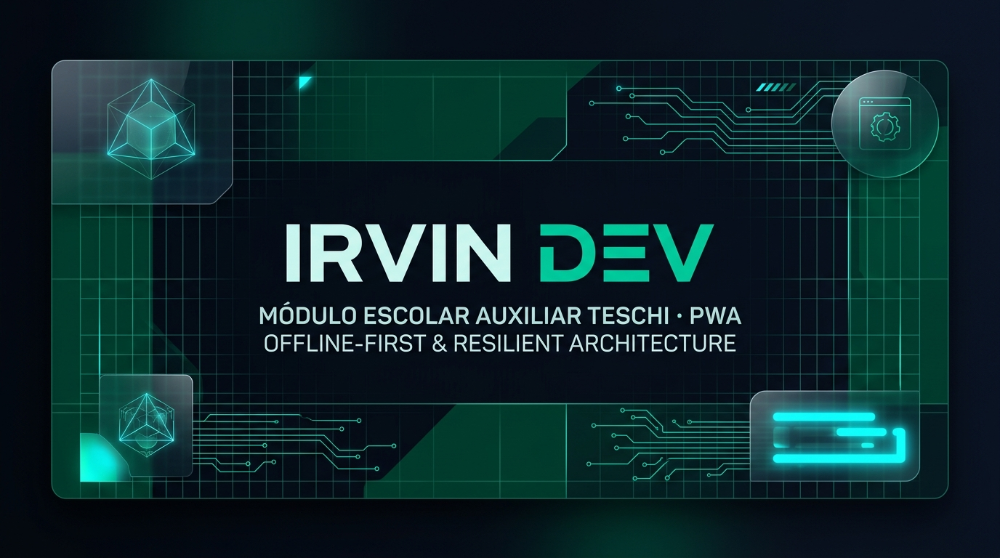

<div align="center">
  

  <br />

  [](https://github.com/Irvin-Osvaldo-Galvez-Romero0)
  [](https://www.teschi.edu.mx/)
  [](https://github.com/Irvin-Osvaldo-Galvez-Romero0/PWA-Modulo-Escolar-TESChi)
  [](https://github.com/Irvin-Osvaldo-Galvez-Romero0/PWA-Modulo-Escolar-TESChi)
  [](https://github.com/Irvin-Osvaldo-Galvez-Romero0/PWA-Modulo-Escolar-TESChi)
  [](https://github.com/Irvin-Osvaldo-Galvez-Romero0/PWA-Modulo-Escolar-TESChi)
  [](https://github.com/Irvin-Osvaldo-Galvez-Romero0/PWA-Modulo-Escolar-TESChi)
</div>

---

# 🎓 Módulo Auxiliar de Servicios Escolares TESChi

> **Aplicación Web Progresiva (PWA) Offline-First de Alta Resiliencia para Gestión Académica y Trámites Escolares.**  
> Desarrollado como proyecto de Residencia Profesional para la División de Ingeniería en Sistemas Computacionales y el Departamento de Ciencias Básicas del **Tecnológico de Estudios Superiores de Chimalhuacán (TESChi)**, bajo estándares internacionales W3C, ISO/IEC y Teoría de Residualidad.

---

## 📌 Descripción del Sistema

El **Módulo Auxiliar de Servicios Escolares TESChi** es una plataforma tecnológica institucional diseñada para resolver de manera definitiva la saturación, cuellos de botella e intermitencias de red que históricamente se presentan durante los períodos críticos de **reinscripción, consulta de kárdex y registro a cursos intersemestrales** en el campus.

Construido bajo el paradigma **Offline-First**, el sistema rompe con la fragilidad de las plataformas web monolíticas convencionales. A través de un proxy programable en el cliente (**Service Workers**) y persistencia transaccional estructurada en **IndexedDB**, la aplicación garantiza disponibilidad 24/7 y una respuesta subsegundo (<200 ms) en todas sus vistas principales. Los estudiantes y directivos pueden consultar historiales académicos, estructurar y validar cargas horarias, explorar retículas curriculares y **emitir comprobantes oficiales con códigos QR criptográficos**, incluso ante caídas de conexión a Internet o fallas transitorias de los servidores institucionales.

La interfaz implementa la identidad cromática oficial del TESChi (`#012d1d` verde institucional) complementada con micro-animaciones fluidas a 60 FPS, ergonomía visual para mitigación de errores del usuario y cumplimiento estricto de accesibilidad universal.

---

## 🏛️ Marco Normativo & Estándares Internacionales

El sistema fue concebido y evaluado formalmente contra cinco marcos de calidad técnica y metodológica:

| Estándar / Norma | Dimensión Evaluada | Implementación en el Sistema |
| :--- | :--- | :--- |
| **W3C PWA Standards** | Instalabilidad & Offline | Web App Manifest independiente, ciclo de vida de Service Worker y funcionamiento *standalone* sin tienda de apps. |
| **ISO/IEC 25010** | Calidad del Producto Software | Eficiencia de desempeño, fiabilidad ante pérdida de paquetes, usabilidad y portabilidad multiplataforma. |
| **ISO/IEC 27001** | Seguridad de la Información | Cifrado de datos en reposo y en tránsito, protección contra inyección y validación estricta de NIP institucional. |
| **ISO 9241-110** | Ergonomía de Interacción Humano-Sistema | Conformidad con las expectativas del usuario, tolerancia a errores en selección de carga y retroalimentación inline inmediata. |
| **ISO/IEC 40500 (WCAG 2.1 AA)** | Accesibilidad Web | Navegación por teclado, contraste cromático superior a 4.5:1 y soporte completo para tecnologías de asistencia. |
| **Residuality Theory (Barry O'Reilly)** | Arquitectura de Resiliencia | Tolerancia a estresores de red y concurrencia mediante *Bulkheads* modulares y sincronización asíncrona no destructiva. |

---

## ⚡ Módulos y Capacidades del Sistema

### 🔐 1. Acceso Institucional & Autenticación Segura
- Validación directa de matrícula estudiantil y NIP cifrado.
- Generación de captcha dinámico anti-automatización maliciosa.
- Gestión de tokens de sesión con renovación segura y protección contra ataques de fuerza bruta.

### 📊 2. Kárdex Académico Transaccional (Solo Lectura Auditada)
- Visualización estructurada del historial de calificaciones por semestre.
- Cálculo en tiempo real de créditos acumulados, promedio general ponderado y porcentaje de avance curricular.
- Semaforización de estatus académico (Regular / Condicionado / Alerta).

### 📝 3. Módulo Integral de Reinscripciones
- Selección dinámica de asignaturas y grupos disponibles sin conflictos de horario.
- Validación de prerrequisitos y límites máximos/mínimos de créditos autorizados.
- Previsualización gráfica de la carga horaria semanal antes de la confirmación formal.

### 📚 4. Módulo de Cursos Intersemestrales
- Catálogo de asignaturas ofertadas para períodos intersemestrales por Ciencias Básicas y Sistemas.
- Preinscripción simplificada con control de cupos en tiempo real.
- Notificaciones de confirmación de apertura de grupos.

### 🧾 5. Emisión de Comprobantes Oficiales con Código QR
- Generación instantánea de comprobantes de reinscripción y de cursos intersemestrales.
- Estampado de código QR de validación criptográfica para cotejo administrativo offline/online.
- Plantilla oficial imprimible optimizada para exportación a PDF y formato físico sin distorsión de estilos.

### 📅 6. Calendario Escolar Interactivo
- Agenda oficial con marcas visuales de períodos de reinscripción, evaluaciones ordinarias/extraordinarias y recesos.
- Filtrado por hitos administrativos y vista detallada por mes y semestre en curso.

### 🗺️ 7. Retícula Curricular Interactiva
- Visualizador interactivo del mapa curricular por carrera (Ingeniería en Sistemas Computacionales, etc.).
- Identificación de líneas de especialidad, áreas de conocimiento y estados de materias (aprobada, cursando, pendiente).

### 🛡️ 8. Centro de Seguridad & Auditoría
- Panel de control de sesiones activas y trazabilidad de accesos.
- Verificación de integridad del almacenamiento local y purga segura de credenciales en logout.

---

## 🛠️ Stack Tecnológico

```
┌────────────────────────────────────────────────────────┐
│                   CAPA DE PRESENTACIÓN                 │
│    React 19 · TypeScript 5.8 · Tailwind CSS v4 · Motion│
├────────────────────────────────────────────────────────┤
│                   NÚCLEO PWA & OFFLINE                 │
│  Service Workers · Cache Storage API · IndexedDB Store │
├────────────────────────────────────────────────────────┤
│                   BACKEND & PROXY API                  │
│       Node.js · Express 4.21 · TSX · REST API v1       │
├────────────────────────────────────────────────────────┤
│                   MOTOR INTELIGENTE                    │
│      Google GenAI SDK (@google/genai 2.4.0)            │
└────────────────────────────────────────────────────────┘
```

- **Frontend:** [React 19](https://react.dev/) + [TypeScript](https://www.typescriptlang.org/) + [Tailwind CSS v4](https://tailwindcss.com/)
- **Animaciones y Ergonomía:** [Motion](https://motion.dev/) + [Lucide React](https://lucide.dev/)
- **Motor PWA:** [Vite Plugin PWA](https://vite-pwa-org.netlify.app/)
- **Servidor y API:** [Node.js](https://nodejs.org/) + [Express](https://expressjs.com/) (ejecutado con [TSX](https://github.com/privatenumber/tsx))
- **Bundler y Compilación:** [Vite 6](https://vite.dev/) + [esbuild](https://esbuild.github.io/)

---

## 🚀 Guía de Instalación y Ejecución Local

### Prerrequisitos
- **Node.js** v18.0.0 o superior (recomendado Node.js LTS v20+)
- **npm** v9.0.0 o superior

### 1. Clonar el Repositorio
```bash
git clone https://github.com/Irvin-Osvaldo-Galvez-Romero0/PWA-Modulo-Escolar-TESChi.git
cd PWA-Modulo-Escolar-TESChi
```

### 2. Instalar Dependencias
```bash
npm install
```

### 3. Configuración de Variables de Entorno
Copia el archivo de variables de ejemplo y configura tu clave de Gemini API si deseas habilitar los servicios auxiliares inteligentes:
```bash
cp .env.example .env.local
```
Define en `.env.local`:
```env
GEMINI_API_KEY="tu_api_key_aqui"
APP_URL="http://localhost:3000"
```

### 4. Iniciar el Servidor de Desarrollo
```bash
npm run dev
```
La aplicación estará disponible de inmediato en: **`http://localhost:3000`**

### 5. Compilar para Producción
```bash
# Compilar cliente Vite y empaquetar servidor Express
npm run build

# Ejecutar el bundle de producción
npm start
```

### 6. Verificación de Tipos y Calidad
```bash
npm run lint
```

---

## 📱 Instalación como PWA (Móvil & Escritorio)

1. Abre la aplicación en Google Chrome, Microsoft Edge, Safari o cualquier navegador moderno en **`http://localhost:3000`**.
2. En la barra de direcciones o en el menú contextual, pulsa en el botón **"Instalar aplicación"** o **"Agregar a la pantalla de inicio"**.
3. La aplicación se integrará como ejecutable de escritorio o app móvil nativa independiente, permitiendo acceso offline inmediato con su propio ícono en el lanzador del sistema.

---

## 👨‍💻 Autor & Residencia Profesional

- **Residente y Arquitecto del Sistema:** **Irvin Osvaldo Gálvez Romero** ([@Irvin-Osvaldo-Galvez-Romero0](https://github.com/Irvin-Osvaldo-Galvez-Romero0)) — *Irvin Dev*
- **Carrera:** Ingeniería en Sistemas Computacionales
- **Institución:** [Tecnológico de Estudios Superiores de Chimalhuacán (TESChi)](https://www.teschi.edu.mx/)
- **Departamento Responsable:** División de Ingeniería en Sistemas Computacionales · Departamento de Ciencias Básicas
